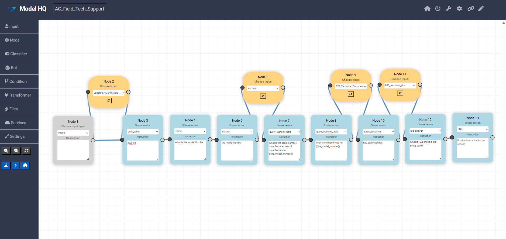
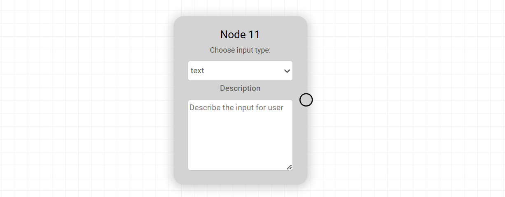
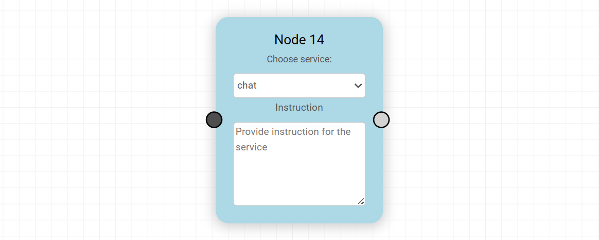
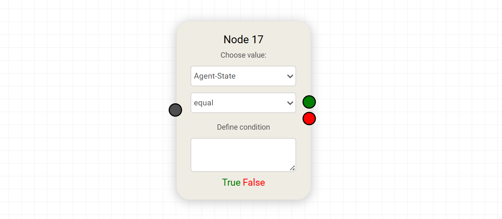
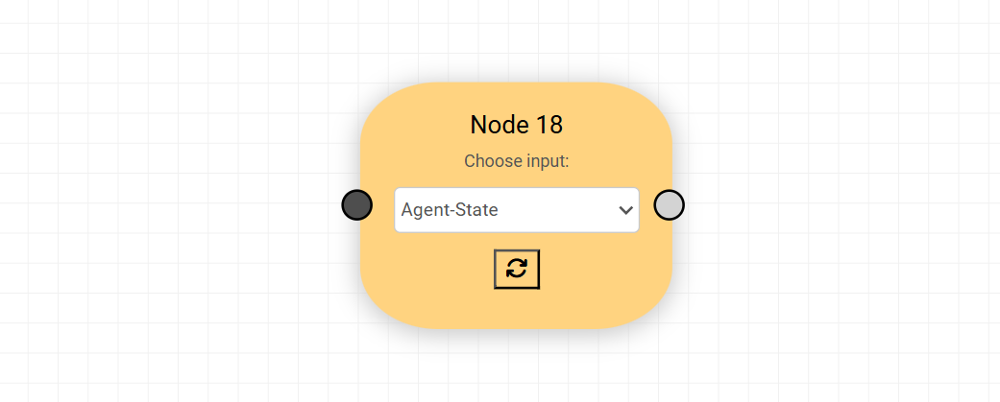
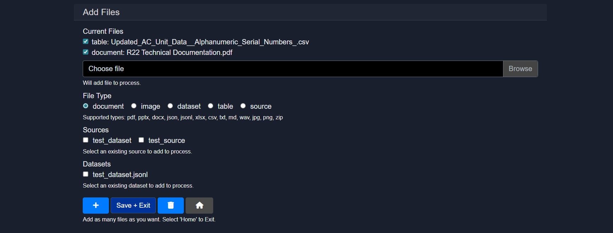
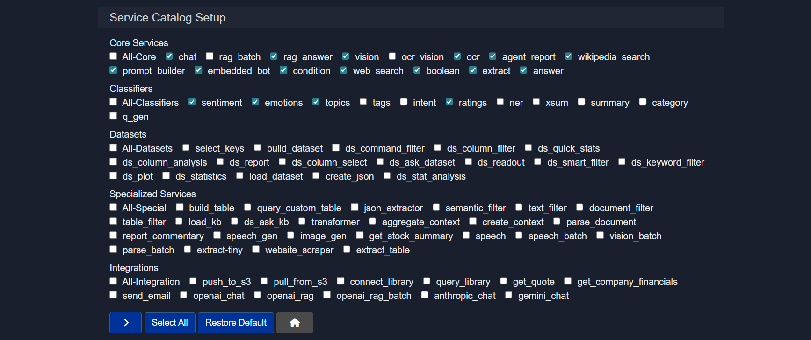

## Building/Editing Agents with Visual Builder
The **Visual Builder** provides an interactive drag-and-drop interface for creating agents using a node-and-wire paradigm. This mode is particularly useful for users who prefer visual workflow design over text-based configuration. The Visual Builder allows nodes representing different services (such as document parsing, RAG retrieval, data extraction, or model inference) to be placed on a canvas and connected to define execution flow and data dependencies. Each node can be configured with specific instructions, input contexts, and output mappings through intuitive forms and dropdowns.

The Visual Builder excels at creating complex workflows with branching logic, conditional execution, and parallel processing paths, as these structures are more easily understood and modified in graphical form. The interface includes features for zooming, panning, rearranging nodes, and validating connections to ensure data flows correctly between steps. Once the visual workflow is complete, it can be executed directly from the builder, exported as a JSON configuration file, or further refined using the step-based editor.

### 3.1 Builder overview
The canvas represents the full execution flow of an agent, from input to final output. Each block is a node, and connections define how data moves between steps.

Up to **Transformers**, all components are fully visual and configurable directly in the builder.

### 3.2 Left panel (node types)
The left sidebar contains the core building blocks that can be dragged onto the canvas:

* **Input**
  Defines how data enters the agent (for example text, image, or file input).

* **Node**
  General-purpose processing steps that pass data forward.

* **Classifier**
  Routes execution based on intent or classification logic.

* **Bot**
  Handles LLM-powered reasoning or responses.

* **Condition**
  Adds branching logic based on rules or outputs.

* **Transformer**
  Transforms or enriches data before it moves to the next step.

### 3.3 Agent Configurations:
- **Files**:
  This section is used to upload, manage, and associate assets with the agent.

- **Services**:
  It serves as a service catalog for the agent. It determines which capabilities are available when building workflows.

- **Settings**:
  Allows to set Agent global configurations from selecting models to overall control in the agent.

### 3.4 Canvas controls
On the canvas, the following actions can be performed:

* Nodes can be dragged to reposition them
* Nodes can be connected to define execution flow
* Nodes can be selected to edit their instructions and configuration

### 3.5 Zoom and utility actions
The bottom-left controls allow the following operations:

* Zoom in
* Zoom out
* Clear the canvas

### 3.6 Action buttons
Below the utility buttons, quick access to key actions is provided:

* **Save Agent**
  Saves the agent definition as a JSON file. This file can later be uploaded to instantly recreate the agent.

* **Run**
  Executes the agent with the current configuration.

* **Home**
  Returns to the main dashboard.

## 4. Input Node

The **Input Node** defines how data enters the agent workflow. It is typically the starting point on the canvas and determines the format and structure of the data that downstream nodes will receive.

Each Input Node can be configured by selecting an **input type** and adding a short **description** to guide users on what to provide. This makes the agent easier to use and ensures consistent input formatting.

### Available Input Types

| Input Type | Description                                                                                            |
| ---------- | ------------------------------------------------------------------------------------------------------ |
| text       | Accepts plain text input. Useful for prompts, queries, or instructions provided directly by the user.  |
| document   | Accepts uploaded documents such as PDFs, Word files, or similar formats for parsing or analysis.       |
| dataset    | Used for structured datasets, typically containing multiple records for batch processing or analytics. |
| table      | Accepts tabular data with rows and columns, suitable for structured data operations.                   |
| image      | Accepts image files for tasks like OCR, visual analysis, or classification.                            |
| source     | Represents a reference input such as a URL, repository, or external data source.                       |
| collection | A grouped set of related items, often used for retrieval or search-based workflows.                    |
| snippet    | Accepts smaller pieces of content, such as code snippets or short text blocks.                         |
| json       | Accepts structured JSON input for precise schema-driven workflows.                                     |
| form       | Captures multiple fields of user input in a structured form format.                                    |
| folder     | Accepts a directory containing multiple files for bulk processing.                                     |

### Notes

* The selected input type directly impacts how downstream nodes interpret and process data.
* Clear descriptions improve usability, especially when agents are shared or reused.
* Multiple Input Nodes can be used if the workflow requires different types of inputs.

## 5. Node

The **Node** represents a general-purpose processing step in the agent workflow. It is used to execute a specific **service** and pass the result forward to the next connected node.

Each Node acts as a bridge between data and capability, allowing the agent to perform operations such as reasoning, transformation, retrieval, or external service interaction.

### Service Selection

Every Node includes a **“Choose service”** dropdown. This list is dynamically populated from the **Services** section in the agent configuration.

* Only services that are added and enabled in the **Services** section will appear here
* This ensures that the Node operates within the capabilities explicitly defined for the agent
* Services can include model-based operations, data processing tools, integrations, or custom logic

### Instruction Field

Each Node provides an **Instruction** field where you define how the selected service should behave.

* Instructions guide the execution of the service
* They can include prompts, rules, or task-specific directions
* Clear and precise instructions improve output quality and consistency

### Custom Datasets as Services

In addition to predefined services, custom datasets can also be used within a Node:

* Datasets must first be added and configured in the **Services** section
* Once listed, they become selectable just like any other service
* This allows workflows to directly interact with structured or domain-specific data

### Key Characteristics

* Nodes process incoming data and produce outputs for downstream steps
* They can be chained to create multi-step workflows
* The behavior of a Node is fully determined by the selected service and its instruction
* Nodes are reusable and can be reconfigured without affecting the overall structure

### Notes

* If a required service is not visible, ensure it has been added in the **Services** section
* Keep instructions concise but explicit to avoid ambiguity
* Nodes can be combined with conditions and transformers to build complex logic flows

## 6. Classifier Node

The **Classifier Node** is used to categorize or label input data based on predefined classification types. It enables routing, filtering, and decision-making within workflows by assigning structured outputs such as labels, categories, or extracted information.

### Classifier Selection

Each Classifier Node includes a **“Choose classifier”** dropdown with a fixed set of available classifiers.

* These classifiers are **not dynamically generated** from the Services section
* However, corresponding capabilities may still be configured or supported through Services if needed
* The dropdown provides a consistent and standardized set of classification options

### Available Classifiers

| Classifier | Description                                                                                     |
| ---------- | ----------------------------------------------------------------------------------------------- |
| sentiment  | Determines the overall sentiment of the input, such as positive, negative, or neutral.          |
| emotions   | Identifies emotional tone, such as happiness, anger, sadness, or surprise.                      |
| topics     | Classifies the input into broad subject areas or themes.                                        |
| tags       | Assigns relevant keywords or labels to the input for easier organization and retrieval.         |
| intent     | Detects the underlying purpose or intent behind the input.                                      |
| ratings    | Assigns a score or rating based on defined criteria.                                            |
| ner        | Performs Named Entity Recognition to extract entities like names, locations, and organizations. |
| xsum       | Generates extremely concise summaries of the input content.                                     |
| summary    | Produces a general summary capturing the main points of the input.                              |
| category   | Classifies input into predefined categories for structured grouping.                            |
| q_gen      | Generates relevant questions based on the input content.                                        |

### Key Characteristics

* Outputs are structured and can be used for conditional routing
* Helps in building branching logic when combined with Condition nodes
* Works well with both raw and preprocessed inputs
* Can be chained with other nodes for multi-step analysis

### Notes

* Since classifiers are predefined, customization is limited to how their outputs are used downstream
* For advanced behavior, combine classifiers with Nodes and Transformers
* Ensure the selected classifier aligns with the expected output format for the next step in the workflow

## 7. Bot Node

The **Bot Node** is used to integrate and execute a pre-configured bot within the agent workflow. It allows you to delegate specific tasks to a reusable bot that has already been defined with its own logic, instructions, and capabilities.

### Bot Selection

Each Bot Node references a bot selected from the **Embedded Agent Bots** available in the **Settings** section.

* The list includes both **pre-built bots** and **user-created bots**
* User-created bots are those configured in the **Bots** section
* Only bots that are properly set up and available in settings can be selected

This ensures that all bot executions are consistent with their predefined configurations.

### How It Works

* The Bot Node receives input from previous nodes
* It passes the input to the selected bot
* The bot processes the request based on its internal configuration
* The output is returned and passed to the next node in the workflow

### Key Characteristics

* Encapsulates complex logic into reusable components
* Reduces duplication by reusing existing bot configurations
* Maintains consistency across workflows using the same bot
* Supports both simple and advanced multi-step reasoning within a single node

### When to Use

* When a task has already been defined as a reusable bot
* When you want to standardize behavior across multiple workflows
* When delegating complex reasoning or interactions to a dedicated component

### Notes

* Changes made to a bot in the **Bots** section will reflect across all Bot Nodes using it
* Ensure the selected bot is properly configured before using it in a workflow
* Bot Nodes can be combined with Classifiers and Conditions for dynamic execution paths

## 8. Condition Node

The **Condition Node** introduces decision-making into the workflow by evaluating a condition and routing execution based on the result. It enables branching logic, allowing the agent to follow different paths depending on the data it receives.

### Value Selection

The **“Choose value”** dropdown determines what data the condition will evaluate.

#### Default Values

* **agent-state**
  Represents the current internal state of the agent
* **user-document**
  Refers to the input provided by the user, especially in document-based workflows
* **none**
  Used when no predefined value is required

#### Dynamic Values

In addition to defaults, the dropdown can include dynamically generated fields based on previous nodes and the overall workflow. These may include:

* `rag_answer`
* `rag_sources`
* `agent_report`
* `description`
* Any other output generated earlier in the flow

These dynamic values allow conditions to be tightly coupled with actual execution results.

### Conditional Operators

The second dropdown defines how the selected value is evaluated. The available operators are:

| Operator    | Description                                                          |
| ----------- | -------------------------------------------------------------------- |
| equal       | Checks if the value matches the defined condition exactly            |
| greater     | Evaluates if the value is greater than the condition                 |
| less than   | Evaluates if the value is less than the condition                    |
| read & eval | Interprets and evaluates the value using custom logic or expressions |

### Define Condition

The **Define condition** field is where the comparison value or expression is specified.

* Can be a static value, keyword, or expression
* Works in combination with the selected operator
* Should align with the data type of the selected value

### Outputs

The Condition Node has two possible execution paths:

* **True (Green output)** → Followed when the condition is satisfied
* **False (Red output)** → Followed when the condition is not satisfied

### Key Characteristics

* Enables branching and control flow within the agent
* Works with both predefined and dynamic values
* Integrates seamlessly with outputs from previous nodes
* Supports simple comparisons as well as advanced evaluations

### Notes

* Ensure the selected value exists in the workflow before using it in a condition
* Use clear and predictable outputs from previous nodes to avoid ambiguity
* Combine with Classifier Nodes for more intelligent routing decisions

## 9. Transformer Node

The **Transformer Node** is used to access, extract, and reshape data from different stages of the agent’s execution. It enables you to work with intermediate outputs and reuse them in downstream steps.

Unlike standard processing nodes, Transformers focus on **state access and data transformation**, making them essential for building flexible, multi-step workflows.

### Purpose

Transformers allow you to:

* Retrieve data from any step in the agent’s process
* Reuse outputs without recomputing them
* Restructure or prepare data for the next node

For example, if an agent workflow has 5 steps, a Transformer can pull data from **any intermediate state** (step 1, 2, 3, etc.) and pass it forward for further processing.

### Input Selection

The **“Choose input”** dropdown defines which data source the Transformer will use.

#### Default Inputs

* **agent-state**
  Provides access to the internal state of the agent across all steps
* **user-document**
  Refers to the original input provided by the user
* **none**
  Used when no predefined input is required

#### Dynamic Inputs

Additional inputs are automatically generated based on the workflow and outputs of previous nodes. These may include:

* `rag_answer`
* `rag_sources`
* `agent_report`
* `description`
* Any other fields produced during execution

These dynamic options allow Transformers to integrate seamlessly with the evolving data flow of the agent.

### How It Works

1. The Transformer selects a specific input (state or output)
2. It extracts or reshapes the data
3. The transformed result is passed to the next connected node

### Key Characteristics

* Enables access to **intermediate and final outputs**
* Supports **data reuse across multiple steps**
* Decouples data retrieval from processing logic
* Improves modularity and flexibility of workflows

### When to Use

* When you need to reference outputs from earlier steps
* When preparing data for another node (e.g., Bot, Classifier, Condition)
* When working with multi-step or stateful agent flows

### Notes

* Ensure the selected input exists in the workflow before using it
* Use meaningful outputs in earlier nodes to simplify transformations
* Transformers are especially powerful when combined with Conditions and Nodes for dynamic execution paths

## 10. Files
The **Files** section is used to upload, manage, and associate assets with the agent.

Capabilities include:

* Uploading documents, images, tables, datasets, or zipped sources
* Assigning file types such as document, image, dataset, table, or source
* Reusing existing datasets or sources already available in the workspace

Uploaded files become available as contexts that can be selected by agent services such as `parse_document`, `build_table`, or `vision`. Multiple files can be added before saving and exiting.

## 11. Services
The Services section defines all the capabilities available to an agent. These services power the execution of Node, Classifier, Bot, and Transformer components in the workflow.

Only services that are added and enabled in this section will be available for selection inside nodes. This ensures controlled, predictable, and modular agent behavior.

### Core services
General building blocks for common tasks such as chat, retrieval, extraction, and logic control.

Examples:

* `chat` – conversational responses
* `rag_answer` – retrieval-augmented answers
* `vision` – image understanding
* `ocr` – text extraction from images
* `web_search` – online search retrieval
* `extract` – structured field extraction
* `answer` – direct question answering
* `prompt_builder` – dynamic prompt creation
* `agent_report` – report generation
* `embedded_bot` – embedded execution
* `condition` – branching logic
* `boolean` – rule evaluation

### Classifiers
Lightweight text analysis tools for labeling or scoring content.

* sentiment – positive/negative tone detection
* emotions – emotional classification
* topics – topic categorization
* tags – keyword tagging
* intent – intent recognition
* ratings – scoring or grading
* ner – named entity recognition
* summary – concise text summaries
* category – predefined grouping
* q_gen – question generation

### Datasets
Tools for preparing, querying, and analyzing structured data.

* build_dataset – create datasets from raw files
* dataset_query – run queries on datasets
* dataset_filter – filter rows or records
* dataset_plot – visualize data
* dataset_stat – compute statistics
* load_dataset – load saved datasets
* ml_predict – run ML predictions
* stats_analyze – perform analysis
* create_json – export structured JSON

### Specialized services
Advanced utilities for targeted or complex workflows.

* semantic_filter – meaning-based filtering
* text_filter – rule-based text filtering
* document_filter – document-level filtering
* table_filter – structured table filtering
* transformer – text transformation tasks
* parse_document – convert documents to text
* create_context – build reusable context blocks
* report_commentary – add report notes
* speech_gen – generate audio output
* image_gen – generate images
* website_scraper – extract web content
* extract_table – extract tables from documents

### Integrations
Connect the agent to external systems or hosted models.

Examples include storage services, email, and external model providers.

### Custom services
Workspace-specific or user-defined services added for specialized use cases.

Below is the list of supported services, their expected instruction formats, descriptions, and applicable context sources.

| **Service Name**           | **Instruction**                            | **Description**                                          | **Context**                                   |
| -------------------------- | ------------------------------------------ | -------------------------------------------------------- | --------------------------------------------- |
| **chat**                   | What is your question or instruction?      | Answers a question or performs instruction               | `MAIN-INPUT`, `User-Text`, `None`             |
| **rag_batch**              | Enter question or instruction              | Performs RAG over batch of documents                     | `User-Document`                               |
| **rag_answer**             | Ask question to longer document input      | Answers a question based on a longer document input      | `User-Source`, `Provide_instruction_or_query` |
| **vision**                 | Enter question to image file               | Provides answer/description from image                   | `User-Image`                                  |
| **ocr_vision**             | Enter instruction                          | Performs OCR + vision-based understanding                | `User-Document`, `User-Image`                 |
| **ocr**                    | Enter name of new document source          | Extracts content from image-based or protected documents | `User-Document`                               |
| **agent_report**           | Enter title for agent report               | Prepares report on agent output                          | `-`                                           |
| **wikipedia_search**       | Add Wikipedia Articles as Research Context | Adds Wikipedia articles as research context              | `None`                                        |
| **prompt_builder**         | Enter prompt instruction                   | Builds structured prompts                                | `None`                                        |
| **embedded_bot**           | Optional                                   | Pauses execution for user interaction                    | `None`                                        |
| **condition**              | Enter expression                           | Evaluates logical condition                              | `None`                                        |
| **web_search**             | Add query                                  | Performs web search and returns structured results       | `None`                                        |
| **boolean**                | Provide yes/no question                    | Provides yes/no answer with explanation                  | `MAIN-INPUT`, `User-Text`                     |
| **extract**                | Enter extraction key                       | Extracts key-value pair                                  | `MAIN-INPUT`, `User-Text`                     |
| **answer**                 | What is your question?                     | Answers specific question from passage                   | `MAIN-INPUT`, `User-Text`                     |
| **sentiment**              | No instruction required                    | Analyzes sentiment                                       | `MAIN-INPUT`, `User-Text`                     |
| **emotions**               | No instruction required                    | Analyzes emotion                                         | `MAIN-INPUT`, `User-Text`                     |
| **topics**                 | No instruction required                    | Classifies topic                                         | `MAIN-INPUT`, `User-Text`                     |
| **tags**                   | No instruction required                    | Generates tags                                           | `MAIN-INPUT`, `User-Text`                     |
| **intent**                 | No instruction required                    | Classifies intent                                        | `MAIN-INPUT`, `User-Text`                     |
| **ratings**                | No instruction required                    | Rates positivity (1–5)                                   | `MAIN-INPUT`, `User-Text`                     |
| **ner**                    | No instruction required                    | Named entity recognition                                 | `MAIN-INPUT`, `User-Text`                     |
| **xsum**                   | No instruction required                    | Generates extreme summary                                | `MAIN-INPUT`, `User-Text`                     |
| **summary**                | Optional                                   | Summarizes content                                       | `MAIN-INPUT`, `User-Text`                     |
| **category**               | No instruction required                    | Classifies category                                      | `MAIN-INPUT`, `User-Text`                     |
| **q_gen**                  | No instruction required                    | Generates questions                                      | `MAIN-INPUT`, `User-Text`                     |
| **build_table**            | Enter name of table                        | Create table from CSV                                    | `User-Table`                                  |
| **query_custom_table**     | Enter query                                | Query database table (requires build_table)              | `Table Output`                                |
| **json_extractor**         | Enter schema                               | Extract structured JSON                                  | `MAIN-INPUT`, `User-Text`                     |
| **semantic_filter**        | Enter instruction                          | Semantic filtering                                       | `User-Source`                                 |
| **text_filter**            | Enter keyword/topic                        | Keyword filtering                                        | `User-Source`                                 |
| **document_filter**        | Enter document name                        | Filter by document                                       | `User-Source`                                 |
| **table_filter**           | No instruction                             | Filter table content                                     | `User-Source`                                 |
| **load_kb**                | Enter KB name                              | Loads knowledge base                                     | `None`                                        |
| **ds_ask_kb**              | Enter query                                | Query dataset KB                                         | `Loaded KB`                                   |
| **transformer**            | Choose input                               | Access/transform agent state                             | `Agent-State`                                 |
| **aggregate_context**      | Enter source names                         | Merge multiple contexts                                  | `None`                                        |
| **create_context**         | Enter instruction                          | Generate answer/context                                  | `User-Source`                                 |
| **parse_document**         | Enter name                                 | Parse document into source                               | `User-Document`                               |
| **report_commentary**      | Optional                                   | Generate commentary report                               | `None`                                        |
| **speech_gen**             | Enter text/topic                           | Generate speech file                                     | `None`                                        |
| **image_gen**              | Enter description                          | Generate image                                           | `None`                                        |
| **get_stock_summary**      | Enter ticker                               | Stock lookup                                             | `None`                                        |
| **speech**                 | Enter text                                 | Convert text to speech                                   | `None`                                        |
| **speech_batch**           | Enter instruction                          | Batch speech generation                                  | `None`                                        |
| **vision_batch**           | Enter instruction                          | Batch image processing                                   | `User-Document`                               |
| **parse_batch**            | Enter instruction                          | Batch document parsing                                   | `User-Document`                               |
| **extract-tiny**           | Enter key                                  | Lightweight extraction                                   | `MAIN-INPUT`, `User-Text`                     |
| **website_scraper**        | Enter URL                                  | Scrape website content                                   | `None`                                        |
| **extract_table**          | Enter query                                | Extract table from document                              | `User-Document`                               |
| **push_to_s3**             | Enter path                                 | Upload to S3                                             | `None`                                        |
| **pull_from_s3**           | Enter path                                 | Download from S3                                         | `None`                                        |
| **connect_library**        | Enter library name                         | Connect semantic library                                 | `None`                                        |
| **query_library**          | Enter query                                | Query semantic library                                   | `Library Context`                             |
| **get_quote**              | Enter symbol                               | Retrieve stock quote                                     | `None`                                        |
| **get_company_financials** | Enter company/ticker                       | Retrieve financials                                      | `None`                                        |
| **send_email**             | Enter email                                | Send email                                               | `Select context`                              |
| **openai_chat**            | Enter instruction                          | OpenAI chat                                              | `Text Source`                                 |
| **openai_rag**             | Enter instruction                          | OpenAI RAG                                               | `Text Source`                                 |
| **openai_rag_batch**       | Enter instruction                          | OpenAI batch RAG                                         | `Text Source`                                 |
| **anthropic_chat**         | Enter instruction                          | Anthropic chat                                           | `Text Source`                                 |
| **gemini_chat**            | Enter instruction                          | Gemini chat                                              | `Text Source`                                 |

## Conclusion
The **Visual Builder** establishes a clear and structured approach to agent design by translating complex workflows into an intuitive visual format. By organizing execution into interconnected nodes—covering inputs, processing, decision-making, and transformation—it enables users to construct both simple and highly sophisticated agents within a single, unified canvas.

Throughout the system, emphasis is placed on **modularity, reusability, and controlled capability exposure**. Components such as Nodes, Classifiers, Bots, Conditions, and Transformers work together to create flexible pipelines, while the **Services** and **Files** sections ensure that only explicitly configured resources and capabilities are used. This not only improves maintainability but also promotes consistency across different agent implementations.

Key mechanisms like **Condition nodes** introduce dynamic branching, and **Transformer nodes** provide access to intermediate execution states, allowing workflows to evolve beyond linear processing into adaptive, state-aware systems. At the same time, reusable bots and services reduce duplication and streamline development.

Finally, the use of concise instruction fields and UI-oriented labels maintains clarity for end users without disrupting the overall documentation style. Together, these elements position the Visual Builder as a scalable and user-friendly framework for designing, managing, and executing agent workflows with both precision and flexibility.
