# Exploring agents in Model HQ
After setup, you’ll land on the **Main Menu**, where you can open the **Agents** section.

**Agents** are automated workflows that handle tasks for you. They combine things like reading documents, searching for relevant information (RAG), running AI models, and creating structured outputs — all in one repeatable process.

The user will build each agent for a specific job, such as:

* Analyzing contracts
* Automating customer support
* Summarizing research
* Extracting financial data
* Tagging images

You can run an agent on a single file or many files at once. The results can include Word reports, CSVs, JSON data, summaries or text files.

The **Agents interface** lets you:

* Buid your own agents from scratch
* Use a drag and drop interface with no code to build agents
* Use a multi-step interface (with no code) to build longer or more complex agents
* Run ready-made agents
* Edit existing workflows
* Share agents with others
* Create demos of existing agents to illustrate the agent use case (handy when sharing agents with others)

Pre-built agents are included as examples and can be customized for your needs.

When you run an agent, it follows a step-by-step process, such as:

* Reading and parsing documents
* Answering questions using RAG
* Extracting or filtering key data in CSVs then applying generative AI to the results
* Auto-Generating reports and outputs from repeatable workflows

You can track what’s happening using logs that show:

* Model responses at each step of the process
* Token usage
* Processing time
* Confidence scores

This guide will show you how to:

* Create your own custom agents
* Run and use existing agents
* Understand outputs and logs
* Process multiple files at once
* Share and upload agents
* Build and edit workflows visually

Understanding Agents is key to automating complex tasks, creating custom AI workflows, and using AI effectively in your organization.

This document provides comprehensive guidance on the Agents interface, including how to load and run existing agents, interpret agent outputs and inference logs, utilize batch processing for multiple files, share agents with others, upload custom agents, and leverage the visual builder for workflow creation and editing. Understanding the Agents framework is essential for automating complex document workflows, building custom AI-powered processes, and integrating agent capabilities into broader enterprise systems.

## 1. Launching the agents interface
The **Agent** button in the main menu sidebar can be selected, or the agents option can be chosen from the home page as shown in the attached image.

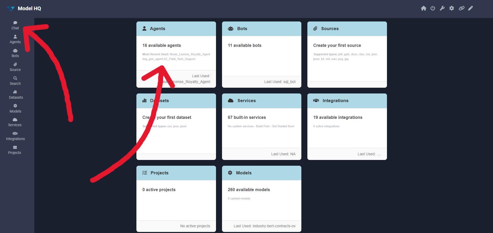

## 2. Agent interface overview
The Agents interface allows agents to be run, built, edited, shared, and deleted.

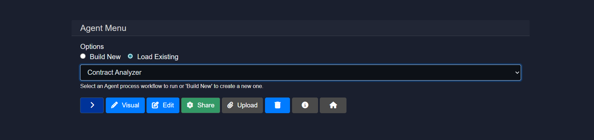

Here is a breakdown of the key components:
1. **Build New & Load Existing Options**
   - **Build New**: Creates a new agent from scratch.
   - **Load Existing**: Loads an existing agent, either a pre-created template included in Model HQ or one previously built by the user.

2. **Visual**: Builds agents with an open visual builder by connecting nodes and wires (no-code, easy to use agent creation mode, enabling quick workflow creation or diagrammatic understanding of agent workflows).

3. **Edit**: Modifies an existing agent.

4. **Share**: Shares an agent with others.

5. **Upload**: Quickly builds an agent by uploading a pre-built file.

6. **Delete**: Deletes an agent.

7. **Info Icon**: Provides metadata and step-by-step information and process diagram about an agent workflow for users 

> [!NOTE]
> This documentation does not cover building and editing agents in detail. For creating a new agent, the [Create New Agent](/v1/agents/creating-new-agent) documentation should be consulted, and for editing an agent, the [Edit an Agent](/v1/agents/edit-an-agent) documentation should be followed. The visual builder mode is discussed in [Agent Visual Builder](/v1/agent/agent-visual-builder).

In this documentation, an existing agent will be run, and other options such as share and upload will be explained in detail.

### 2.1 Loading an existing agent
To load an existing agent, `load existing` can be selected (if not already selected), and then any of the pre-existing agents can be chosen. 

#### Available Pre-Created Agent Templates in Model HQ
- **AC Field Tech Support**
- **Cloud API Agent**
- **Conditional Agent**
- **Contract Analyzer**
- **Customer Support**
- **Financial Data Extractor**
- **Handwriting Reading Agent**
- **Image Tagger**
- **Image Generation Agent**
- **Intake Processing**
- **Intune Device Risk Agent**
- **Music License Royalty Agent**
- **Research Process**
- **Stock Research Agent**
- **Summarize Website**

Select any agent from the list and click the `>` button to continue. 

For this walkthrough, **Contract Analyzer** has been selected, which was specifically designed to demonstrate how complex Employment Agreements can be quickly queried using pre-built agents.

## 2.2 Confirming the agent
After selecting an agent, the following interface will be displayed:

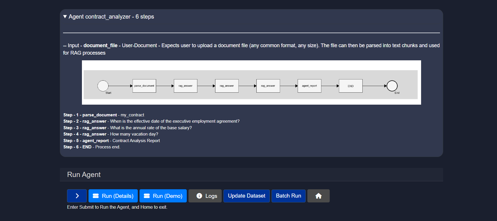

Once the user selects and agent and clicks ">", details about the agent will be provided along with the complete process flow from input to output by expanding the top bar with the agent name and the number of steps.


In the Run agent section, 2-3 options will typically be available:
- Run (Details)
- Run (Demo) 
- Batch Run

  
## 2.3 Running the Agent


### 2.3.1 Run (Demo)
Demo mode is available for all of the Pre-Created Agent templates listed above in Section 2.1. When you select this mode, the agent will run automatically from start to finish. You’ll see a clear explanation of the input, watch each step as it runs, and view the final output.
   - Note: If there is a model required in the Agent process that is not loaded on the user device, the model will be uploaded the very first time the agent is being run on that particular device. This will add to the time to complete the agent for the first time only. Once the model(s) downloads, the agent will resume running and subsequent runs of the agent will proceed normally. 


### 2.3.2 Run (Details)
Run (Details) enables the agent to be executed. 

User input will be requested based on the agent's configuration, such as text input or file upload.

>[!NOTE]
> If the required model(s) are not downloaded to run this agent, the models will be downloaded step-by-step as needed.

In the selected agent (Contract Analyzer), a file is required as input. Since it is a contract analyzer agent, a contract document is needed for analysis. The complete breakdown of all steps for this agent is as follows:
```
Step 1 - parse_document - my_contract
Step 2 - rag_answer - When is the effective date of the executive employment agreement?
Step 3 - rag_answer - What is the annual rate of the base salary?
Step 4 - rag_answer - How many vacation day?
Step 5 - agent_report - Contract Analysis Report
Step 6 - END - Process end.
```

**Uploading a File as Input** 

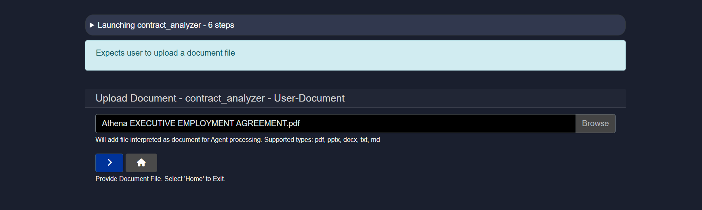

Model HQ includes sample executive employment agreement documents that can be used to test this agent. These files are located in:
```
c:\users\{user name}\llmware_data\sample_files\agreements
```
This sample agent demonstrates how documents can be queried using pre-built agents in an automated workflow, using one of the provided Executive Employment Agreements as an example. 

(Supported file types are `.pdf`, `.pptx`, `.docx`, `.txt`, and `.md`.)

Once the file has been added, the process can proceed to the next step.

Once the file is uploaded, the agent will begin executing the defined workflow automatically.

No further user action is required at this stage.

The agent will process the input and generate output as defined in its configuration.

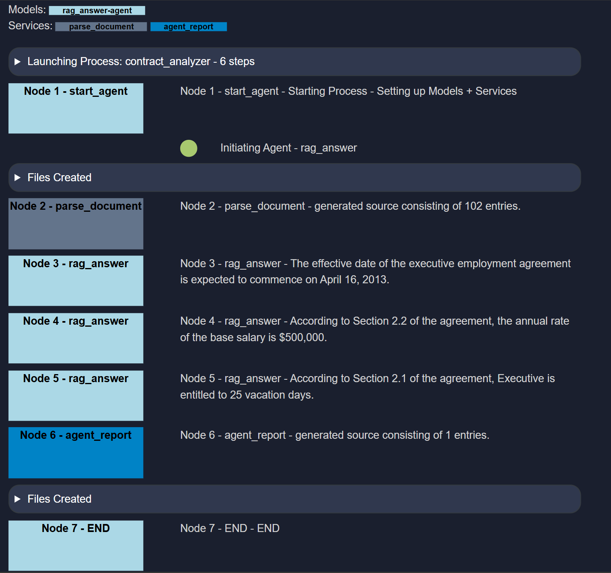

Once all processes have been completed, a summary report table will be created according to the 5th step (`agent_report - Contract Analysis Report`).

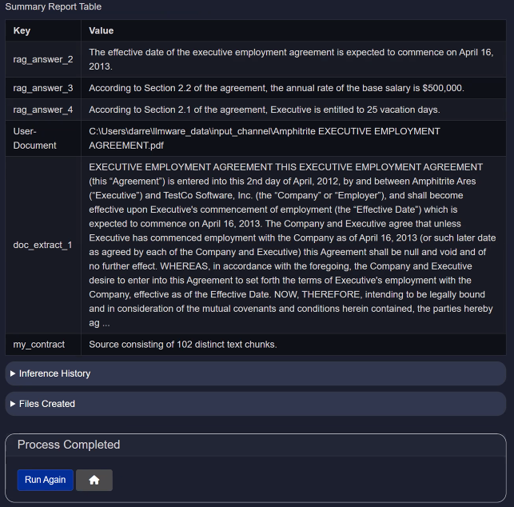

For every output, inference history and created files will also be available.

#### 2.3.2.1 Inference history
The Inference History table provides detailed logs of each inference performed by the language model, enabling transparency, performance tracking, and auditing. This is particularly useful for AI-driven processes such as contract analysis, customer support, and research workflows.

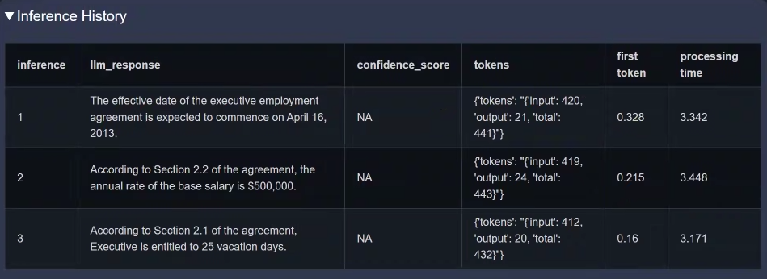

| **Column**            | **Description**                                                                        |
| --------------------- | -------------------------------------------------------------------------------------- |
| **inference**         | A sequential identifier for each inference operation.                                  |
| **llm_response**     | The text response generated by the language model (LLM) based on the input context.    |
| **confidence_score** | The model's confidence level (if available). `NA` indicates not applicable.            |
| **tokens**            | Token statistics, including input tokens, output tokens, and total tokens processed.   |
| **first token**       | Time (in seconds) taken to generate the first token of the response.                   |
| **processing time**   | Total time (in seconds) taken to process and return the complete response.             |

#### 2.3.2.2 Files created
This section lists the output files generated by the **Contract Analyzer Agent**. Each file captures a distinct part of the analysis—ranging from visual diagrams to raw metadata and final summaries—making it easier to trace the agent's behavior and audit results.


| **File Name**                         | **Description**                                                                                       |
| ------------------------------------- | ----------------------------------------------------------------------------------------------------- |
| `agent_name.png`               | A visual representation (e.g., diagram or flowchart) of the contract analysis process or structure.   |
| `agent_name_mermaid_chart.md`  | A markdown file containing a Mermaid.js chart definition that visually maps the agent’s workflow.     |
| `agent_name.json`              | A structured JSON file containing the raw data or metadata extracted by the agent from the contract.  |
| `agent_process_report_technical.docx` | A detailed technical report describing the internal processing steps, models used, and outcomes.      |
| `agent_name_take_aways.txt`    | A human-readable text summary highlighting key insights and findings from the contract.           |
| `agent_name_take_aways.json`   | A structured version of the takeaways in JSON format for use in APIs, dashboards, or further parsing. |

> [!IMPORTANT]
> In the screenshots above and below, the name `contract_analyzer` is used (as mentioned before). This is because these outputs were generated while testing the Contract Analyzer Agent.


### 2.3.3 Batch run
Batch Run allows multiple files to be selected at once as input to the agent.

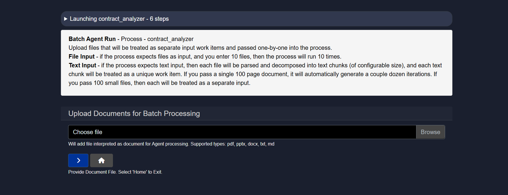

More details about this feature are available in the [Batch Processing](/v1/agents/batch-processing) documentation.

## 2.4 Share your agent
The Share option in the agents interface allows an agent to be downloaded for sharing purposes.

When this option is clicked, a `.zip` file will be created and made ready for download. The user can download the file and share the ZIP file by email or any file-sharing method. Another Model HQ user can then upload it by following the upload steps.

When sharing agents, it’s recommended to include a Demo mode so others can easily see how the agent works and what it’s designed to do.


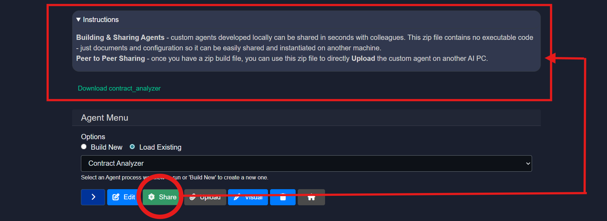

## 2.5 Uploading an agent
The Upload option in the agents interface allows agents to be uploaded.

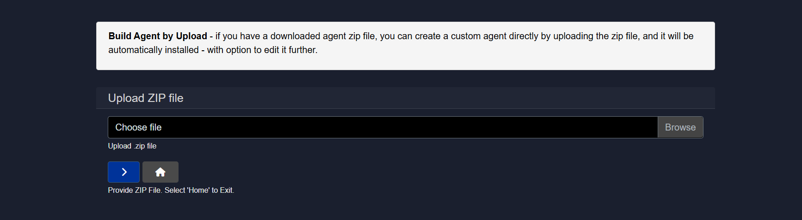

If a downloaded agent zip file is available, a custom agent can be created directly by uploading the zip file, and it will be automatically installed in the list of available agents with the option to edit it further.

## 2.6 Agent visual builder
The Visual option in the agent interface allows a visual view of an agent to be quickly obtained, along with the ability to edit that agent.

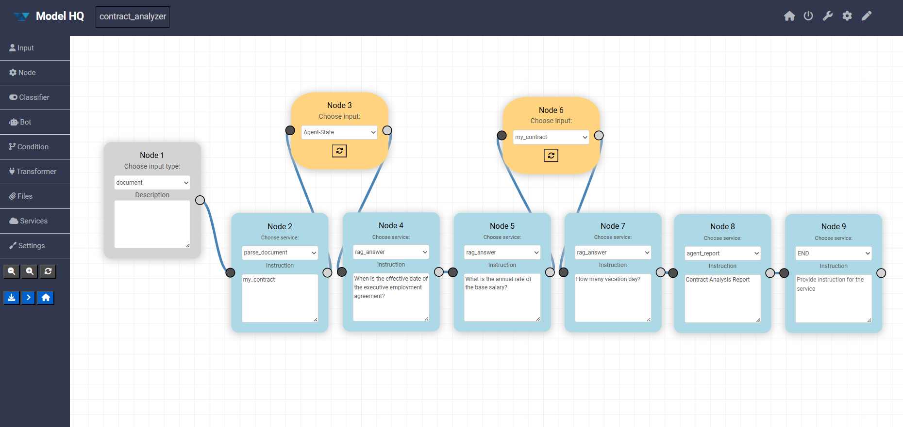

A drag-and-drop based interface is provided that allows any new agent to be built or edited quickly.

>[!NOTE]
> Further information about this mode is available in the [Agent Visual Builder](/v1/agents/agent-visual-builder) documentation.

## Conclusion
This document provided comprehensive guidance on the Agents interface in Model HQ, covering how to run, share, upload, and visualize agents within the platform. Agents represent automated workflows that combine document parsing, retrieval-augmented generation, language model inference, and structured output generation into repeatable, scalable processes. Pre-built agents such as Contract Analyzer, Customer Support, Financial Data Extractor, and Research Process demonstrate common use cases and serve as templates that can be customized to meet specific organizational requirements.
