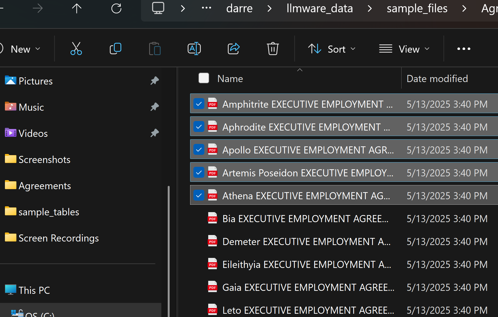

# Batch processing or multi-doc agent
This section explores the **Batch Run** capabilities of Model HQ, which enable automated execution of agent processes across multiple documents simultaneously.

**Batch Run** is designed to automate agent execution across multiple documents at once, eliminating the need to load each document individually. This feature significantly accelerates workflows that require consistent analysis or processing across large document sets, such as contract review, invoice processing, research summarization, or compliance audits. Batch processing maintains the same agent logic and output format across all documents while dramatically reducing manual intervention and total processing time.

The **Contract Analyzer** example covered in the Agents documentation will be used to demonstrate a Batch Run and illustrate how to utilize this feature effectively. The Batch Run interface provides a streamlined workflow for uploading multiple documents, initiating processing, monitoring progress, and retrieving results in structured formats such as Word documents or JSON files. This capability transforms single-document agents into scalable multi-document processing pipelines suitable for enterprise-scale deployments.

## Batch run workflow
Once **'Batch Run'** has been selected, the user will be directed to the **Upload Documents for Batch Processing** page.


From this interface, the first 5 agreements from the sample files provided in the Model HQ package can be selected. These files are located at:
```
c:\users\{user_name}\llmware_data\sample_files\agreements
```



After selecting the files, the `'>'` button can be clicked to initiate the batch run.

Within a few minutes, each of the 5 contracts will be processed during this Batch Run. Examples of the results are shown below:


Once the **Batch Run** is completed, results will be accessible via a **Word document** or a **JSON file**, depending on the use case requirements.

## Conclusion
Batch Run functionality can be applied to almost any agent workflow where consistent processing needs to be applied across multiple files. This capability is particularly valuable for enterprise scenarios involving contract analysis, financial document processing, research report summarization, compliance checking, or data extraction from large document collections. By automating the execution of agent workflows across document sets, Batch Run eliminates repetitive manual tasks, ensures consistent analysis methodologies, and accelerates time-to-insight for document-intensive processes. The structured output formats enable downstream integration with business intelligence tools, dashboards, APIs, and enterprise systems, making Batch Run a critical feature for scaling Model HQ agents from individual use cases to production-grade document processing pipelines.
