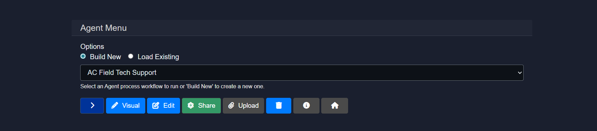
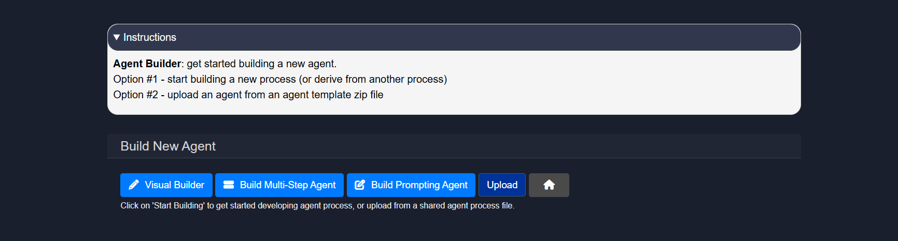
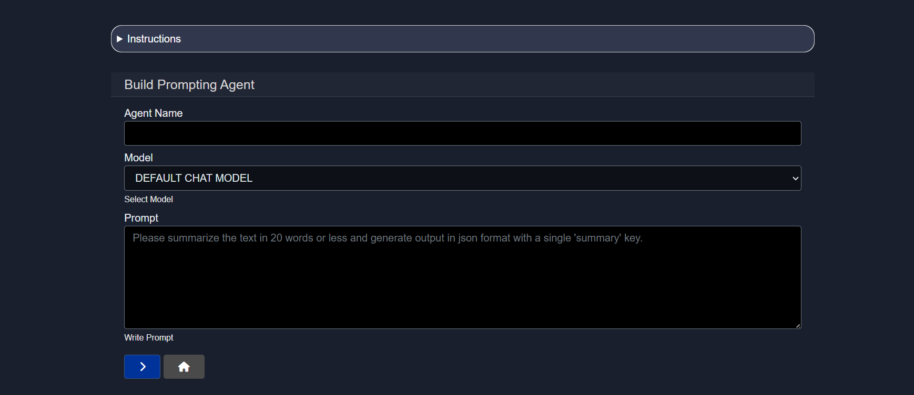

# Creating a new agent in Model HQ
The Agent creation interface in Model HQ provides multiple pathways for building custom workflows that automate document processing, data extraction, question answering, and complex multi-step analysis tasks. Agents can be created from scratch using step-by-step configuration, derived from existing agent templates, built visually using a drag-and-drop node editor, or imported from pre-packaged agent files. Each approach serves different use cases: step-based creation offers precise control over execution logic and service configuration, visual building provides intuitive workflow design through graphical interfaces, and template-based creation accelerates development by leveraging pre-built patterns for common scenarios.

This guide provides a comprehensive walkthrough for creating new agents using the Model HQ platform, covering interface navigation, configuration options, and setup procedures for different agent types. The agent creation interface is essential for translating business requirements into automated, repeatable processes — whether the goal is a simple single-step agent or a complex multi-stage pipeline with branching logic and conditional execution.

The documentation covers three primary agent building approaches: the **Visual Builder** for interactive node-based design, the **Multi-Step Agent** builder for structured sequential workflows, and the **Prompting Agent** builder for conversational AI implementations. Each mode carries distinct advantages depending on the complexity of the workflow, the technical background of the user, and the specific use case requirements. Advanced topics such as service selection, context management, and output configuration are covered in subsequent sections of the agent development documentation series.

## 1. Launching the interface
To begin creating a new agent, the following steps should be performed:

1. The **Main Menu** should be navigated to.
2. The **Agents** section should be selected.
3. The **Build New** option should be clicked to initiate a new agent.

The **>** button can be selected to proceed to the next step.

## 2. Agent builder overview
When the agent creation flow is initiated, two primary options are presented:

- **Option 1** — A new process can be built from scratch, or an existing agent can be used as the starting point by deriving from it.
- **Option 2** — A pre-packaged agent template can be uploaded from a `.zip` file to import a fully configured agent.

The sections below cover Option 1 in detail, walking through each of the available creation modes. When building an agent from scratch or from an existing workflow, three modes are available:

1. Visual Builder
2. Build Multi-Step Agent
3. Build Prompting Agent

## 3.1 Visual builder
The **Visual Builder** provides an interactive drag-and-drop interface for creating agents using a node-and-wire paradigm. This mode is particularly suited for users who prefer visual workflow design over text-based configuration. Nodes representing different services — such as document parsing, RAG retrieval, data extraction, or model inference — can be placed on a canvas and connected to define execution flow and data dependencies. Each node can be individually configured with specific instructions, input contexts, and output mappings through intuitive forms and dropdowns.

The Visual Builder excels at creating complex workflows involving branching logic, conditional execution, and parallel processing paths, as these structures are more readily understood and modified in graphical form. The interface includes support for zooming, panning, rearranging nodes, and validating connections to ensure data flows correctly between steps. Once a visual workflow is complete, it can be executed directly from the builder, exported as a JSON configuration file, or further refined using the step-based editor.

For comprehensive information about the Visual Builder — including detailed walkthroughs of node types, connection rules, configuration options, and best practices for visual workflow design — the [Agent Visual Builder]() documentation should be consulted.

## 3.2 Build multi-step agent
The **Multi-Step Agent** builder creates agents as ordered sequences of services that are executed from start to finish. This mode is well-suited for structured, predictable workflows in which each step has a clearly defined role and passes its output to the next.

**Agent setup: Getting started**

Basic information about the agent should be configured at this stage:

- **Agent name**: A unique, descriptive name should be provided that clearly indicates the agent's purpose — for example, Contract Analyzer, Invoice Processor, or Research Summarizer.

- **Input definition**: The input types that will be provided when the agent is run should be selected. By default, 	ext is defined as MAIN-INPUT. Additional input types — such as User-Document, User-Table, User-Image, or User-Source — can be enabled as required by the workflow.

- **Derive Agent**: The agent can be built from scratch with a blank workflow (the default), or an existing agent can be selected as the base to derive from, inheriting its pre-built logic and structure.

## 3.3 Build prompting agent
The **Prompting Agent** builder is designed for creating conversational AI workflows that centre on natural language interactions and prompt-based model invocations. This mode is the simplest entry point for deploying a language model with custom instructions, making it well-suited for question-answering agents, summarisation assistants, and other single-model interaction patterns.

> [!NOTE]
> The configuration steps for the Prompting Agent — including name, input definition, and starting point — follow the same structure as described in the Multi-Step Agent setup above. For details on subsequent configuration options such as services, controls, and plan, refer to the [Editing Agents]() documentation.

## Conclusion
This document described the agent creation interface in Model HQ and the three primary modes available for building new agents: the Visual Builder, the Multi-Step Agent builder, and the Prompting Agent builder. Each mode provides a different entry point into the agent development process, and the appropriate choice will depend on the complexity of the intended workflow and the preferred working style of the user.

Regardless of the mode selected, the foundational steps remain consistent: a meaningful agent name should be assigned, the correct input types should be defined, and a decision should be made on whether to start from a blank slate or derive from an existing agent. These initial choices shape the structure of the workflow and influence how the agent will be configured and maintained over time.

For next steps, the [Agent Visual Builder]() documentation covers the Visual Builder in detail, and the [Editing Agents]() documentation provides a full reference for all configuration options available after the initial setup — including steps, services, controls, plans, and output settings.
