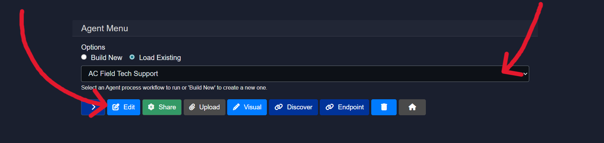
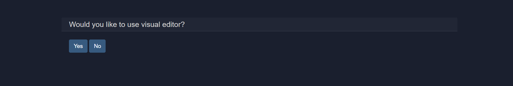
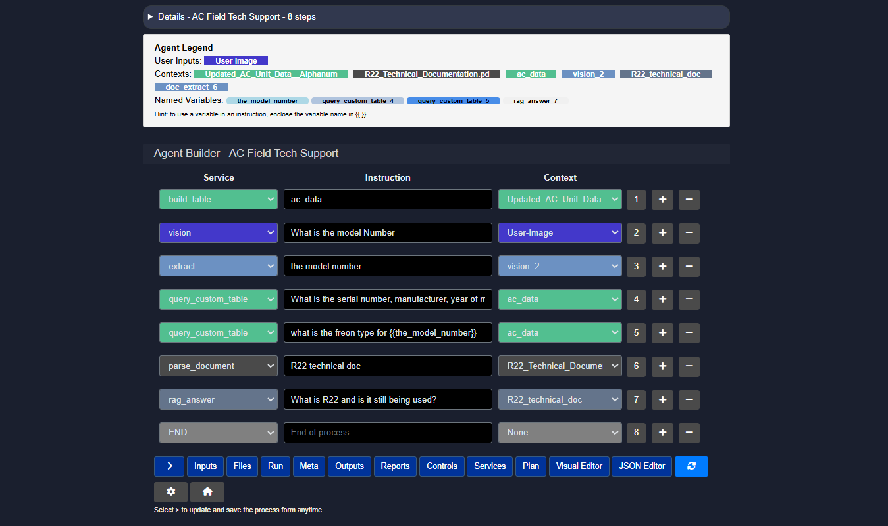
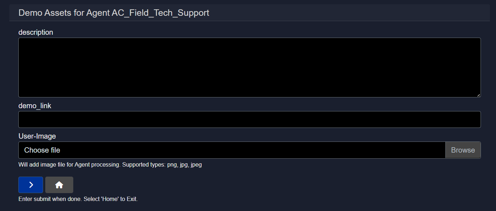
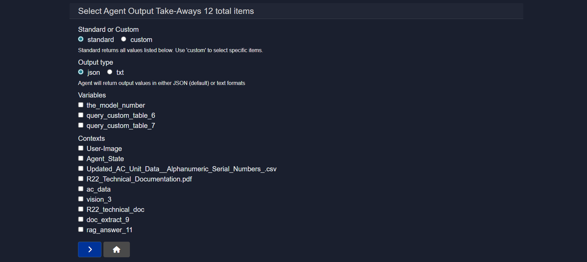
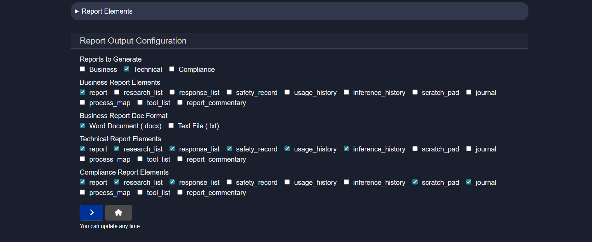
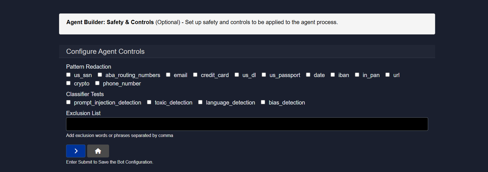
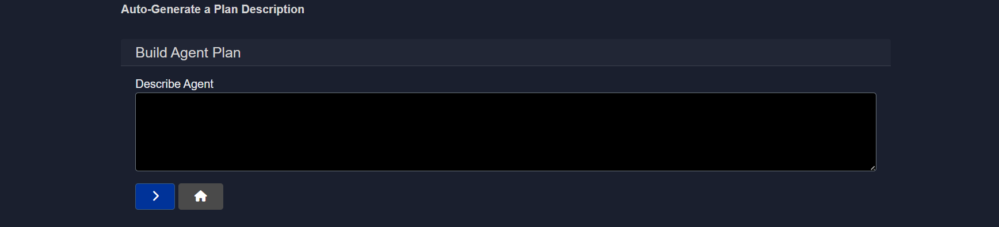
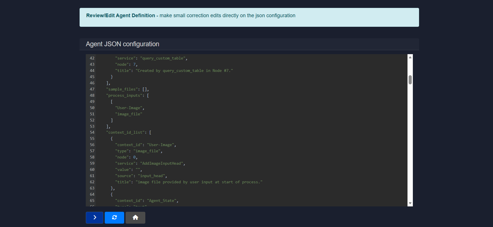

# Editing agents in Model HQ

The **Edit Agent** feature in Model HQ lets you change and improve agents after they’ve been created. You can make simple updates or completely redesign how the workflow works.

You can:

* Add or remove steps
* Change settings (such as models) and inputs
* Update outputs and formats
* Adjust safety rules or filters

This makes it easy to update agents as your needs change, without starting from scratch.

---

There are two ways to edit an agent:

1. **Step-by-step editor**

   * Shows the workflow as a simple list of steps
   * Best for quick changes and precise control

2. **Visual Builder**

   * Shows the workflow as a diagram
   * Best for visual understanding of the workflow

Both views work on the same agent, so you can switch between them anytime.

---

This guide will show you how to:

* Open and use the Edit interface
* Understand key sections like inputs, outputs, and settings
* Use action buttons (like Run, Files, Reports, and Controls)
* Edit workflows using the Visual Builder

Learning how to edit agents is important for keeping them up to date, improving performance, and reusing them for different use cases.

## 1. Launching the edit interface
Editing an existing agent process is straightforward in Model HQ.

The agent to be edited should be selected from the dropdown, and the edit button can be clicked.

Once clicked, an option to use the Visual Builder for editing the agent will be presented.

The Visual Builder shows your agent as a node-and-connection diagram, making it easy to see how steps are linked and how data flows through the workflow.

When you make changes in the Visual Builder, you’ll still review everything in a step-by-step format before saving, so you can clearly confirm the final sequence.

For editing, the step-based editor can be the easiest and fastest option—it makes it simple to add, remove, or adjust individual steps (by adding or deleting rows) without navigating a visual layout.

The choice between the two editing modes is entirely optional. If detailed information about the Visual Builder is required, the [Agent Visual Builder Mode]() documentation should be consulted.

Both editing approaches will be covered in this document. The step-based editor (without Visual Builder) will be explained first.

## 2. Editing an agent (without visual builder)
This section explains how agents can be edited using the step-based editor. An agent is defined as a linear sequence of steps where each step connects a service, an instruction, and a context. Execution always happens sequentially from the first step to END.

### 2.1 Details view
The **Details** view is collapsible by default and provides a high-level, read-only overview of the agent.

The view includes:

* A flowchart visualizing the complete execution path from Start to End
* A numbered list of steps showing the order of execution
* A short description of what each step performs

This view is primarily used to understand the agent flow without modifying it.

### 2.2 Agent legend
The **Agent Legend** appears below the Details view and summarizes all key components used by the agent.

The legend includes:

* **User Inputs** such as text input or image input
* **Contexts** including files, tables, parsed documents, and intermediate outputs
* **Named Variables** created during execution and reused across steps

Named variables must be referenced inside instructions using `{{variable_name}}`.

This section helps track how data moves through the agent.

### 2.3 Editing steps
Each row in the Agent Builder represents a single step. Each step can be deleted by clicking on the "-" in the same row. A step or a row will be created directly **after** the current row by clicking "+" to add a step.

The number next to the context column connotes the numbered order of the agent step. This is helpful when referencing that particular step in the agent process in a future agentic step.

Every step is composed of:

* **Service**
  Selects the capability used in that step. There is an extensive list of supported services. The services displayed in Service Name depends on the selection in the *services* button at the bottom of the Step-Based editor or the side nav of the Visual Editor. User must check the service name in order for that particular service to be displayed as an option.

* **Instruction**
  A natural language instruction describing what the service should do. (note: some services do not require any input and will be denoted as such)
  Instructions may also reference named variables `{{variable_name}}` (i.e., the result of an earlier step in an agent process).

* **Context**
  Defines the input source used by the service.

Steps are always executed from top to bottom in the order shown.

Below is the list of supported services, their expected instruction formats, descriptions, and applicable context sources.

| **Service Name**         | **Instruction**                                                        | **Description**                                                                               | **Context**                                   |
| ------------------------ | ---------------------------------------------------------------------- | --------------------------------------------------------------------------------------------- | --------------------------------------------- |
| **build_table**         | Enter name of table (will be built from the selected input table file) | Create Table from CSV data                                                                    | `User-Table`                                  |
| **query_custom_table** | Enter query for database table                                         | Database lookup in natural language. Requires `build_table` first. Keep table schema in mind. | `Enter_name_of_Table` This table is the result of Build_Table service step.                         |
| **semantic_filter**     | What is your question or instruction?                                  | Filters an existing source based on question/topic to create new filtered source              | `User-Source`                                 |
| **text_filter**         | What is the keyword or topic to filter the source?                     | Filters an existing source based on question/topic                                            | `User-Source`, or a 'filtered' query in the agent process.                 |
| **document_filter**     | Document name                                                          | Filters an existing source by document name                                                   | `User-Source`, or a 'filtered' query in the agent process.                 |
| **table_filter**        | No instruction required                                                | Filters table type content in User Source                                                     | `User-Source`                                 |
| **aggregate_context**   | List the names of source contexts to consolidate. Use space-separated names like: `source_1 source_2 source_3`. Do **not** use curly braces (`{{}}`).        | Consolidates multiple source contexts into one. This is used to merge several sources into a unified context.                                                         | `No input context required`                     |
| **create_context**      | What is your question or instruction?                                  | Answers a question or performs an instruction                                                 | `User-Source`                                 |
| **parse_document**      | Enter name of new document source                                      | Creates a source from document for further document-related processing                        | `User-Document`                               |
| **ocr**      | Enter name of new document source                                      | Creates a source from document for further This is the fall-back step to documents that cannot be parsed using the 'parse_document' step because they are image-based PDFs or security-encrypted PDFs. Create Source from Document - a necessary step for handling Document-related workflows such as RAG or Summary. This service must be applied first, prior to using most User-Document related Services.                         | `User-Document`                               |
| **rag_answer**          | Ask question to longer document input                                  | Answers a question based on a longer document input                                           | `User-Source`, `Provide_instruction_or_query` |
| **report_commentary**   | (Optional) Guidance to Commentary                                      | Generate report and commentary on key process results from the agent state in Word - no input context required                                  | `-`                                           |
| **agent_report**        | Enter title for agent report                                           | Prepares report on agent output                                                               | `-`                                           |
| **wikipedia_search**    | Add Wikipedia Articles as Research Context                             | Adds Wikipedia articles as research context                                                   | `None`                                        |
| **embedded_bot**    | Optional. None required.                             | Pauses the execution of the agent process to allow the user to interact with the current state of the agent in chat format.                                                    | `None`                                        |
| **condition**    | Enter expression to evaluate in 'if_true' or 'if_false' format                             | Evaluates the truth value of a condition, which can then be used as a variable in any other process step such that the step will only execute if it meets the selected condition                                                   | `None`                                        |
| **web_search**    | Add query for a topic or a question                              | Runs websearches returning a summary text as a source and an indexed set of text chunks - needs SERP API or Tavily API                                                   | `None`                                        |
| **speech_gen**    | Enter a topic or short input to convert to speech file                              | Using a short text input, generates an audio voice wav file based on the input text. (Experimental)                                                   | `None`                                        |
| **image_gen**    | Enter a topic or description to convert to an image                              | Creates an image using the description or instruction provided by the user                                                   | `None`                                        |
| **website_scrapper**    | Enter the full website url                             | Scrapes the website in question (some websites are protected against automatic scraping and does not work for all websites) to extract content for a downstream question in the agent process                                                   | `None`                                        |
| **send_email**    | Enter the email address of the receiver                              | Automatically sends an email (Gmail only with credentials provided in Configuration/Credentials)                                                   | `Select context of the email`                                        |
| **connect_library**     | Enter library name                                                     | Connects to Semantic Library from Model HQ API                                                | `-`                                           |
| **query_library**       | Enter query for semantic library                                       | Queries connected semantic library                                                            | `Enter_Library-name`                          |
| **get_stock_summary**  | Enter stock ticker                                                     | Stock lookup using YFinance                                                                   | `None`                                        |
| **vision**               | Enter question to image file                                           | Provides answer/description from image                                                        | `User-Image`                                  |
| **vision_batch**               | Enter question to batch of image files                                           | Takes a collection of user images as an input context, along with a text input of a question or instruction. Returns text output context with the answer based on the set of images.                                                         | `User-Document`                                  |
| **parse_batch**               | Enter question to batch of documents files that have been parsed                                           | Takes a collection of document files as an input context, and will return a set of text chunks, indexed and packaged as a source, which can then be used as input to a number of other services                                                        | `User-Document`                                  |
| **sentiment**            | No instruction required                                                | Analyzes sentiment (positive/negative/neutral)                                                | `MAIN-INPUT`, `User-Text`                     |
| **boolean**              | Provide yes/no question                                                | Provides yes/no answer with explanation                                                       | `MAIN-INPUT`, `User-Text`                     |
| **emotions**             | No instruction required                                                | Analyzes primary emotion in input                                                             | `MAIN-INPUT`, `User-Text`                     |
| **topics**               | No instruction required                                                | Classifies topic of input                                                                     | `MAIN-INPUT`, `User-Text`                     |
| **tags**                 | No instruction required                                                | Generates tags from input                                                                     | `MAIN-INPUT`, `User-Text`                     |
| **intent**               | No instruction required                                                | Classifies intent of input                                                                    | `MAIN-INPUT`, `User-Text`                     |
| **ratings**              | No instruction required                                                | Rates positivity from 1 to 5                                                                  | `MAIN-INPUT`, `User-Text`                     |
| **ner**                  | No instruction required                                                | Identifies named entities (people, places, organizations)                                     | `MAIN-INPUT`, `User-Text`                     |
| **xsum**                 | No instruction required                                                | Generates extreme summary or headline                                                         | `MAIN-INPUT`, `User-Text`                     |
| **summary**              | Optional - add input instructions to focus the summarization           | Summarizes source content                                                                     | `MAIN-INPUT`, `User-Text`                     |
| **category**             | No instruction required                                                | Analyzes category of the input passage                                                        | `MAIN-INPUT`, `User-Text`                     |
| **q_gen**               | No instruction required                                                | Generates question from passage                                                               | `MAIN-INPUT`, `User-Text`                     |
| **chat**                 | What is your question or instruction?                                  | Answers a question or performs instruction                                                    | `MAIN-INPUT`, `User-Text`, `None`             |
| **extract**              | Enter extraction key, e.g., 'customer name'                            | Extracts key-value pair                                                                       | `MAIN-INPUT`, `User-Text`                     |
| **extract_tiny**        | Enter extraction key, e.g., 'customer name'                            | Extracts key-value pair (tiny version)                                                        | `MAIN-INPUT`, `User-Text`                     |
| **answer**               | What is your question?                                                 | Answers specific question from passage                                                        | `MAIN-INPUT`, `User-Text`                     |
| **extract_table**       | Enter query to filter among available tables                           | Extracts table from document                                                                  | `User-Document`                               |
| **END**                  | End of process                                                         | Marks the end of agent process                                                                | `None`                                        |
| **openai_chat**                  | Enter input question or instruction                                                         | Chat agent calls OpenAI (requires separate API key in Configuration/Credentials) with an optional text input context. The output provides a context passage that can be used by other services                                                                | `Main Input or other Text Source`                                        |
| **openai_rag**                  | Enter input question or instruction                                                         | Calls OpenAI (requires separate API key in Configuration/Credentials) with a RAG question. The output provides a context passage that can be used by other services                                                                | `Main Input or other Text Source`                                        |
| **openai_rag_batch**                  | Enter input question or instruction                                                         | Calls OpenAI (requires separate API key in Configuration/Credentials) with a batch of document sources and generates a response based on the input instruction/question. The output provides a context passage that can be used by other services                                                                | `Main Input or other Text Source`                                        |
| **anthropic_chat**                  | Enter input question or instruction                                                         | Chat agent calls Anthropic (requires separate API key in Configuration/Credentials) with an optional text input context. The output provides a context passage that can be used by other services                                                                | `Main Input or other Text Source`                                        |

### 2.4 Example: AC field tech support agent
The example below demonstrates an **AC Field Tech Support** agent configured with **8 sequential steps**.

#### 2.4.1 Step-based execution flow
The agent executes steps from top to bottom. Each step can produce outputs that are reused in later steps using named variables.

Execution order in this example:

* Build structured data from CSV
* Read information from an image
* Extract a specific value
* Query structured data
* Query structured data again using a variable
* Parse a technical document
* Answer a question using retrieved context
* End the process

#### 2.4.2 Steps explained (high level)
**Step 1: build_table**
Creates a structured table from CSV data so it can be queried later.

**Step 2: vision**
Answers a question based on an uploaded image.
This step is used to identify the AC model number from an image.

**Step 3: extract**
Extracts a key value from the previous step output.
The extracted value is stored as a named variable.

**Step 4: query_custom_table**
Queries structured AC data using natural language.

**Step 5: query_custom_table**
Performs another query using a variable produced in Step 3.

**Step 6: parse_document**
Creates a searchable source from a technical document.

**Step 7: rag_answer**
Answers a question using the parsed document as context.

**Step 8: END**
Marks completion of the agent execution.

### 2.5 Action buttons
The Action Buttons provide quick access to configure inputs, manage files, execute the agent, inspect metadata, review outputs, and control the overall agent lifecycle. Each button opens a focused view related to a specific stage of the agent workflow.

#### 2.5.1 Inputs
The **Inputs** button can be used to configure or update the user inputs required to run the agent.

Supported input types:

* `MAIN-INPUT` – primary text input
* `User-Document` – documents in various formats
* `User-Image` – image files such as PNG or JPG
* `User-Table` – structured data like CSV or JSON
* `User-Source` – a collection of multiple files treated as one source
* `User-Text` – short text snippets
* `None` – no user input required

Selecting the correct inputs is critical. The user must provide values for all selected input types when running the agent. By default, `MAIN-INPUT (text)` is enabled.

Input-specific notes:

* **MAIN-INPUT (text)**
  Free-form text can be pasted into a text field. The current limit is 5000 characters, roughly two pages of text.

* **User-Document**
  Used for larger documents. These must be processed first using the `parse_document` service before being used by downstream services such as `rag_answer`, `semantic_filter`, or `create_context`.

* **User-Table**
  Accepts CSV or JSON files. Tables must first be processed with the `build_table` service to extract data and store it in a local SQL table. Once built, the table can be queried using `query_custom_table`.

  Typical flow:

  1. Upload table
  2. Run `build_table`
  3. Query using `query_custom_table`

* **User-Image**
  Image files such as PNG or JPEG. Images must first be processed with the `vision` service, which converts visual content into text-based output that can be reused by later steps.

* **User-Text**
  Optional secondary context provided by the user.

* **User-Source**
  Allows users to upload multiple files as a single object. Parsing, table building, and vision processing are handled automatically. For best results, it is recommended to apply `semantic_filter` and `create_context` early in the workflow.

#### 2.5.2 Files
The **Files** section is used to upload, manage, and associate assets with the agent.

Capabilities include:

* Uploading documents, images, tables, datasets, or zipped sources
* Assigning file types such as document, image, dataset, table, or source
* Reusing existing datasets or sources already available in the workspace

Uploaded files become available as contexts that can be selected by agent services such as `parse_document`, `build_table`, or `vision`. Multiple files can be added before saving and exiting.

#### 2.5.3 Run
The **Run** action executes a test run of the agent using the currently configured inputs, files, and workflow.

During execution:

* Nodes are executed sequentially from top to bottom
* Intermediate outputs are generated and stored as named variables
* Any configuration or logic issues surface immediately during the run

This mode is primarily used for validation, debugging, and iteration before publishing or sharing the agent.

#### 2.5.4 Meta
The **Meta** section allows descriptive and presentation-related information for the agent to be defined.

This typically includes:

* A short description of what the agent does
* Optional demo links
* A user-facing image associated with the agent

Meta information does not affect execution but is used for documentation, discovery, and presentation.

#### 2.5.5 Outputs
The **Outputs** section controls what the agent returns after execution.

Options include:

* Standard or custom output selection
* JSON or text-based output formats
* Selecting specific variables, contexts, or intermediate results to expose

This allows fine-grained control over what consumers of the agent actually receive, rather than returning all internal state by default.

#### 2.5.6 Reports
The **Reports** section controls how agent execution results are packaged into structured, downloadable documents for different audiences such as business users, engineers, or compliance reviewers.

One or more report types can be generated simultaneously:

* **Business** – high-level summaries focused on outcomes and insights
* **Technical** – detailed execution logs and system behavior for debugging
* **Compliance** – safety, audit, and governance records

Each report type allows selection of which elements should be included:

* `report` – final results or conclusions
* `research_list` – sources or references used during execution
* `response_list` – responses generated by each node or step
* `safety_record` – redactions, filters, and control actions applied
* `usage_history` – token usage, runtime, and performance statistics
* `inference_history` – model calls and inference details
* `scratch_pad` – shared state and intermediate variables
* `journal` – chronological execution log
* `process_map` – visual representation of the workflow
* `tool_list` – tools and services used
* `report_commentary` – optional notes or annotations

Output formats:

* **Word (.docx)** – formatted and presentation-ready
* **Text (.txt)** – plain logs or lightweight exports

Reports can be regenerated at any time after a run.

#### 2.5.7 Controls
The **Controls** section applies safety, privacy, and content protections automatically during agent execution. These safeguards help prevent sensitive data exposure, unsafe outputs, and malicious inputs without requiring changes to the workflow itself.

**Pattern redaction**
Sensitive data is automatically detected and masked before it is processed.

Supported patterns include:

* SSN
* ABA routing numbers
* Email
* Credit card
* Driver’s license
* Passport
* Dates
* IBAN
* PAN
* URLs
* Crypto addresses
* Phone numbers

Detected values are redacted or replaced automatically.

**Classifier tests**
Automated content checks are applied:

* `prompt_injection_detection` – blocks malicious or manipulative prompts
* `toxic_detection` – flags unsafe or harmful language
* `language_detection` – identifies the language of the input
* `bias_detection` – detects potentially biased or sensitive content

**Exclusion list**
Custom words or phrases (comma-separated) can be specified to be blocked or ignored during execution.

#### 2.5.8 Services
The **Services** section is the service catalog for the agent. It determines which capabilities are available when building workflows. Only enabled services can be added as nodes.

**Core services**
General building blocks for common tasks such as chat, retrieval, extraction, and logic control.

Examples:

* `chat` – conversational responses
* `rag_answer` – retrieval-augmented answers
* `vision` – image understanding
* `ocr` – text extraction from images
* `web_search` – online search retrieval
* `extract` – structured field extraction
* `answer` – direct question answering
* `prompt_builder` – dynamic prompt creation
* `agent_report` – report generation
* `embedded_bot` – embedded execution
* `condition` – branching logic
* `boolean` – rule evaluation

**Classifiers**
Lightweight text analysis tools for labeling or scoring content.

* sentiment – positive/negative tone detection
* emotions – emotional classification
* topics – topic categorization
* tags – keyword tagging
* intent – intent recognition
* ratings – scoring or grading
* ner – named entity recognition
* summary – concise text summaries
* category – predefined grouping
* q_gen – question generation

**Datasets**
Tools for preparing, querying, and analyzing structured data.

* build_dataset – create datasets from raw files
* dataset_query – run queries on datasets
* dataset_filter – filter rows or records
* dataset_plot – visualize data
* dataset_stat – compute statistics
* load_dataset – load saved datasets
* ml_predict – run ML predictions
* stats_analyze – perform analysis
* create_json – export structured JSON

**Specialized services**
Advanced utilities for targeted or complex workflows.

* semantic_filter – meaning-based filtering
* text_filter – rule-based text filtering
* document_filter – document-level filtering
* table_filter – structured table filtering
* transformer – text transformation tasks
* parse_document – convert documents to text
* create_context – build reusable context blocks
* report_commentary – add report notes
* speech_gen – generate audio output
* image_gen – generate images
* website_scraper – extract web content
* extract_table – extract tables from documents

**Integrations**
Connect the agent to external systems or hosted models.

Examples include storage services, email, and external model providers.

**Custom services**
Workspace-specific or user-defined services added for specialized use cases.

#### 2.5.9 Plan
The **Plan** section allows the agent's intended behavior to be described using plain language. The system uses this description to automatically suggest or generate an ordered workflow.

This helps:

* Quickly scaffold new agents
* Validate logic before building nodes
* Document intended behavior
* Speed up initial setup

The description acts as a high-level specification of the agent's goal and execution steps.

#### 2.5.10 Visual editor
The **Visual Editor** opens the drag-and-drop canvas used to build and edit the agent workflow.

This interface opens the visual builder, where you can:

* Nodes can be added, connected, and reordered
* Services and inputs can be configured
* Execution flow can be visually inspected

#### 2.5.11 JSON editor
The **JSON Editor** displays the complete agent configuration in raw JSON format.

This view shows the full structure of the agent, including services, nodes, inputs, contexts, and execution settings, allowing precise inspection and modification of how the workflow is defined.

Common sections include:

* `service` – service assigned to each node
* `node` – execution order
* `process_inputs` – required user inputs
* `context_id_list` – data passed between steps
* `sample_files` – example inputs
* configuration metadata

Changes made in this editor directly update the agent configuration.

## 3. Editing an agent (with visual builder)
The Visual Builder allows agents to be edited using a point-and-click, drag-and-drop interface. This makes it easy to understand, modify, and extend agent logic without writing code.

### 3.1 Builder overview
The canvas represents the full execution flow of an agent, from input to final output. Each block is a node, and connections define how data moves between steps.

Up to **Transformers**, all components are fully visual and configurable directly in the builder. The remaining options are covered in detail in the dedicated Visual Builder documentation.

### 3.2 Left panel (node types)
The left sidebar contains the core building blocks that can be dragged onto the canvas:

* **Input**
  Defines how data enters the agent (for example text, image, or file input).

* **Node**
  General-purpose processing steps that pass data forward.

* **Classifier**
  Routes execution based on intent or classification logic.

* **Bot**
  Handles LLM-powered reasoning or responses.

* **Condition**
  Adds branching logic based on rules or outputs.

* **Transformer**
  Transforms or enriches data before it moves to the next step.

### 3.3 Canvas controls
On the canvas, the following actions can be performed:

* Nodes can be dragged to reposition them
* Nodes can be connected to define execution flow
* Nodes can be selected to edit their instructions and configuration

### 3.4 Zoom and utility actions
The bottom-left controls allow the following operations:

* Zoom in
* Zoom out
* Clear the canvas

### 3.5 Action buttons
Below the utility buttons, quick access to key actions is provided:

* **Download Agent**
  Downloads the agent definition as a JSON file. This file can later be uploaded to instantly recreate the agent.

* **Run**
  Executes the agent with the current configuration.

* **Home**
  Returns to the main dashboard.

Additional information about the Visual Builder can be found in the [Agent Visual Builder]() documentation.

## Conclusion
This document provided comprehensive guidance on editing agents in Model HQ using both the step-based editor and the Visual Builder interface. The Edit Agent functionality enables existing workflows to be refined, extended, and optimized by modifying services, adjusting execution order, configuring inputs and outputs, and applying safety controls. The step-based editor offers precise control over linear agent workflows through a structured interface where services, instructions, and contexts can be configured for each execution step. The Visual Builder provides an intuitive drag-and-drop canvas for visualizing complex workflows, making structural changes, and understanding data flow through node-and-wire representations.

Key editing capabilities include configuring input types (text, documents, images, tables, sources), managing files and assets, executing test runs for validation, defining metadata and presentation elements, controlling output formats, generating structured reports for different audiences, and applying automated safety controls such as pattern redaction and content classification. The Services catalog determines which capabilities are available within the agent, ranging from core services like chat and RAG to specialized utilities for web scraping, image generation, and email automation. Advanced features such as the Plan section enable natural language descriptions to be used for workflow generation, while the JSON Editor provides direct access to the underlying agent configuration for precise modifications.

Understanding the Edit Agent interface is essential for maintaining production agents, adapting workflows to changing requirements, implementing safety and compliance controls, and building reusable agent templates that can be customized for specific deployment scenarios. The flexibility to switch between step-based and visual editing modes ensures that both quick targeted edits and complex structural changes can be performed efficiently, making Model HQ a powerful platform for iterative agent development and continuous workflow optimization.
