# Exploring Bots in Model HQ
After completing the initial setup, users will be directed to the **Main Menu**. This document describes the Bots feature, which allows users to create custom Chat and RAG bots for either AI PC/edge device use cases (for either standalone or bots to be incorporated into an agent workflow) or via API deployment (Model HQ API Server Biz Bot).

## 1. Launching the bots interface
The Bots interface can be accessed by clicking the **Bots** button from the main menu.

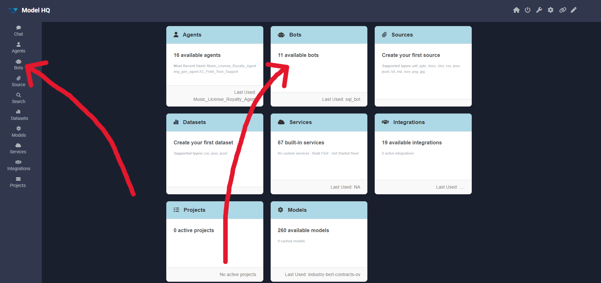

## 2. Bots interface overview
After selecting Bots, an interface similar to the one shown below will be presented.

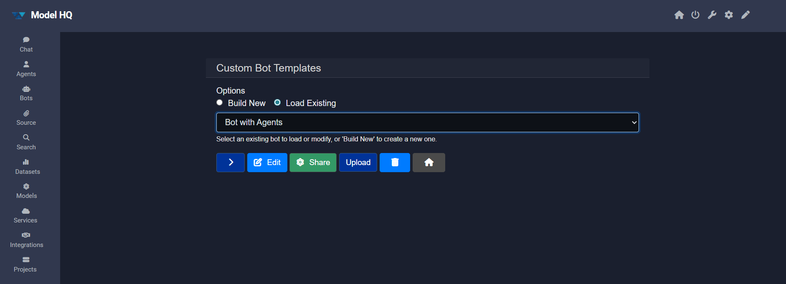

The interface provides multiple control options. The following subsections describe each control and recommended usage.

Available options:
1. Options — choose whether to create a new bot or load an existing one.
   - Build new: Create a new bot from scratch.
   - Load Existing: Load a previously created or existing bot.
2. Next or `>` — proceed to the next step.
3. Edit — modify an existing bot configuration.
4. Share — export and share bot configurations.
5. Upload — import a bot from a shared file.
6. Delete — remove a bot from the interface.

> [!NOTE]
> By default, the **Load Existing** option is selected, which allows pre-existing bots to be run immediately.

### 2.1 Building a new bot
To build a bot, `build new` can be selected and then the `>` button clicked.

For detailed instructions, see [Building a Bot](https://github.com/BloksAdmin/model-hq-docs/blob/master/v1/bots/buildBot).

### 2.2 Loading an existing bot
To load an existing bot, `load existing` can be selected (if not already selected) and then the `>` button clicked.

#### 2.2.1 **Launching Bot: Demo Bot Example**
Once the bot is selected, user is able to get a description of the Bot as well as other details such as whether a source such as a document is appended to the bot for queries. In this example, the bot has an example Employment Agreement that is attached so the user can query the document by accessing it as a source.

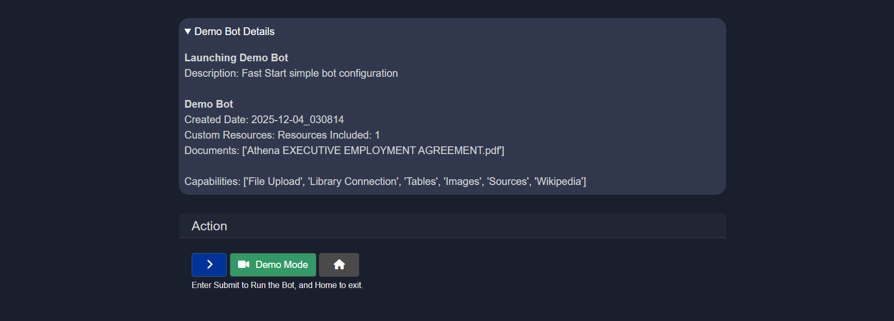

#### 2.2.2 **Demo Mode**
Bots that have been created with a demo will be able to be pre-viewed with a Demo Mode. In the Demo Bot example, when the user selects Demo Mode, the Demo Bot will automatically launch the conversation turns that the creator pre-set, as shown in the Description section. In addition, if there is a YouTube video of the bot in action or a related tutorial by LLMWare, the Video section will link to the specific video.

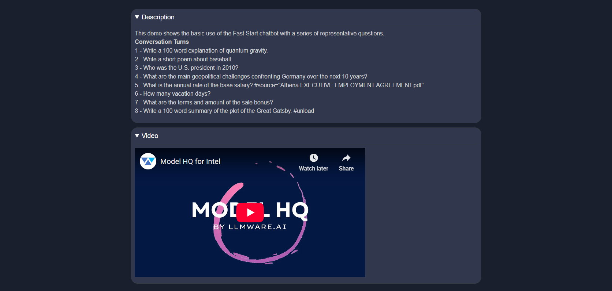

#### 2.2.3 **Bot with Agents**
Users have the ability to incorporate agents into custom bots. To add pre-created agents into a bot, select a bot, then "Agents".

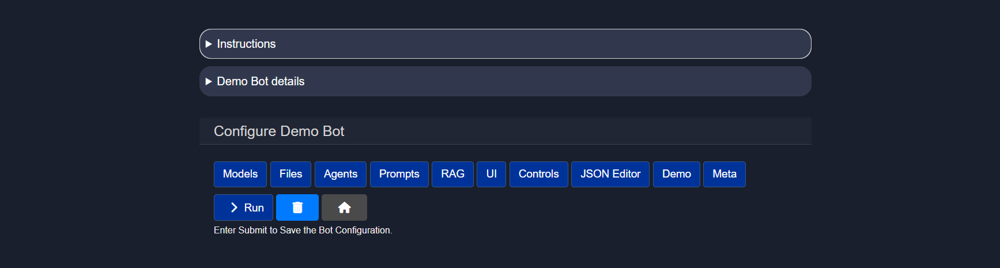

Once "Agents" is selected, the user will have the option to pick the agents they would like incorporated into the bot (note: the following is an example only and the agent list will vary depending on the user's agents).

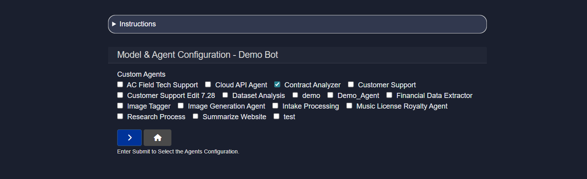

The User will select ONE root agent as shown below. The ROOT AGENT is the only agent that will have access to all of the other information in the chat and also with any other agents in the bot so that this agent can consolidate or have a holistic view of the interactions that took place amongst other agents in this bot interaction.

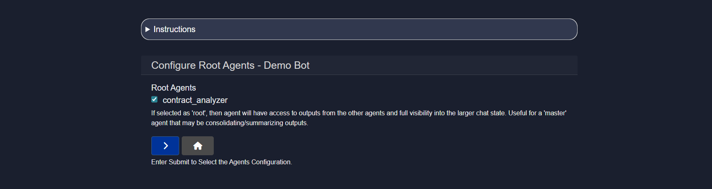

Once incorporated, the user may select the Agent now shown below the chat box and run the agent.

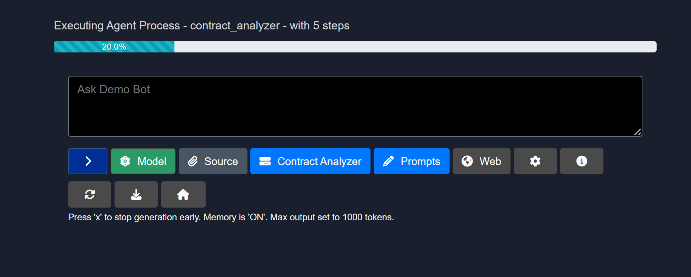

> [!IMPORTANT]
> If the model used in the bot is not pre-downloaded, it will be downloaded automatically. This typically takes 1-2 minutes depending on internet connectivity.

### 2.3 Edit
The Edit control allows existing bots to be modified. The editing process for a bot is the same as creating a new bot.

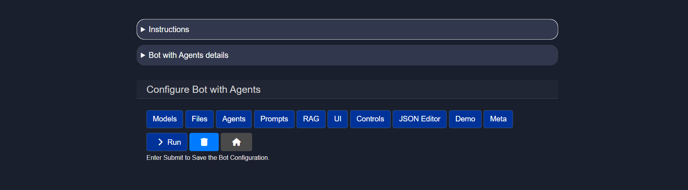

For a complete editing overview, see [Editing a Bot](https://github.com/BloksAdmin/model-hq-docs/blob/master/v1/bots/editBot).

### 2.4 Share
The Share control allows bots to be exported and shared with others. When the Share button is clicked, a downloadable zip file will be created. The bot configuration can then be imported by others using the Upload feature.

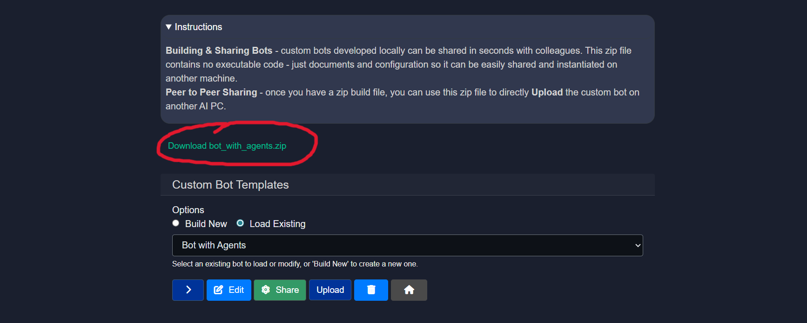

### 2.5 Upload
The Upload control allows bots to be imported from a zip file that is shared by another Model HQ user via email or other method of sharing files. The zip file should be one that was previously shared using the Share feature.

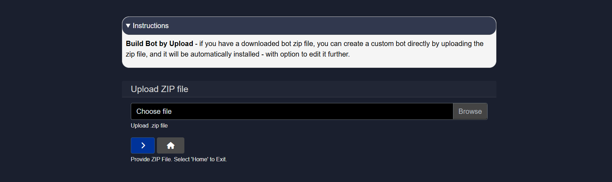

## Conclusion
This section is designed to give users a high-level overview of the Bots section of Model HQ. Please see our documentation for Building and Editing Bots for more information.
