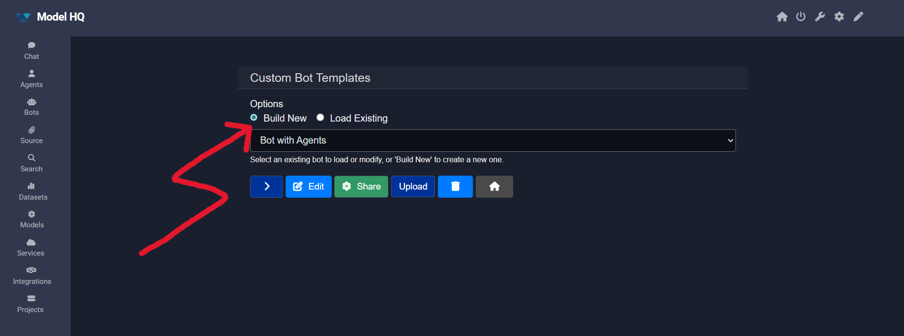
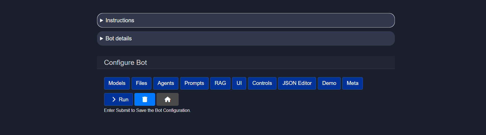
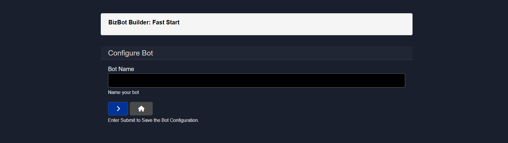
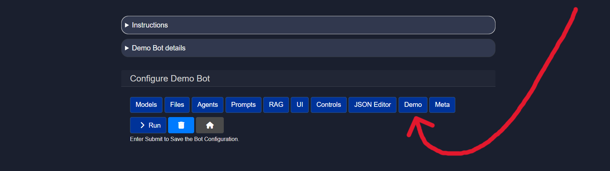
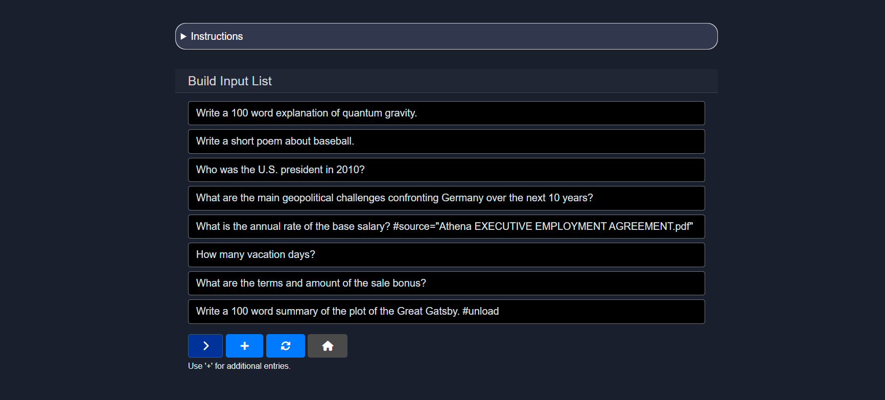

# Building a custom bot
This document describes the process of creating a custom bot in Model HQ that can be used as a standalone bot or to be used as part of an agent workflow.

## 1. Building a custom bot
To build a bot, the **build new** option can be selected from the bots interface, followed by clicking the `>` button.



## 2. Configuring a custom bot
After selecting build new, an interface with multiple configuration options will be presented. The options provided here are the same as those used when editing an existing bot.



All configuration options are detailed in [Editing a Bot](https://github.com/BloksAdmin/model-hq-docs/tree/master/v1/bots/editBot.md).

At this point, the User should select the Model they would like to use with this custom bot. When any configuration option is selected for the first time, a prompt to name the bot will be displayed. User should name the bot, and follow instructions set out in [Editing a Bot](https://github.com/BloksAdmin/model-hq-docs/tree/master/v1/bots/editBot.md).



### Instructions to build a custom bot
Bot Builder enables the design of custom bot interaction applications. Please see for detailed directions [Editing a Bot](https://github.com/BloksAdmin/model-hq-docs/tree/master/v1/bots/editBot.md):
1. **Models** — configure models and generation parameters.
2. **Files** — attach dedicated file resources (e.g., Documents, Images, Tables).
3. **RAG** — configure available information sources.
4. **UI Customization** (Optional).
5. **Safety & Controls** (Optional).

When configuration is complete, the bot template can be run locally, exported, or shared.

### Instructions to add a Demo feature to a custom bot
The user is able to create a short demo with the custom bot so that the when the bot is shared with others, it is easy to show and demo. To create a demo, when creating a new bot, once the bot has been named and the model selected, select "Demo."



Once the Demo button is selected, the bot creator will be asked to build an input list. This is the list of queries or prompts the bot will automatically run in Demo Mode to showcase its capabilities. To add each prompt, select the "+" button, and type in each row the specific prompt for the demo, as shown below, and press ">" when finished.



The next screen will ask for a short demo description and a video link to share if any. Press ">" when finished. Once complete, when this bot is selected, the user will be given Demo Mode as an option. 

If the user selects the Demo Mode when accessing the bot, the bot will automatically run through the prompts as shown [here](https://github.com/BloksAdmin/model-hq-docs/tree/master/model-hq-markdown-docs/v1/bots/botsOverciew.md#222-demo-mode).

### Checking Bot's JSON Schema

<details><summary>The bot's JSON schema can be found by selecting the "JSON Editor" button once a bot is selected. An example of a bot is</summary>

```
{
  "name": "",
  "display_name": "",
  "model_name": "",
  "execution_mode": "Local",
  "user_select_model": "User Selects Model",
  "description": "",
  "agent_list": [],
  "root_agents": [],
  "max_output": 1000,
  "temperature": 0.0,
  "sample": false,
  "text_chunk_size": 600,
  "wiki_article_count": 3,
  "library_search_results": 20,
  "context_top_n": 5,
  "context_target_size": 1100,
  "supporting_models": [
    "vision_model",
    "sql_model",
    "ranker_model"
  ],
  "vision_model": "qwen2-vl-2b-instruct-ov",
  "sql_model": "slim-sql-ov",
  "ranker_model": "jina-reranker-v1-tiny-en-ov",
  "local_exec": true,
  "connected_library": [],
  "connection_types": [
    "File Upload",
    "Library Connection",
    "Tables",
    "Images",
    "Sources",
    "Wikipedia",
    "Tavily",
    "Serp API",
    "NewsAPI.org",
    "Finnhub.io",
    "AWS S3 Buckets",
    "Azure Blob Storage",
    "OneDrive"
  ],
  "source_name": "",
  "api_exec": false,
  "api_endpoint": {},
  "web_search": null,
  "web_search_config": null,
  "patterns": [],
  "classifiers": [],
  "write_to_db": null,
  "model_repo": "Azure",
  "allow_download_chat_history": true,
  "allow_generation_config": true,
  "show_explanation": true,
  "show_prompts": true,
  "show_web_search": true,
  "show_bot_config": true,
  "single_app_mode": false,
  "model_size": "small",
  "files": [],
  "install_bot_files": [],
  "ui_configs": {
    "theme": "dark",
    "title": "Model HQ",
    "app_title": "Model HQ",
    "company_name": "LLMWare",
    "company_url": "https://www.llmware.ai",
    "icon_image": "llmware_logo_color_icon_square_48x48.ico",
    "header_color": "#31384E",
    "footer_color": "#31384E",
    "main_color": "#1A1F2E",
    "header_text_color": "#ffffff",
    "footer_text_color": "#ffffff",
    "main_icon": "256x256_strict_edges.png"
  },
  "last_modified": "",
  "created": "",
  "author": "",
  "bot_table_files": [],
  "bot_image_files": [],
  "bot_document_files": [],
  "bot_source_files": [],
  "bot_dataset_files": [],
  "rag_compare_instruction": "Here are several sources - please use as the basis for answering questions, and cite the specific source, if used, in generating your answer.\n",
  "rag_aggregate_instruction": "",
  "system_instruction": "",
  "use_wikipedia": true,
  "show_search_and_context": true,
  "table_only_mode": false,
  "parse_pdf_by_ocr": false,
  "parse_pdf_by_vision": false,
  "include_source_info": false,
  "interpret_csv_as_table": false,
  "apply_memory": false,
  "memory_role": "both",
  "memory_rule": "max",
  "integrations": [],
  "prompt_list": [],
  "max_turns": -1,
  "demo_inputs": [],
  "demo_video": "",
  "demo_description": "",
  "chat_history": [],
  "preload_active_source": ""
}
```
</details>

The JSON schema reflects the Bot's configurations and specifications, and can also be modified directly here.

## Hands on: Create a Custom Bot with Us
Jump into this quick, hands-on tutorial and create your very first custom bot—no long setup, just results.

[Create Your Custom Bot Now](link to cookbook here)

## Conclusion
Building a custom bot in Model HQ provides a flexible and powerful way to create specialized AI applications tailored to your specific needs. By configuring models, attaching relevant files, setting up RAG connections, and customizing the UI, you can create bots that serve as standalone applications or integrate seamlessly into larger agent workflows. Whether you're building a simple Q&A bot or a complex multi-source information assistant, the Bot Builder interface gives you the control and customization options needed to bring your vision to life. Once configured, your custom bot can be tested locally, exported for deployment, or shared with your team—making it easy to iterate and scale your AI solutions.
