# Editing a bot
This document describes how to configure and edit bots in Model HQ.

> [!IMPORTANT]
> The configuration process is the same for both existing bots and creating new bots.

## 1. Configuring a bot
Although configuration is identical for both scenarios, since the process for [building a new bot](https://github.com/BloksAdmin/model-hq-docs/tree/master/v1/bots/buildBot.md) has already been covered, this section focuses on editing an existing bot.

The Edit button can be clicked to begin editing the bot selected in the dropdown.


The main configuration options are:
- Models
- Files
- Agents
- RAG

Other optional options:
- Prompts
- UI
- Controls

Additional options:
- JSON Editor
- Demo
- Meta
- Run
- Delete

Each option is described in detail in the following subsections.

### 1.1 Models
This is one of the most important configuration panels when building or customizing a bot.

The **Models** panel allows models to be selected from the catalog and various related configurations to be specified. Chat models, re-ranker models, vision models, and SQL models can be selected. Available options are displayed based on the selected model size.

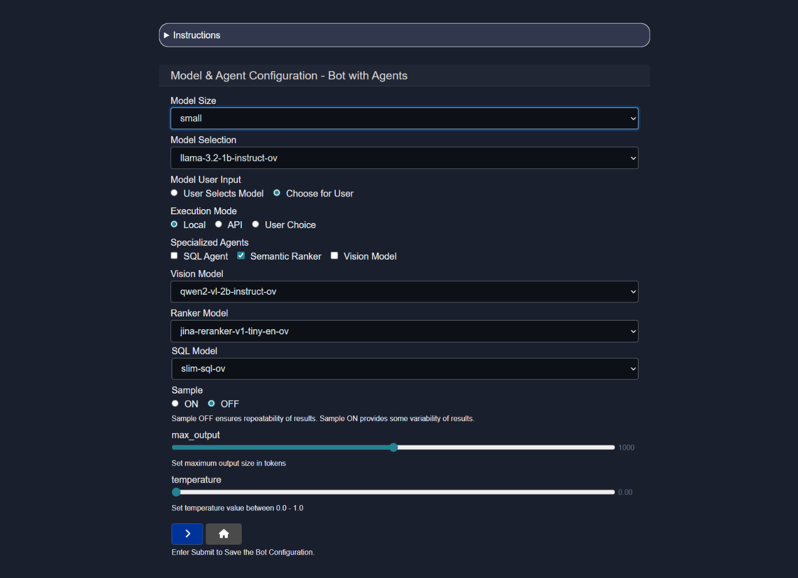

- **Model Size and Model Selection**
  When Model Size is selected (choices are Small, Medium, or Large), the corresponding models will be displayed in the Model Selection dropdown.

- **Model User Input**
  This setting allows developers to specify whether end users will be permitted to select the model or whether they will use a preselected model from the configuration screen.

  Options:
    - `User Selects Model` — permits users to select a model.
    - `Choose for User` — provides users with a preselected model.

- **Execution Mode**
  Specifies whether the model will be run locally, via an API, or whether the user will have the option to choose between the two modes.

- **Specialized Model Capabilities**
  Chatbots can ingest tables, `.csv` files, images, and documents for text-to-SQL capabilities, document searching (RAG), or image processing (Vision). Developers can indicate whether one or more of these three capabilities will be permitted within the chatbot and make a model selection.

  The **execution mode** and **generation settings** can also be configured by specifying:
    - whether the Sampling capability is ON or OFF
    - the max output token limit
    - the temperature setting.

- **Sampling**
  Sampling in AI model inferencing is the process of selecting possible output values (such as words or tokens) from a probability distribution generated by the model, often to introduce variability or control randomness in the response. Sample OFF ensures repeatability of results, whereas Sample ON provides more variability in responses. Where the user is working with business data or retrieval of information, it is recommending to turn Sampling OFF. If the user wants to use the Bot for more creative works such as story writing, Sampling can be turned ON.

- **Max Output**
  Determines the maximum length of the model's response.

- **Temperature**
  Temperature controls the randomness of the model's output; higher values produce more diverse and creative responses, while lower values yield more focused and deterministic results.

If no selection is made, default options will be chosen based on the best models available for the selected size.

Once configuration is complete, the `>` button can be clicked to save changes.

### 1.2 Files
The Files feature allows the user to attach one or more specific files for use by the custom bot that will be appended to the bot when used later or when shared with others. This is useful for example if there is a specific technical documentation that the bot should query in its interaction, as an example. Using this feature will allow the user to specifically append one or more document, image, dataset, table, source (a collection of documents or information) or a dataset that the user has already created to be used by the bot in its interactions.

After selecting Files, you’ll be prompted to attach files that will act as sources for the bot. After attaching a file, select its type from the radio options. Supported types include: `.pdf`, `.pptx`, `.docx`, `.xlsx`, `.csv`, `.txt`, `.md`, `.wav`, `.png`, `.jpg`, `.zip`.

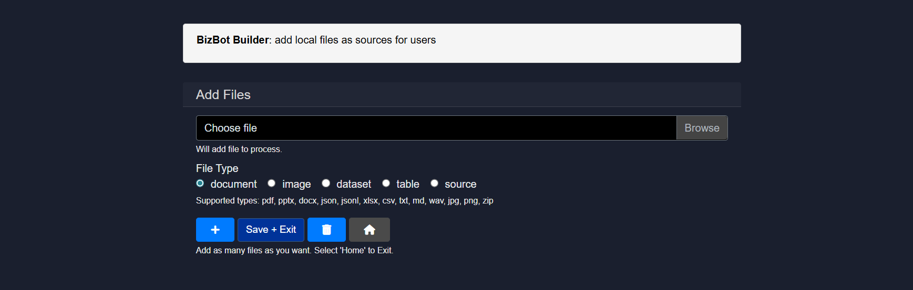

The `Save + Exit` button can be clicked to save the source. 

Sources represent a group of one or more documents that have been previously uploaded and may be reused in queries at a later time.

To add multiple files or sources, the **`+`** icon can be clicked and used repeatedly until the desired files are appended.

> [!CAUTION]
> If no files are selected, the bot will behave as a normal chatbot. Sources can still be added later from the [chat interface](https://github.com/BloksAdmin/model-hq-docs/tree/master/v1/chat/chat.md#22-sources-rag--document-chat), but they will not persist after restarting or be packaged with the bot for use by others if shared.

> [!TIP]
> To query a file that has been included with the bot, the user will select the **Source** button under the chat interface then in Loaded Sources, select the desired file that has been appended with the bot.
> 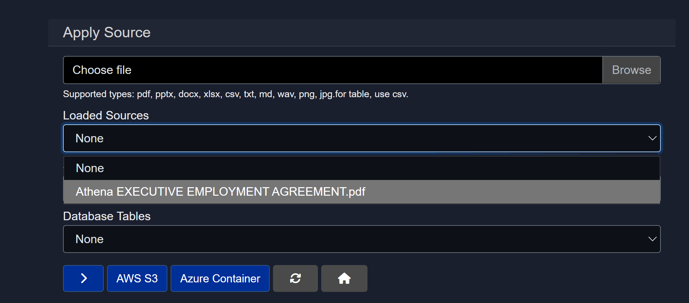

### 1.3 Agents
Specialized agents can be added to the bot.

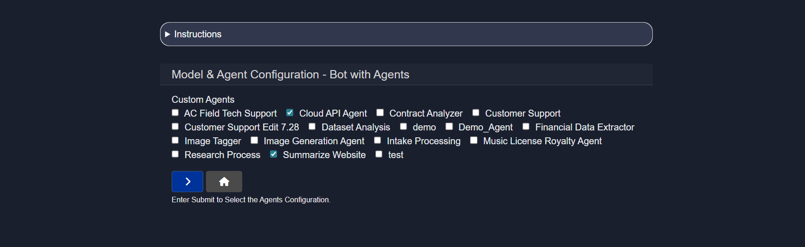

<details><summary>Here's a brief takedown of every pre-existing Agent</summary>

- **AC Field Tech Support**
  Assists field technicians by providing troubleshooting steps, diagnostics guidance, and on site support instructions. Optimized for quick issue resolution during deployments or maintenance.

- **Cloud API Agent**
  Handles interactions with cloud based APIs including request formation, authentication, and response parsing. Useful for integrating external cloud services into workflows.

- **Contract Analyzer**
  Reviews contracts to extract key clauses, obligations, risks, and timelines. Helps teams quickly understand legal documents without manual scanning.

- **Customer Support**
  Responds to customer queries, resolves common issues, and provides product or service information. Designed to reduce support load and improve response times.

- **Customer Support Edit 7.28**
  An updated or customized version of the Customer Support agent with refined logic or responses. Typically used for testing or iterative improvements.

- **Dataset Analysis**
  Analyzes structured datasets to uncover trends, anomalies, and insights. Supports exploratory analysis, summaries, and basic statistical reasoning.

- **demo**
  A lightweight agent used for demonstrations or proof of concept flows. Not intended for production workloads.

- **Demo_Agent**
  Another demo focused agent used to showcase agent orchestration or specific capabilities. Often used in presentations or internal testing.

- **Financial Data Extractor**
  Extracts financial information such as totals, line items, or metrics from documents or reports. Useful for accounting, audits, and financial reviews.

- **Image Tagger**
  Automatically detects and assigns descriptive tags to images. Helps with image organization, search, and metadata generation.

- **Image Generation Agent**
  Generates images based on text prompts or structured inputs. Commonly used for creative assets, mockups, or visual experimentation.

- **Intake Processing**
  Processes incoming requests, forms, or documents and routes them appropriately. Acts as the first step in automated workflows.

- **Music License Royalty Agent**
  Analyzes music licensing data to calculate royalties and usage details. Supports compliance and accurate royalty reporting.

- **Research Process**
  Assists with structured research by gathering sources, synthesizing information, and producing summaries. Useful for technical, market, or academic research.

- **Summarize Website**
  Fetches and summarizes the main content of a website or webpage. Designed for quick understanding without reading full pages.

- **test**
  A sandbox agent used for experimentation and validation. Typically not connected to real workflows or data.

</details>

> [!NOTE]
> Custom agents can be created and added to the bot. Once an agent is created, it will be automatically listed here.

### 1.4 Prompts
This section allows the user to add prompts that will persistently be added to each chat and interaction with the bot. For example, if the user adds the prompt for the custom bot to answer only in French, the bot will do as instructed for every interaction.

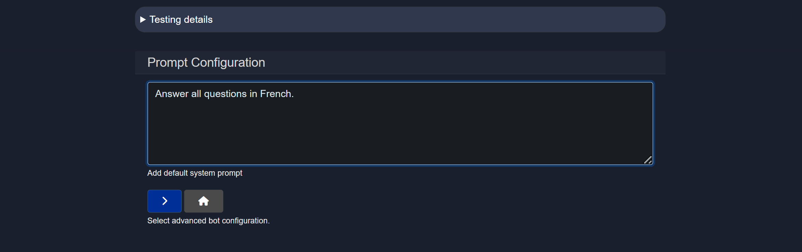

The instruction above will result in a French-only answer by the bot as shown:

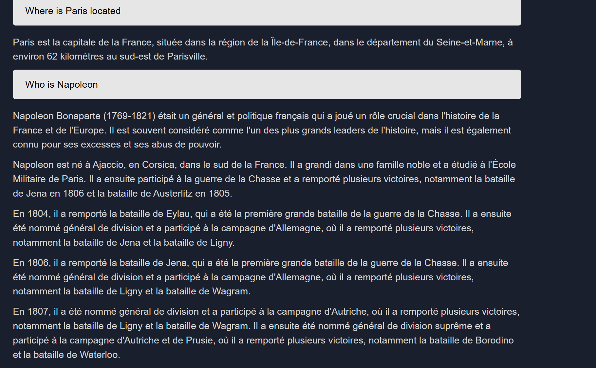

### 1.5 RAG
RAG configurations can be updated for the custom bot. This allows selection of sources and other context-related settings that can impact output quality, providing maximum control and flexibility for users.


- **Preload Source**
  Pre-existing sources can be loaded. Sources saved from the Source option will automatically appear here.

- **Supported Modes of Additional Source Information**
  This setting allows developers to control whether users will be able to connect to additional sources of information from multiple options:
  -  File Upload
  -  Library Connection
  -  Tables
  -  Images
  -  Sources
  -  Wikipedia
  -  Tavily
  -  Serp API
  -  NewsAPI.org
  -  Finnhub.io
  -  AWS S3 Buckets
  -  Azure Blob Storage
  -  OneDrive

- **Text Chunk Size**
  Text chunk size in parsing refers to the amount of text, measured in tokens, that is processed as a single unit during analysis or transformation of the file to a searchable body of text. Selecting the right text chunk size is important because it affects how accurately and efficiently a model can understand, process, and retrieve information—too small, and context may be lost; too large, and it may exceed model limits or reduce performance.

- **Context top n**
  Context Top N refers to selecting the top N most relevant pieces of information (e.g., text chunks) from a larger context based on similarity to a query. This ensures the model focuses on the most pertinent data to generate accurate and relevant responses.

- **Context target size**
  Context target size is the predefined maximum amount of text (in tokens) that can be included in a model's input. It balances the trade-off between including enough relevant information and staying within the model's processing limits to ensure efficient and coherent responses.

- **Reranker max samples**
  Max samples in a reranker model refers to the maximum number of candidate items (e.g., documents, passages, or text chunks) that the model will consider and score for relevance. This setting ensures computational efficiency while still allowing the model to choose the most relevant results from a sufficiently broad pool.

- **Library Search Results**
  Controls how many results are returned from the semantic search library. Higher values provide broader context but may increase noise.

- **Wiki Article Count**
  Defines the number of Wikipedia articles retrieved during search. This setting is used when Wikipedia is enabled as a source.

- **Prompt Instruction for Source Comparison**
  Adds guidance instructing the model to compare multiple retrieved sources. Useful for synthesis, validation, and cross-referencing.

- **Prompt Instruction Passed to RAG**
  Custom instruction injected into the retrieval-augmented generation pipeline. Helps steer how retrieved context is used in responses.

- **Use Wikipedia as Source**
  Enables Wikipedia content as part of the retrieval sources. Useful for general knowledge and background information.

- **Table Only Mode**
  Restricts retrieval to extracted tables within documents. Best used for data-heavy queries and structured analysis.

- **Interpret CSV as DB Table**
  Automatically treats uploaded CSV files as database tables. Enables natural language queries that translate to SQL-style operations.

- **PDF Parsing Options**
  Controls how PDFs are processed. Digital is fastest, OCR is for scanned text, Vision Model is best for image-heavy documents.

- **Show Search Results and Context**
  Displays retrieved documents and context used for generation. Helpful for debugging and transparency.

- **Show Post Prompt Reference / Explanation**
  Shows references and explanations after the model response when available. Useful for understanding how answers were generated.

- **Include Source Information in Context**
  Adds metadata such as document name and page number into the context. Improves traceability of answers.

- **Use Memory in Chat**
  Allows the system to retain conversation history across turns. Enables more contextual and continuous interactions.

- **Memory Apply Rule**
  Controls how much history is stored. "All" saves maximum context, "Last" saves only the most recent turn.

- **Memory Apply Role**
  Defines whose messages are stored in memory. Can include user messages, assistant messages, or both.

## Other optional configuration options

### 1.6 UI
The UI panel enables fast and easy customization of the bot name, icons, colors, and other visual elements. The custom bot will be displayed to the user with the specific UI choices when accessed.

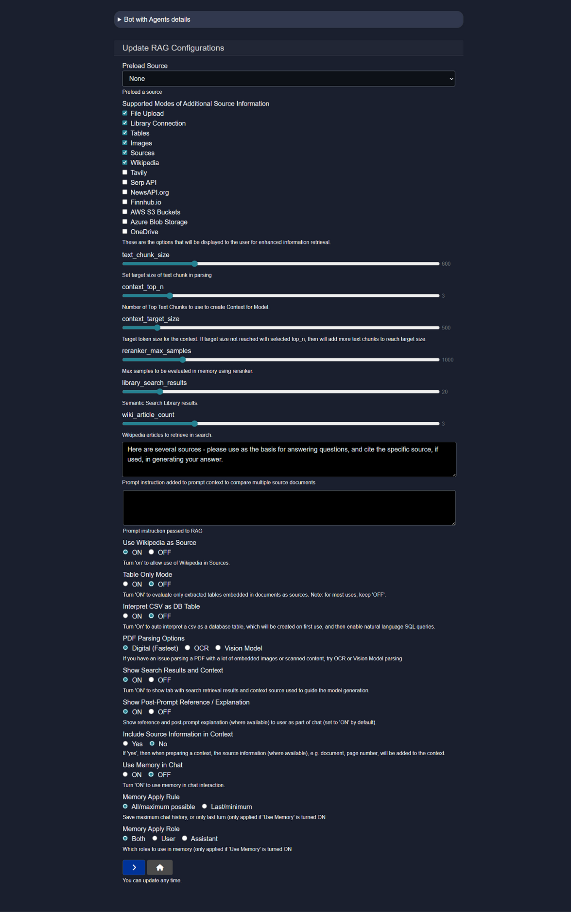

### 1.7 Controls
The Controls panel provides additional configuration options including logs, validation, model pull repository selection, download controls, pattern redaction, and classifier tests.

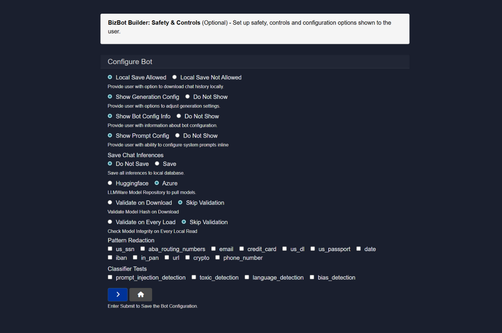

**Control Configuration Options** includes many Safety and Security features of Model HQ:

- **LLMWare Model Repository**
  This option allows models to be downloaded directly from LLMWare's private model repository in Azure (recommended) or Huggingface. Note that Huggingface may experience outages and downtimes, as well as code changes, which can sometimes interfere with the ability to access their repository.

- **Validate Model Hash on Download**
  Important safety feature that ensures the file has not been tampered with or corrupted during download, protecting against malicious code and safeguarding data integrity. It also ensures reproducibility by confirming that the exact version intended by the model provider is being used.

- **Validate on Every Load of the Model or Skip Validation**
  Determines the frequency of the model safety hash check.

- **Safety Feature: Pattern Redaction**
  Allows automatic redaction of various forms of personally identifiable information including US Social Security numbers, ABA routing numbers, email addresses, credit card information, driver's license numbers, passport information, dates, IBAN information, Indian PAN numbers, URLs, cryptocurrency addresses, or phone numbers.

- **Safety Feature: Classifier Tests**
  By selecting any of the available options such as prompt injection detection, toxic detection, language detection, bias detection, or malicious URL detection, Model HQ will automatically run a model to detect any of the selected forms of safety checks before displaying the inference results.

## Additional configuration options

### 1.8 JSON editor
The JSON Editor can be used to make small correction edits directly on the JSON schema of the bot that has been built.

A full bot can also be created from scratch using this editor, but this requires knowledge of the entire schema; therefore, this option is not widely promoted.

<details><summary>Sample JSON Configuration of `Bots with Agent` bot</summary>

```
{
  "name": "bot_with_agents",
  "display_name": "Bot with Agents",
  "model_name": "llama-3.2-1b-instruct-ov",
  "execution_mode": "Local",
  "user_select_model": "Choose for User",
  "description": "This bot is an example of integrating custom Agents into a Bot. The bot is designed to run on the NPU, while the Agent processes run on CPU, or the option to use a cloud-based service - all can be run concurrently.  To use the Anthropic service, you will need a separate Anthropic subscription, and provide your Anthropic API key in Credentials (on the configuration panel).",
  "agent_list": [
    "Cloud_API_Agent",
    "Summarize_Website"
  ],
  "root_agents": [],
  "max_output": 1000,
  "temperature": 0,
  "sample": false,
  "text_chunk_size": 600,
  "wiki_article_count": 3,
  "library_search_results": 20,
  "context_top_n": 3,
  "context_target_size": 500,
  "supporting_models": [
    "ranker_model"
  ],
  "vision_model": "qwen2-vl-2b-instruct-ov",
  "sql_model": "slim-sql-ov",
  "ranker_model": "jina-reranker-v1-tiny-en-ov",
  "local_exec": true,
  "connected_library": [],
  "connection_types": [
    "File Upload",
    "Library Connection",
    "Tables",
    "Images",
    "Sources",
    "Wikipedia"
  ],
  "source_name": [],
  "api_exec": false,
  "api_endpoint": {},
  "web_search": null,
  "web_search_config": null,
  "patterns": [],
  "classifiers": [],
  "write_to_db": null,
  "model_repo": "Azure",
  "allow_download_chat_history": true,
  "allow_generation_config": true,
  "show_explanation": true,
  "show_prompts": true,
  "show_web_search": true,
  "show_bot_config": true,
  "single_app_mode": false,
  "model_size": "small",
  "files": [],
  "install_bot_files": [],
  "ui_configs": {
    "theme": "dark",
    "app_title": "Model HQ",
    "title": "Model HQ",
    "company_name": "LLMWare",
    "company_url": "https://www.llmware.ai",
    "header_color": "#31384e",
    "footer_color": "#31384e",
    "main_color": "#1a1f2e",
    "apply_custom_ui": true,
    "icon_image": "llmware_logo_color_icon_square_48x48.ico",
    "main_icon": "llmware_logo_color_icon_square_48x48.ico"
  },
  "last_modified": "2026-01-08_191148",
  "created": "2025-07-06_135720",
  "author": "llmware",
  "bot_table_files": [],
  "bot_image_files": [],
  "bot_document_files": [],
  "bot_source_files": [],
  "bot_dataset_files": [],
  "rag_compare_instruction": "Here are several sources - please use as the basis for answering questions, and cite the specific source, if used, in generating your answer.\n",
  "rag_aggregate_instruction": "",
  "system_instruction": "",
  "use_wikipedia": true,
  "show_search_and_context": true,
  "table_only_mode": false,
  "parse_pdf_by_ocr": false,
  "parse_pdf_by_vision": false,
  "include_source_info": false,
  "interpret_csv_as_table": false,
  "apply_memory": false,
  "memory_role": "both",
  "memory_rule": "max",
  "integrations": [],
  "prompt_list": [],
  "max_turns": -1,
  "demo_inputs": [],
  "demo_video": "",
  "demo_description": "",
  "chat_history": [],
  "preload_active_source": ""
}
```

</details>

### 1.9 Demo 
The Demo feature allows predefined conversation flows to be configured and run, showcasing a bot's capabilities without manual input. It is primarily used for demonstrations, onboarding, and validating bot behavior using realistic example prompts.

Demo inputs can be added, with each input acting as a step in the demo sequence that will be executed in the order they are added. The plus button can be used to add more inputs, or the reset option can be used to clear the sequence.

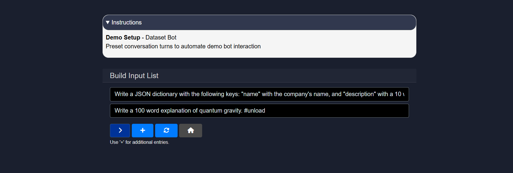

Once the sequence is ready, the Next (`>`) button can be clicked. The interface then switches to the demo details view, where a short description can be provided explaining what the demo shows. An optional video link can also be added if a recorded demo or walkthrough is available.

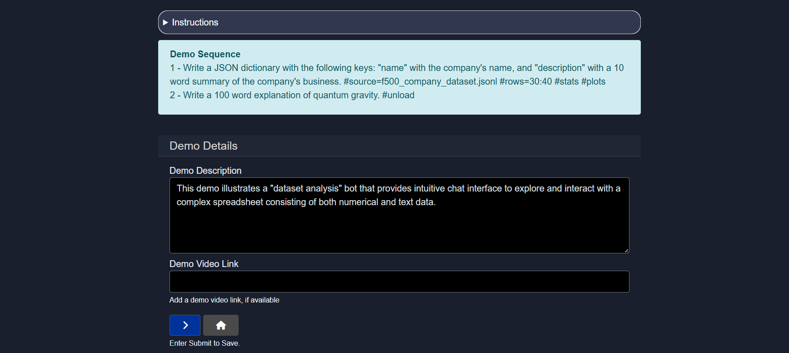

Once the demo has been configured, running the bot presents an additional Demo option in the subsequent interface.

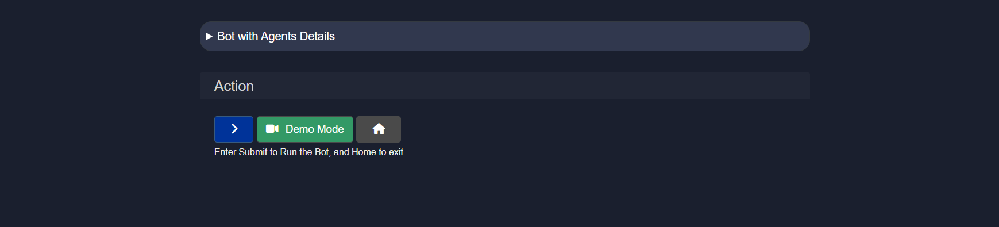

Selecting the Demo option initiates the predefined demo flow. The bot then executes the configured sequence step by step, displaying the conversation and behavior as described in the demo setup. This allows viewers to experience the intended functionality without providing manual input.

### 1.10 Meta
The Meta section is used to add descriptive information about the bot before sharing or publishing it. This information helps users understand the purpose, ownership, and intended usage of the bot.

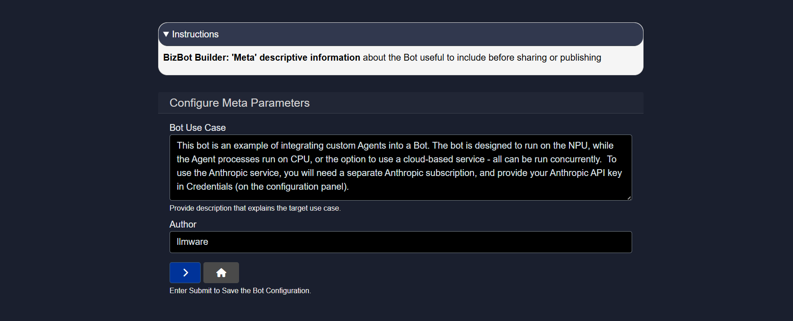

The **Bot Use Case** field can be defined to explain what the bot does, who it is for, and any important requirements or constraints. This description is shown as contextual information and does not affect bot behavior.

The **Author** field identifies the creator or organization responsible for the bot. This is useful for attribution, discovery, and internal reference.

### 1.11 Run
After a bot is configured, it can be tested or used directly by clicking the Run button.

### 1.12 Delete
If a bot needs to be removed or the configuration needs to be reset, the Delete button can be clicked to start fresh.

## Conclusion
This document covered the process of editing and configuring bots in Model HQ, from model selection and file attachment to RAG configuration, UI customization, and safety controls. Each configuration option provides developers with granular control over bot behavior, sources, and user experience. Once configured, bots can be tested locally, shared with others, or deployed for production use.
