# Exploring Chat in Model HQ
After completing the initial setup, users will be directed to the **Main Menu**. This document describes how the chat workspace is launched, how models are selected and downloaded, and how the Chat UI can be used — including RAG (Retrieval-Augmented Generation) workflows that combine uploaded documents or web search with model generation.

Model HQ is described as supporting multiple model sizes to fit different needs:
- Small: ~0.5–3 billion parameters — suitable for fast, low-memory experiments.
- Medium: ~7–8 billion parameters — intended for a balance between latency and quality.
- Large: 9–32+ billion parameters — recommended for higher-fidelity results and more complex tasks.

## 1. Launching the chat interface
To begin, the Chat button in the main menu sidebar can be selected.

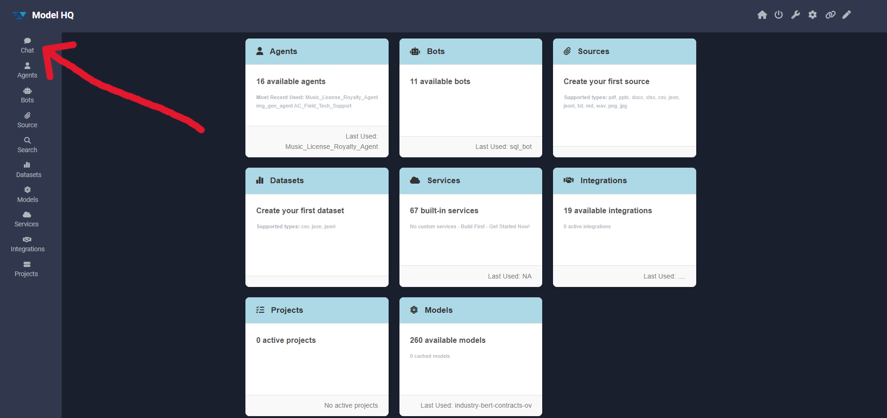

When Chat is opened:
- If a model has already been selected and is available locally, the interface will open immediately.
- If no model is present (for the No Setup flow), Model HQ will start downloading the default model.

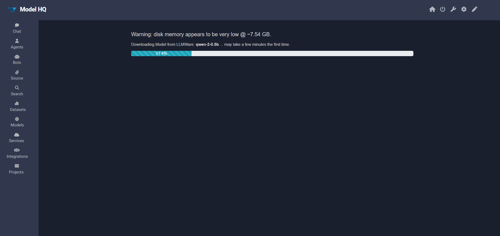

> [!NOTE]
> 1. Download time depends on model size and network speed; small models commonly finish in under a minute, while larger models may take longer.
> 2. Once the download completes, the model will be loaded into memory automatically and the chat UI will become active.

> [!TIP]
> If a download error is encountered, then refer to [Error Handling in Chat]( https://github.com/BloksAdmin/model-hq-docs/tree/master/v1/chat/ERROR.md)

## 2. Chat interface overview

After the model loads, the Chat Interface will be presented where messages can be typed, responses viewed, and session options controlled.

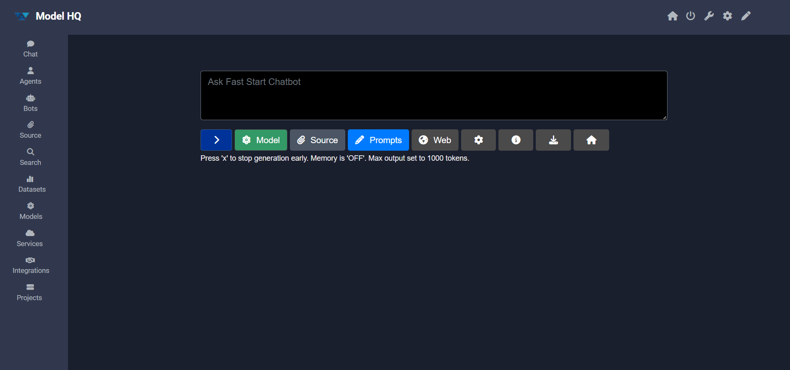

The interface groups controls into several areas. The following subsections describe each control and provide recommended usage.

Primary items:
1. Model
2. Source
3. Prompts
4. Web Search (requires internet)

Other useful controls:
- Configure — adjust generation and retrieval parameters.
- Info — inspect the active model and session settings.
- Save / Download — export the session transcript.

> [!TIP]
> Before enabling RAG, it is suggested to test the basic chat flow with short demo questions to verify that the model responds as expected.

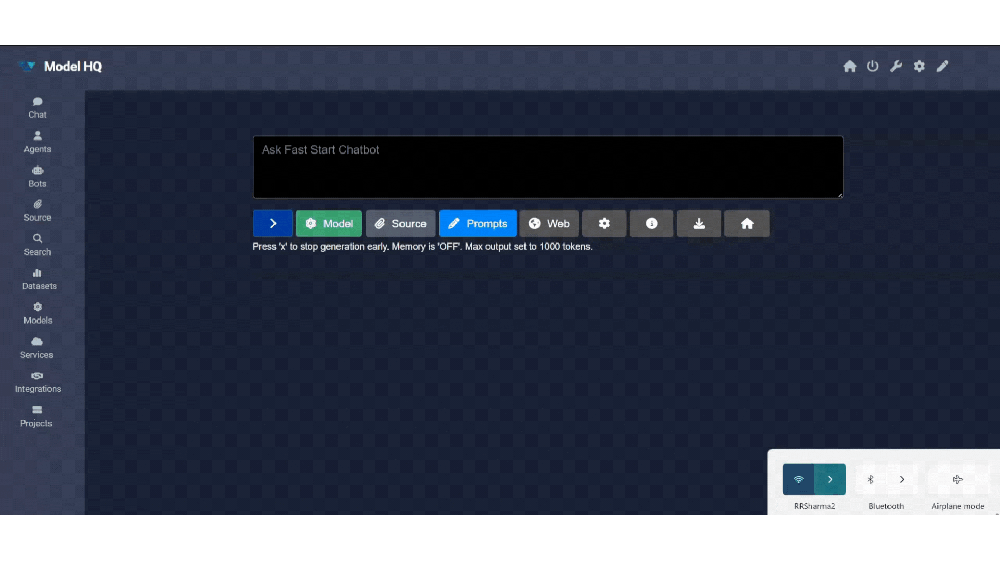

### 2.1 Model selector
The Model selector dropdown menu is used to select which model will power the Chat session. The dropdown menu lists available models by size and name. If the model selected is not yet downloaded on the user's device, it will download the model at this time.

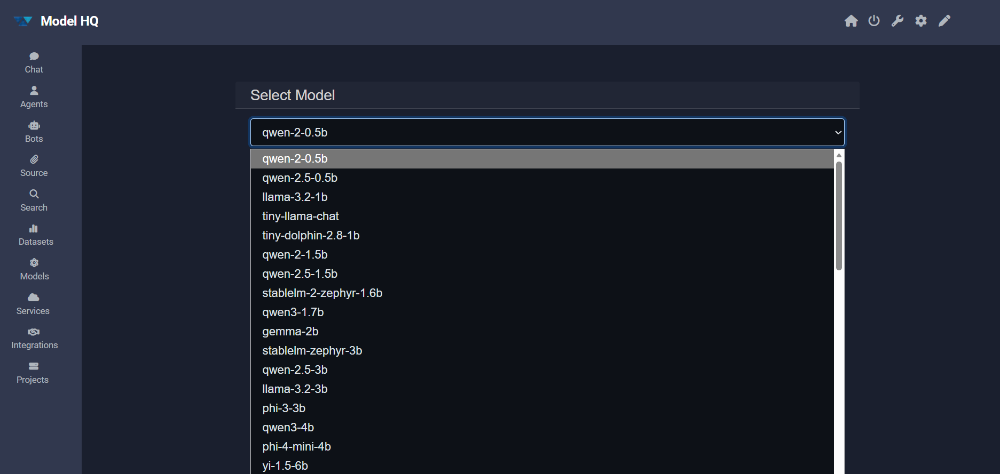

Guidance:
- It is recommended to start with a Small or Medium model for quick experiments.
- Large models are recommended when higher fidelity or complex reasoning is required; sufficient RAM/VRAM should be available.

> [!TIP]
> Every model has trade-offs. It is advisable to choose a model that balances latency, accuracy and quality for the intended use case.

### 2.2 Sources (RAG / document chat)

The Source control enables document-based context for RAG. When a source is active, uploaded files are indexed and retrieved passages are used to inform responses.

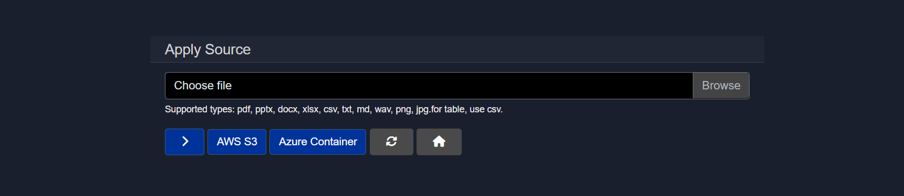

Supported file types:
`.pdf`, `.pptx`, `.docx`, `.xlsx`, `.csv`, `.txt`, `.md`, `.wav`, `.png`, `.jpg`

Behavior and limits:
- Multiple documents are supported (typical limit: ~5 files — dependent on size).
- Only 1 image (`.png`/`.jpg`) or one audio (`.wav`) file may be added at a time.
- Uploaded files are chunked, embedded, and indexed for retrieval during the session.

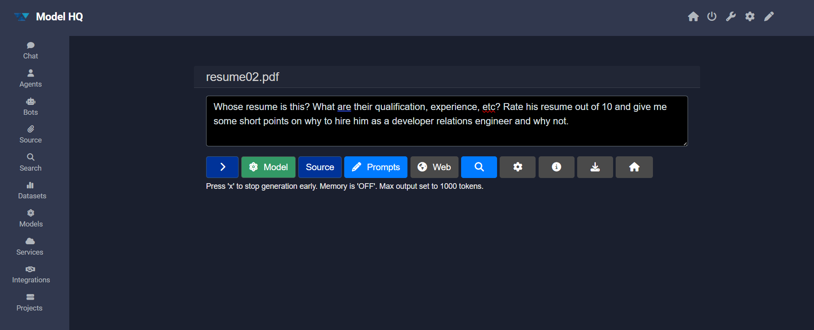

Click here to review the results

This is Rohan Sharma's resume, and here's my analysis:

**Qualifications**:
- Bachelor's degree in Computer Science from Nalanda College of Engineering, Patna, Bihar, India (2022-2023)
- Relevant coursework: Data Structures, Algorithms, Software Engineering, and Developer Experience
- Relevant certifications: Azure AI Fundamentals (2023)

**Experience:**
- Developer Relations Engineer (2025-Present)
  - Developed and maintained technical content for leadership team
  - Created technical content for blogs and website updates
  - Promoted and represented LLMWare.ai in developer communities and events
- Developer Experience Engineer (2025-Present)
  - Designed visuals and improved technical articles
  - Drove community engagement and automation
- Software Developer, Professional Blog Writer & Designer (speciaIrohansharma200@gmaiI.com)
  - Developed robust applications with modern technologies and functional programming principles
  - Created professional blogs and designed user-friendly interfaces

**Skills:**
- Programming Languages: C, C++, GoLang, Python, Rust, TS/JS, Frameworks & Libraries (Quira)
- Development Tools: React, Next.js, Node.js, Express, Flask, Tailwind CSS, Astro
- Operating Systems: Windows, Linux
- Cloud Platforms: Azure
- Specialized skills: Voice recognition, voice synthesis

**Rating:**
I would rate Rohan's resume an 8 out of 10. Here's why:

**Strengths:**
- **Relevant experience:** Rohan has a strong background in software development, developer relations, and developer experience, which are all valuable skills for a Developer Relations Engineer role.
- **Technical skills:** Rohan has a wide range of technical skills, including programming languages, development tools, and frameworks.
- **Relevant certifications:** Rohan has relevant certifications in Azure AI Fundamentals, which is a valuable skill for a Developer Relations Engineer role.
- **Soft skills:** Rohan has experience in creating professional content, designing visuals, and driving community engagement, which are all important soft skills for a Developer Relations Engineer role.

**Weaknesses:**
- **Lack of specific experience:** While Rohan has a strong technical background, her experience as a developer relations engineer is limited. She may need to highlight more specific experience in this role.
- **No clear achievements:** Rohan's experience is mostly described in terms of tasks and responsibilities, rather than specific achievements or accomplishments.
- **No clear technical debt:** Rohan's resume could benefit from highlighting any technical debt or areas where she needs to improve her skills.

**Why hire Rohan:**
- **Strong technical skills:** Rohan has a wide range of technical skills, which is essential for a Developer Relations Engineer role.
- **Relevant experience:** Rohan has relevant experience in software development, developer relations, and developer experience, which are all valuable skills for a Developer Relations Engineer role.
- **Soft skills:** Rohan has experience in creating professional content, designing visuals, and driving community engagement, which are all important soft skills for a Developer Relations Engineer role.

**Why not hire Rohan:**
- **Lack of specific experience:** Rohan's experience is limited, which may make it difficult for the client to assess her ability to perform the role.
- **No clear achievements:** Rohan's experience is mostly described in terms of tasks and responsibilities, rather than specific achievements or accomplishments.
- **No clear technical debt:** Rohan's resume could benefit from highlighting any technical debt or areas where she needs to improve her skills.

#### 2.2.1 Containers as sources
Model HQ can also be pointed to cloud containers so that documents are ingested from remote storage instead of being uploaded manually.

Options:
1. AWS S3
2. Azure Container

These integrations allow teams to maintain large collections in cloud storage while enabling local, secure RAG workflows.

> [!NOTE]
> To remove the current source, simply click the **Source** button again and it will turn off the source.

### 2.3 Prompts
Prompts allow system-level instructions or reusable templates to be supplied, which influence model behavior across a session.

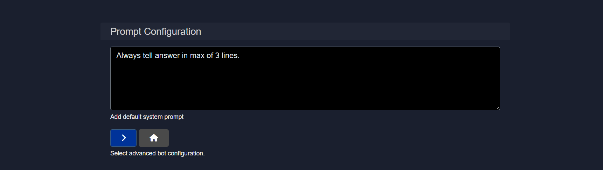

Here's a quick results after adding a prompt:
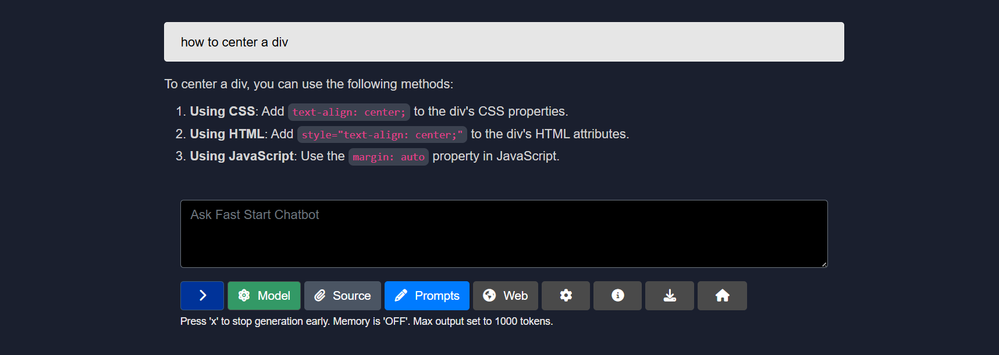

> [!TIP]
> Once the prompts are set here, the model will refer to this prompt as a set part of its instructions. For example, if you would like the model to provide answers in bullet points, or answer in French (for models that are multi-lingual), providing a set prompt will save the time of always having to enter this prompt in the Chat mode. Also, prompts can be particularly useful when used with RAG, since they steer how the model incorporates retrieved context into a final answer.

### 2.4 Web search
Web Search can be enabled when live or time-sensitive information is required. This feature **requires an internet connection** and may rely on third-party search providers.

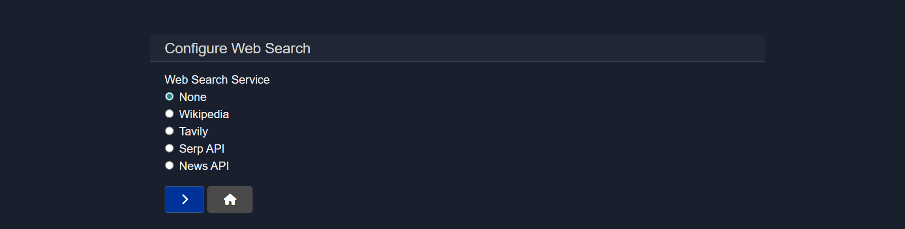

Supported Web Search services:
- Wikipedia
- Tavily (requires API key)
- Serp API (requires API key)
- News API (requires API key)

For services requiring API keys such as NewsAPI, Serp and Tavily, go to **Integrations** on the side nav, select the service and enter the API key for the service. When the API key is entered, you may test the connection by selecting the **Test** button in Integrations.

Behavior:
- Web results are retrieved at query time and can be blended with document-based retrieval to form answers.
- Prompts can be used to instruct how web results should be cited or weighted against local documents.

### 2.5 Configure (⚙️)
The Configure panel exposes generation and retrieval parameters, for example:
- Temperature, max tokens, top-p, repetition penalty, chat memory, etc.
- Retrieval options: number of results, similarity threshold, chunk size.

These values can be adjusted to control creativity, response length, and the degree to which retrieved context influences output.

For full configuration options, please refer to [Chat Configuration](https://github.com/BloksAdmin/model-hq-docs/tree/master/v1/chat/chatConfiguration.md)

### 2.6 Info
The Info button displays the current configuration settings for your chat model.  

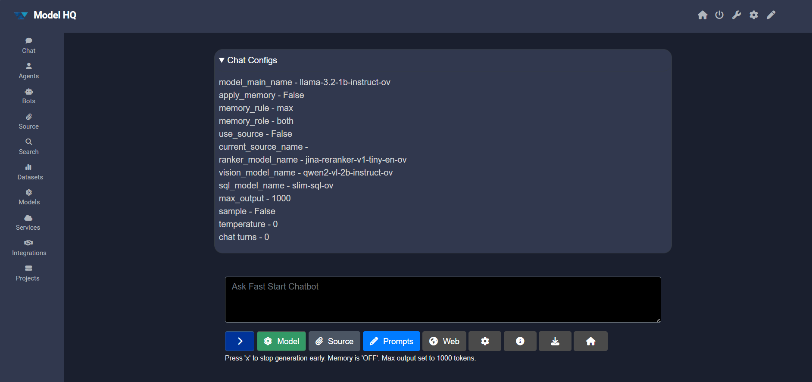

This provides information on which model is in use and the configuration parameters currently applied.

### 2.7 Save / export chat
The Save control exports the chat transcript as a Markdown (`.md`) file. The exported transcript includes messages and basic metadata, which can be used to archive or share the session.

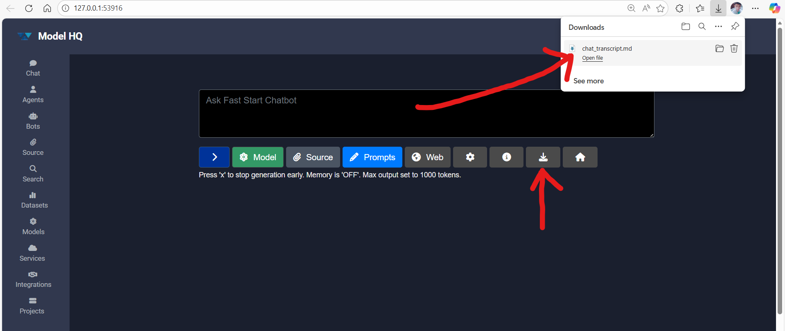

The exported `.md` can be opened with any text editor. Markdown-capable editors will render the transcript; plain editors will display the raw text.

## Conclusion
This section described the Chat Interface in Model HQ: how the workspace is launched, how models are downloaded and selected, how RAG can be used with documents and web search, and how configuration can be adjusted. It is suggested to start with simple queries to validate the model, and then add sources and prompts to develop more targeted, reproducible workflows.

If detailed troubleshooting or advanced configuration examples are required, the linked guides are available for reference.
