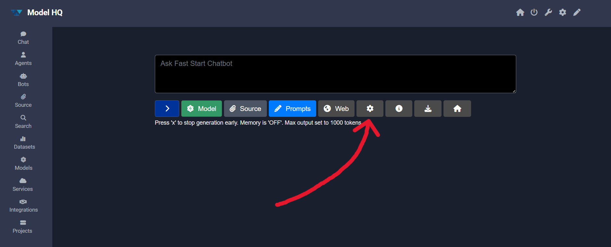
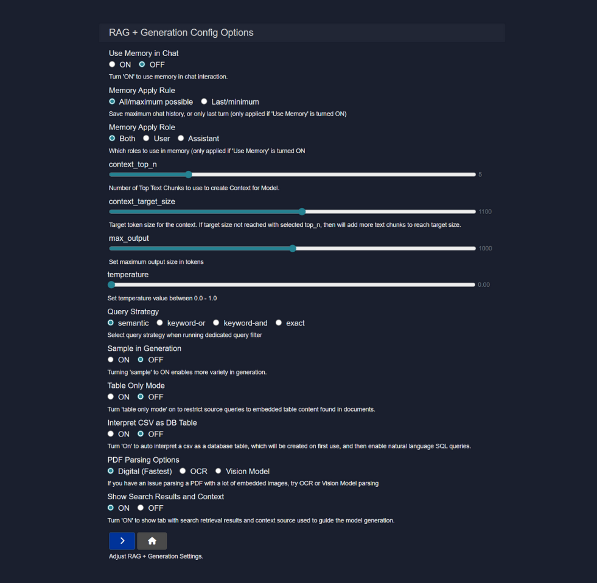

# Chat Configuration
The Configure panel provides access to advanced generation and retrieval parameters that control how Model HQ processes queries, retrieves context, and generates responses. These settings enable fine-tuning of the chat experience for different use cases, from precise factual responses to creative outputs.

Key configuration areas include:
- **Generation parameters**: Temperature, max tokens, sampling behavior
- **Memory management**: Chat history usage and retention
- **Retrieval options**: Number of results, query strategies, similarity thresholds
- **Document processing**: PDF parsing methods, table handling, CSV interpretation

These values can be adjusted to control creativity, response length, and the degree to which retrieved context influences output. Understanding these parameters allows users to optimize Model HQ for specific workflows, whether prioritizing accuracy, speed, or contextual richness.

## 1. Opening the configuration panel

The configuration panel can be accessed by clicking the "⚙️" button located beneath the chat input box.

## 2. Configuration options

Once opened, the configuration panel presents a comprehensive set of options that control how memory, retrieval, and text generation behave in a Retrieval-Augmented Generation (RAG) setup.

## 3. Configuration parameters overview

The table below provides a quick reference of all available configuration parameters, their types, default values, and available options:

| Parameter | Type | Default | Options/Range | Description |
|-----------|------|---------|---------------|-------------|
| **Use Memory in Chat** | Toggle | ON | ON / OFF | Controls whether conversation history is included as context |
| **Memory Apply Rule** | Dropdown | All / maximum possible | All / maximum possible, Last / minimum | Defines how much chat history is stored and reused |
| **Memory Apply Role** | Dropdown | Both | Both, User, Assistant | Specifies which messages are considered when building memory |
| **context_top_n** | Integer | 10 | 5-20 (recommended) | Number of top-ranked text chunks retrieved for context |
| **context_target_size** | Integer | 3000 | 2000-8000 (recommended) | Target token size for final context sent to model |
| **max_output** | Integer | 2048 | 256-4096 (recommended) | Maximum number of tokens the model can generate |
| **temperature** | Float | 0.3 | 0.0-1.0 | Controls randomness and creativity in generation |
| **Query Strategy** | Dropdown | semantic | semantic, keyword-or, keyword-and, exact | Defines how queries are matched against documents |
| **Sample in Generation** | Toggle | ON | ON / OFF | Controls probabilistic sampling during text generation |
| **Table Only Mode** | Toggle | OFF | ON / OFF | Restricts retrieval to embedded tables only |
| **Interpret CSV as DB Table** | Toggle | OFF | ON / OFF | Treats CSV files as database tables for SQL-style queries |
| **PDF Parsing Options** | Dropdown | Digital (Fastest) | Digital (Fastest), OCR, Vision Model | Controls how PDF files are processed |
| **Show Search Results and Context** | Toggle | OFF | ON / OFF | Displays retrieved search results and context in UI |

> [!NOTE]
> Some parameters have prerequisites. For example, **Memory Apply Rule** and **Memory Apply Role** only apply when **Use Memory in Chat** is ON.

The following sections describe each configuration parameter in detail:

### 3.1 Use Memory in Chat

**Options:** ON / OFF  
**Default:** ON

This setting determines whether the conversation history is included as context when processing new queries.

* **ON:** The system maintains awareness of previous exchanges, enabling contextual follow-up questions and maintaining conversation continuity. This is recommended for multi-turn dialogues where context from earlier messages is relevant to later queries.
* **OFF:** Each query is processed independently without reference to prior messages. This mode is useful for unrelated, standalone queries or when privacy concerns require that no conversation history be retained.

When memory is enabled, the model can reference earlier statements, pronouns, and context from the conversation, providing more coherent and contextually aware responses.

### 3.2 Memory Apply Rule

**Options:** All / maximum possible, Last / minimum  
**Default:** All / maximum possible  
**Prerequisite:** Requires **Use Memory in Chat** to be ON

This parameter controls the extent of conversation history that is included in the context window when processing a new query.

* **All / maximum possible:** The entire available conversation history is included, up to the model's maximum context window. This provides the most complete context and is ideal for long, complex conversations where earlier details remain relevant throughout the session.
* **Last / minimum:** Only the most recent user-assistant exchange is retained. This reduces token usage and speeds up processing, and is appropriate for conversations where only immediate context matters or when working within tight token budgets.

The choice between these options involves a trade-off between contextual richness and computational efficiency. Longer histories consume more tokens but provide better continuity.

### 3.3 Memory Apply Role

**Options:** Both, User, Assistant  
**Default:** Both  
**Prerequisite:** Requires **Use Memory in Chat** to be ON

This setting determines which participant's messages are included when constructing the conversation memory.

* **Both:** Messages from both the user and the assistant are included in memory. This is the standard mode and preserves the full conversational flow, allowing the model to reference both its own previous responses and the user's queries.
* **User:** Only the user's messages are retained in memory. This mode can be useful when the focus should be on user-provided information rather than the assistant's interpretations or generated content.
* **Assistant:** Only the assistant's previous responses are included. This is a specialized mode that may be useful when tracking the model's own outputs across turns without including user prompts.

In most standard chat scenarios, the **Both** option is recommended to maintain natural conversation flow and full contextual awareness.

### 3.4 context_top_n

**Type:** Integer  
**Default:** 10  
**Recommended range:** 5-20

This parameter specifies the number of top-ranked text chunks that are retrieved from the document source and included in the context sent to the model.

When a query is processed with RAG enabled, the retrieval system searches through indexed documents and ranks chunks by relevance. The `context_top_n` value determines how many of these highest-ranked chunks are selected for inclusion.

* **Lower values (5-10):** Provide tighter, more focused context with only the most relevant passages. This reduces noise and token usage but may miss relevant information that ranks slightly lower. Recommended for precise, targeted queries where the relevant information is likely contained in a small number of highly relevant chunks.
* **Higher values (15-20+):** Cast a wider net, including more context that may contain relevant information. This increases the likelihood of capturing all pertinent details but also introduces more noise and consumes more tokens. Recommended for exploratory queries or when relevant information may be distributed across multiple document sections.

The optimal value depends on document structure, query specificity, and the trade-off between comprehensiveness and precision.

### 3.5 context_target_size

**Type:** Integer (tokens)  
**Default:** 3000  
**Recommended range:** 2000-8000

This parameter sets a target token count for the total context that is assembled from retrieved chunks and sent to the model for generation.

The retrieval system first selects the number of chunks specified by `context_top_n`. If these chunks do not reach the `context_target_size` token count, the system automatically includes additional lower-ranked chunks until the target is met or the available chunks are exhausted.

This dynamic adjustment ensures that:
* Sufficient context is provided to the model, even when individual chunks are small
* The model has adequate information to generate comprehensive, well-informed responses
* Token budgets can be managed predictably across different queries

The target size should be set based on:
- The model's maximum context window
- The typical length of relevant passages in the document corpus
- The balance between providing enough context and leaving room for the generated response

For example, if working with a model that has an 8K context window and expect responses of ~1000 tokens, setting `context_target_size` to 3000-4000 leaves room for conversation history and generation while providing substantial retrieved context.

### 3.6 max_output

**Type:** Integer (tokens)  
**Default:** 2048  
**Recommended range:** 256-4096

This parameter sets a hard limit on the number of tokens the model can generate in a single response.

When the model reaches this token limit, generation stops, even if the response would otherwise continue. This serves several important functions:

* **Prevents runaway generation:** Ensures the model doesn't produce excessively long outputs that consume unnecessary resources
* **Latency control:** Shorter maximum outputs complete faster, improving response time
* **Resource management:** Limits computational and memory usage per query
* **Predictable behavior:** Provides consistent upper bounds on response length

Recommended values by use case:
- **Short answers and summaries:** 256-512 tokens
- **Standard conversational responses:** 1024-2048 tokens
- **Detailed explanations and analysis:** 2048-4096 tokens
- **Extended content generation:** 4096+ tokens (if the model supports it)

> [!NOTE]
> Setting this value too low may result in truncated responses that end mid-sentence. Setting it too high may allow verbose outputs that could be more concise.

### 3.7 temperature

**Type:** Float  
**Range:** 0.0 to 1.0  
**Default:** 0.3  
**Recommended range:** 0.0-0.7

Temperature is a fundamental parameter that controls the randomness and creativity of the model's text generation by adjusting the probability distribution over possible next tokens.

At each step of generation, the model calculates probabilities for all possible next tokens. Temperature scales these probabilities:

* **0.0 (Deterministic):** The model always selects the highest-probability token. This produces consistent, predictable, and factual outputs. Recommended for:
  - Factual question answering
  - Data extraction and structured outputs
  - Tasks requiring consistent, reproducible results
  - RAG scenarios where accuracy is paramount

* **0.3-0.5 (Low creativity):** Slight randomness is introduced while still favoring likely tokens. This provides some variation without sacrificing accuracy. Recommended for:
  - General conversational AI
  - Document summarization
  - Professional writing assistance

* **0.6-0.8 (Moderate creativity):** More diverse outputs with increased creativity and variation. Recommended for:
  - Creative writing assistance
  - Brainstorming and ideation
  - Generating multiple alternative phrasings

* **0.9-1.0 (High creativity):** Maximum randomness, producing highly diverse and creative outputs that may include unexpected or unconventional responses. Use with caution as factual accuracy may decrease.

> [!TIP]
> For RAG-based question answering, lower temperatures (0.0-0.3) are generally recommended to ensure responses stay grounded in the retrieved context.

### 3.8 Query Strategy

**Options:** semantic, keyword-or, keyword-and, exact  
**Default:** semantic

This setting determines the algorithm used to match user queries against indexed document chunks during retrieval.

* **semantic:** Uses embedding-based similarity to match the semantic meaning of the query against document chunks, regardless of exact wording. This is the most flexible and intelligent option, capable of understanding:
  - Synonyms and paraphrasing (e.g., "car" matches "automobile")
  - Conceptual relationships (e.g., "climate change" matches passages about "global warming")
  - Context and intent beyond literal keywords
  
  Recommended for most use cases, especially when users may phrase queries in varied ways.

* **keyword-or:** Uses traditional keyword search with an OR operator. A chunk is retrieved if it contains **any** of the keywords from the query. This provides:
  - Broader recall (more results returned)
  - Fast performance
  - Simple, predictable behavior
  
  Useful when casting a wide net or when semantic search returns insufficient results.

* **keyword-and:** Uses keyword search with an AND operator. A chunk is retrieved only if it contains **all** of the keywords from the query. This provides:
  - Higher precision (fewer, more targeted results)
  - Fast performance
  - Strict matching requirements
  
  Useful for precise queries where all terms must be present.

* **exact:** Requires exact phrase matching, including word order and spacing. Only chunks containing the exact query string are retrieved. This is the most restrictive option and is useful for:
  - Finding specific quotes or passages
  - Legal or compliance searches requiring exact language
  - Debugging or verification tasks

> [!NOTE]
> For most conversational RAG applications, **semantic** search provides the best user experience by understanding intent rather than requiring precise keyword matching.

### 3.9 Sample in Generation

**Options:** ON / OFF  
**Default:** ON

This setting controls whether probabilistic sampling is used during the text generation process.

* **ON:** The model uses sampling to select the next token based on the probability distribution adjusted by temperature and other parameters. This introduces controlled randomness, producing:
  - More diverse outputs across multiple generations of the same prompt
  - More natural, human-like variation in phrasing
  - Creative and less repetitive responses
  
  This is the standard mode for most conversational and creative applications.

* **OFF:** The model uses greedy decoding, always selecting the highest-probability token at each step (similar to temperature=0.0). This produces:
  - Deterministic outputs (same input always produces the same output)
  - Highly predictable and stable responses
  - Less variation and creativity
  
  This mode is useful for testing, debugging, or applications requiring absolute consistency.

> [!TIP]
> When sampling is ON, the temperature parameter controls the degree of randomness. When sampling is OFF, temperature has no effect.

### 3.10 Table Only Mode

**Options:** ON / OFF  
**Default:** OFF

This specialized mode restricts retrieval operations to only table structures that have been extracted and indexed from documents.

* **ON:** The retrieval system searches exclusively within tables (e.g., data tables from PDFs, spreadsheets, or structured sections). Regular text passages are ignored. This is useful when:
  - The answer is known to be in tabular data
  - Working with datasets, reports, or financial documents
  - Querying structured information like pricing tables, feature comparisons, or statistical data
  
  This mode improves precision and reduces noise when the information needed is tabular in nature.

* **OFF:** The retrieval system searches across all indexed content, including both tables and regular text. This is the default mode for general-purpose document Q&A.

> [!NOTE]
> Model HQ's parsers automatically detect and preserve table structure during document ingestion. When Table Only Mode is enabled, these preserved table structures are the sole source for retrieval.

### 3.11 Interpret CSV as DB Table

**Options:** ON / OFF  
**Default:** OFF

This setting determines how CSV files are processed and made available for querying.

* **ON:** When a CSV file is uploaded, Model HQ automatically parses it and creates an in-memory database table representation. This enables:
  - Natural language queries that are translated to SQL-style operations
  - Structured data operations (filtering, aggregation, sorting)
  - More accurate responses to quantitative questions about the data
  - Proper understanding of column relationships and data types
  
  For example, queries like "What is the average sales figure?" or "Show me all entries where the status is active" can be processed as structured database queries rather than text search.

* **OFF:** CSV files are treated as plain text documents. Each row may be chunked and indexed as text, but the structured nature of the data is not explicitly modeled. This mode uses standard text retrieval and may be less accurate for quantitative or structured queries.

> [!TIP]
> When working with datasets, spreadsheets, or any CSV containing structured information, enabling this option significantly improves query accuracy and enables powerful data analysis capabilities.

### 3.12 PDF Parsing Options

**Options:** Digital (Fastest), OCR, Vision Model  
**Default:** Digital (Fastest)

This setting controls the parsing method used to extract content from PDF files.

* **Digital (Fastest):** Uses Model HQ's proprietary high-performance text extraction engine to read directly from the PDF's text layer. This is the default and recommended option for most PDFs, offering:
  - Fastest processing speed
  - High accuracy for native digital PDFs
  - Preservation of text structure and formatting
  - Low computational overhead
  
  This method works well for PDFs that were created digitally (e.g., from Word, LaTeX, or web browsers) and contain an embedded text layer.

* **OCR (Optical Character Recognition):** Uses embedded OCR technology to recognize and extract text from images within the PDF. This is necessary for:
  - Scanned documents without a text layer
  - Image-based PDFs (e.g., scanned book pages, forms)
  - Permission-restricted PDFs that block text extraction
  
  OCR processing is slower than digital extraction but enables access to content that would otherwise be unavailable. Accuracy depends on image quality, font clarity, and document layout.

* **Vision Model:** Employs a multimodal vision-language model to interpret the PDF content. This advanced method is appropriate for:
  - Complex layouts with mixed text and graphics
  - Documents where spatial relationships matter (e.g., forms, diagrams)
  - Image-heavy PDFs where visual context is important
  - PDFs with unconventional formatting that challenges standard parsers
  
  This is the most computationally intensive option but provides the most sophisticated understanding of document structure and visual elements.

> [!TIP]
> For troubleshooting document parsing issues or handling special PDF types, refer to the [Document Parsing Issues guide](https://github.com/BloksAdmin/model-hq-docs/tree/master/v1/chat/documentParsingIssues.md).

### 3.13 Show Search Results and Context

**Options:** ON / OFF  
**Default:** OFF

This setting controls whether the retrieved document chunks and context that informed the model's response are displayed in the user interface.

* **ON:** The system displays the retrieved search results alongside the generated response. This provides:
  - **Transparency:** Users can see exactly which document passages the model referenced
  - **Verification:** Source material can be reviewed to confirm accuracy
  - **Trust:** Users can validate that responses are grounded in the retrieved context
  - **Learning:** Understanding which sources were retrieved helps refine future queries
  
  This mode is particularly valuable in professional, research, or compliance scenarios where source verification is important.

* **OFF:** Only the final generated response is shown. The retrieval process operates behind the scenes. This provides:
  - **Cleaner interface:** Less visual clutter for end users
  - **Focus on output:** Attention remains on the response rather than the mechanics
  - **Simplified experience:** Appropriate for casual use cases where source transparency is less critical

> [!NOTE]
> Even when this option is OFF, the model still uses the retrieved context for generation—it simply isn't displayed to the user.

## 4. Recommended configurations by use case

The optimal configuration varies based on the intended application. Below are recommended starting points for common scenarios:

### 4.1 Factual Q&A (High accuracy)
- **Use Memory in Chat:** ON
- **Temperature:** 0.0-0.3
- **Query Strategy:** semantic
- **Sample in Generation:** OFF
- **Show Search Results and Context:** ON

### 4.2 Creative writing assistance
- **Use Memory in Chat:** ON
- **Temperature:** 0.7-0.9
- **max_output:** 2048-4096
- **Sample in Generation:** ON

### 4.3 Data analysis (with CSV)
- **Interpret CSV as DB Table:** ON
- **Table Only Mode:** ON (if querying only tabular data)
- **Temperature:** 0.0
- **Query Strategy:** semantic

### 4.4 Exploratory research
- **context_top_n:** 15-20
- **context_target_size:** 4000-6000
- **Query Strategy:** semantic
- **Show Search Results and Context:** ON

These configurations can be adjusted based on specific requirements and observed performance.

## Conclusion

This document described the comprehensive set of configuration options available in Model HQ's Chat interface for controlling generation, retrieval, and memory behavior in RAG workflows. Key parameters include memory settings that control conversation history retention, retrieval parameters (context_top_n and context_target_size) that determine how much document context is included, generation controls (temperature, max_output, sampling) that influence response creativity and length, query strategies that affect how documents are searched, and document processing options for PDFs, CSVs, and images. Understanding and appropriately adjusting these parameters enables users to optimize Model HQ for specific use cases—whether prioritizing factual accuracy with lower temperatures and semantic search, managing token budgets through context limits, or accommodating different document types through specialized parsing options. The recommended configurations provided serve as starting points that can be fine-tuned based on observed performance, document characteristics, and application requirements.