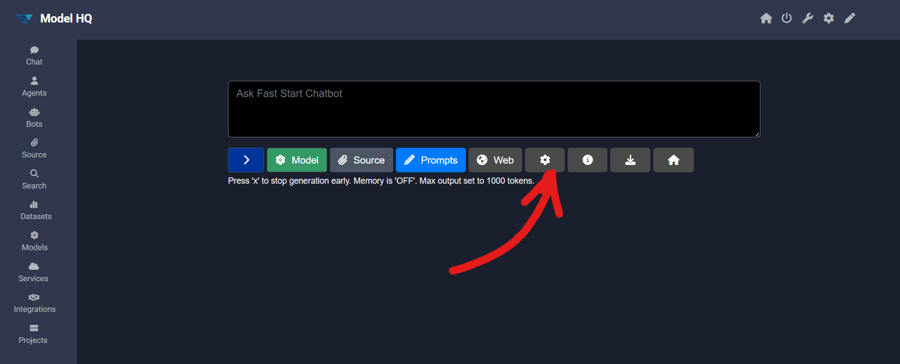
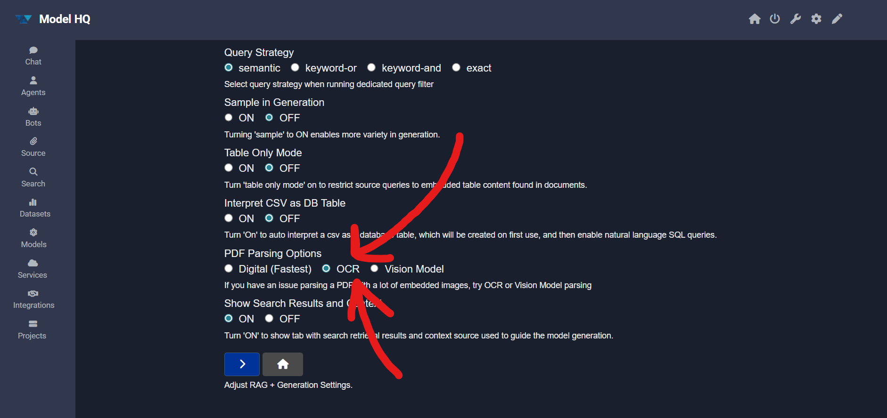

# Troubleshooting Document Parsing and Limitations

Model HQ includes proprietary high-performance parsers designed to process PDFs and other common document types with exceptional speed and accuracy. These parsers extract text, structure, and metadata efficiently, supporting a wide range of use cases for retrieval, RAG workflows, and agentic AI.

However, some documents—particularly PDFs—may present unique challenges:

- **Image-based PDFs**: Certain PDFs are saved entirely as images (e.g., scanned documents), meaning there is no underlying text layer to extract. These require OCR (Optical Character Recognition) to process the content.

- **Permission-restricted PDFs**: Some PDFs use encrypted permissions that limit actions such as text extraction, copying, or printing. These restrictions may prevent direct parsing without prior decryption or appropriate access rights.

When such files are encountered, additional preprocessing steps may be required before they can be ingested and indexed by Model HQ.

## 1. Handling documents that cannot be natively parsed

In some cases, a document cannot be parsed by Model HQ's native proprietary parsers due to being fully image-based or having restrictive permissions.

### 1.1 In Chat
When attempting to load such a document, the system will respond with:

> [!IMPORTANT]
> “Unfortunately, source could not be loaded.”

### 1.2 In Agents
The Parsing step within the workload will complete but return 0 text blocks parsed, indicating that no extractable text was found and the RAG Answer step will not return responses.

## 2. Fallback solution

Model HQ includes an embedded OCR (Optical Character Recognition) capability that can be activated to process such documents. Enabling OCR allows Model HQ to detect and extract text from images, scanned pages, or restricted PDFs, making them fully searchable and usable in RAG and agent workflows.

### 2.1 How to activate OCR:
**In Chat or Bots**, the icon beneath the chat box '⚙️' can be selected in the Dialogue section.

Once in **RAG + Generation Config Options**, the following steps can be followed:

Navigate to **PDF Parsing Options**, select **OCR** and click '>'. The document will be accessed via OCR and a previously locked PDF document will now be searchable.

**In Agents**, **OCR** can be selected in lieu of Parse Documents or Rag-Answer if in Visual editing mode (OCR available for Intel AI PC only - Jan 2026).
