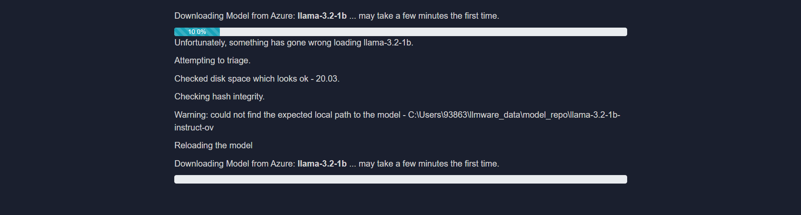
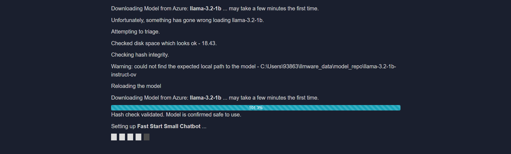

# Error Handling in Chat

## Possible errors during model download
> Unfortunately, something has gone wrong loading _model_name_

If issues are encountered during the download—such as the error prompt shown below:

The **"Yes"** button can be clicked to retry and continue the download.  
> Clicking **"No"** will return the user to the **Main Menu**.

After confirming, the interface should update to:

Once the retry is confirmed and the download continues, the interface will update to the following:

At this stage, the selected models will begin loading automatically after the download completes.  
It is recommended to wait for the loading process to finish before proceeding to use the Chat feature.

Common causes of download errors:
- Insufficient memory on the device
- Disrupted WiFi connection
- Device interruption of model download due to hibernation mode

> [!TIP]
> Refer to the **System Configuration guide** for recommended system settings prior to downloading models.

