# Exploring configuration in Model HQ

The Configure section is the main place where you control how Model HQ works and looks. You can change things like the design, choose your models, set up databases, manage RAG settings, and turn on safety and security options.

After setup, you get access to all these controls in one spot. Think of it like a control panel for the whole app. You can adjust how bots behave, how the screen looks, how data is stored, and how Model HQ connects to other tools.

These settings help users customize Model HQ to fit their own needs, workflows, and rules. 

After completing the initial setup, users gain access to comprehensive configuration controls that shape how Model HQ behaves, appears, and integrates with external systems. The Configure interface serves as the central control panel for tailoring the application to specific use cases, organizational requirements, and security policies. Settings can be adjusted to control default bot behavior, user interface appearance, RAG performance parameters, database connections, safety controls, and enterprise integrations. 

These configurations enable organizations to transform Model HQ from a general-purpose AI application into a customized solution that aligns with their unique workflows, branding guidelines, and compliance requirements. 

Understanding these configuration options is essential for optimizing Model HQ's performance, security posture, and user experience across different deployment scenarios.

## 1. Launching the configuration interface
To begin, the **Configure** button (⚙️) located in the top right side of the main menu can be selected.

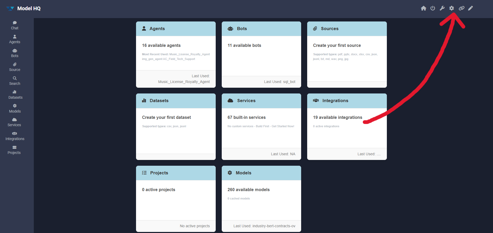

## 2. Configuration interface overview
After launching the configuration section, the interface displays the following key options:


The configuration interface is organized into the following main sections:

| Configuration Section | Description |
|----------------------|-------------|
| **App** | Controls global application behavior, default bots, feature visibility, and runtime modes |
| **Services** | Configures service catalog available in Agents |
| **UI** | Customizes visual appearance including themes, colors, branding, and interface elements |
| **Models** | Configures model options ranging from type of moodels displayed to users, default model selections and max token output sizes |
| **RAG** | Configures retrieval-augmented generation parameters for document search and context building |
| **DB** | Manages database connections and storage configurations |
| **Prompts** | Defines system-level prompts and instruction templates |
| **Server** | Configures backend server settings, ports, and API endpoints |
| **Controls** | Sets Model downloading options and safety controls, content filtering, and security policies (only for users who have **Connected Enterprise Servers** ON in **Config > App**) |
| **Templates** | Manages pre-built templates for agents, bots, and workflows |
| **Connections** | Handles external service integrations and API credentials |
| **Reset** | Provides options to reset bots, agents and model configurations to default values |
| **Display Toggler** | Quick toggle between light and dark display modes |

Each section provides granular control over specific aspects of Model HQ's functionality, enabling customization tailored to organizational needs and deployment environments.

## 3.1 App
The **App** section controls global application behavior, default experiences, visibility of features, and runtime modes within Model HQ. These settings determine how users interact with bots, agents, datasets, services, and enterprise integrations.

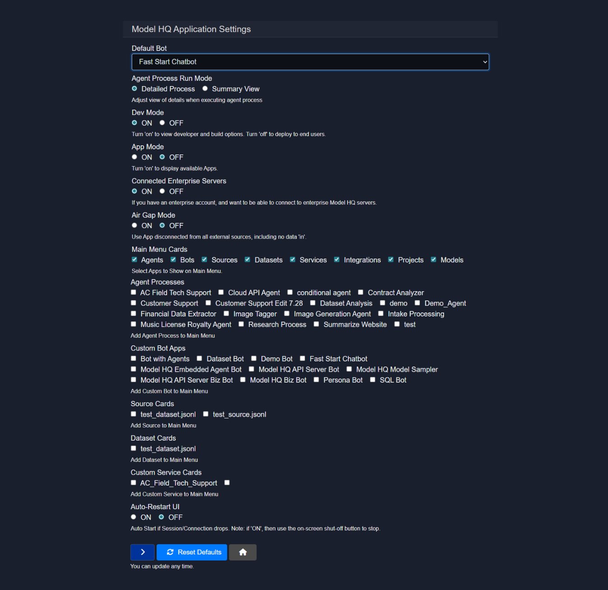

### 3.1.1 Default Bot
Defines which bot is launched by default when the application starts - the listed bots include Bots that are Model HQ template bots as well as any bots the user may have created with Model HQ.

**Available Options:**

* AC Repair Bot
* Bot with Agents
* Dataset Bot
* Demo Bot
* Fast Start Chatbot
* Model HQ Embedded Agent Bot
* Model HQ API Server Bot
* Model HQ Model Sampler
* Persona Bot
* SQL Bot

**Recommendation:**

* Use **Fast Start Chatbot** for quick onboarding and general usage.
* Use **API Server Bots** when running Model HQ primarily as a backend service.
* Use **Bot with Agents** for multi-agent workflows.

### 3.1.2 Agent Process Run Mode
Controls how agent execution details are displayed during runtime.

**Options:**

* **Detailed Process**
  Shows step-by-step execution details for each agent.
* **Summary View**
  Displays a concise execution summary.

**When to use:**

* Detailed Process for debugging and development.
* Summary View for end-user or production environments.

### 3.1.3 Dev Mode
Toggles developer-focused features and build options.

**Options:**

* **ON**
  Enables developer tools, configuration panels, and advanced options.
* **OFF**
  Hides developer options for end-user deployment.

**Recommendation:**

* Enable during development.
* Disable before deploying to non-technical users.

### 3.1.4 App Mode
Controls whether application-level apps are displayed.

**Options:**

* **ON**
  Displays available apps within the UI.
* **OFF**
  Hides app-level UI elements.

### 3.1.5 Connected Enterprise Servers
Enables connectivity to enterprise Model HQ servers.

**Options:**

* **ON**
  Allows connection to enterprise accounts and managed servers.
* **OFF**
  Disables all enterprise server connections.

**Requirement:**

* Must be enabled if using enterprise-hosted Model HQ infrastructure.


### 3.1.6 Air Gap Mode
Runs the application completely disconnected from external networks.

**Options:**

* **ON**
  Blocks all external connections, including data ingestion.
* **OFF**
  Allows internet and external system access.

**Use cases:**

* Secure or regulated environments.
* Offline or isolated deployments.

### 3.1.7 Main Menu Cards
Controls which primary feature cards appear in the main menu.

**Available Cards:**

* Agents
* Bots
* Sources
* Datasets
* Services
* Integrations
* Projects
* Models

**Purpose:**

* Customize UI visibility based on user roles or use cases.
* Simplify the interface for focused workflows.

### 3.1.8 Agent Processes
Select specific agent processes to expose in the main menu.

**Examples:**

* AC Field Tech Support
* Cloud API Agent
* Conditional Agent
* Contract Analyzer
* Customer Support
* Dataset Analysis
* Financial Data Extractor
* Image Tagger
* Image Generation Agent
* Research Process
* Summarize Website

**Behavior:**

* Only selected agents appear as quick-access options.
* Useful for role-based or task-specific setups.

### 3.1.9 Custom Bot Apps
Choose which custom bots appear in the main menu.

**Available Bots:**

* Bot with Agents
* Dataset Bot
* Demo Bot
* Fast Start Chatbot
* Model HQ Embedded Agent Bot
* Model HQ API Server Bot
* Model HQ Model Sampler
* Model HQ API Server Biz Bot
* Model HQ Biz Bot
* Persona Bot
* SQL Bot

**Purpose:**

* Control bot availability per deployment.
* Reduce UI clutter.

### 3.1.10 Source Cards
Select source configurations to display in the main menu.

**Examples:**

* `test_source.jsonl`

Used to provide quick access to predefined data sources.

### 3.1.11 Dataset Cards
Controls which datasets are accessible from the main menu.

**Examples:**

* `test_dataset.jsonl`

Ideal for fast dataset-driven workflows.

### 3.1.12 Custom Service Cards
Displays custom service integrations in the main menu.

**Examples:**

* `AC_Field_Tech_Support`

Used to expose REST, MCP, or backend services directly in the UI.


### 3.1.13 Auto-Restart UI
Controls automatic UI restart behavior if a session or connection drops.

**Options:**

* **ON**
  Automatically restarts the UI on disconnect.
* **OFF**
  Requires manual restart.

**Note:**

* If enabled, use the on-screen shutdown button to stop the application.

### 3.1.14 Reset Defaults
Resets all App settings to their default values.

**Use case:**

* Recover from misconfiguration.
* Quickly revert experimental changes.

These App settings allow fine-grained control over user experience, security posture, feature exposure, and runtime behavior across development, enterprise, and air-gapped deployments.

## 3.2 Services
This is a master panel of services that are available to use in creating agents. Making the selection here will ensure that each of these services are displayed as an option in the Nodes in agents. (Note: Services outside of this master list can be selected at time of use in the agent canvas if not pre-selected here.)

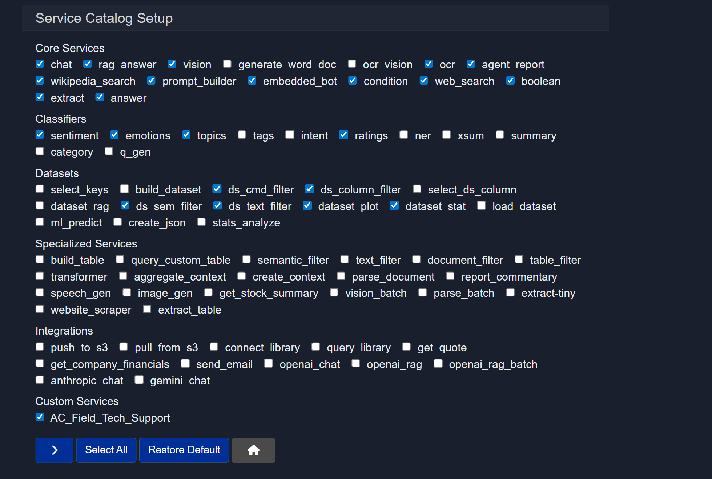

## 3.2.1 Core Services

| Service | Description |
|----------|--------------|
| `chat` | General conversational interface for interacting with the model. Supports multi-turn dialogue with contextual memory. |
| `rag_answer` | Retrieval-Augmented Generation service that retrieves relevant knowledge from connected data sources before generating a response. |
| `vision` | Enables image understanding and visual reasoning from uploaded images. |
| `generate_word_doc` | Generates structured Microsoft Word documents programmatically with formatting and organized content. |
| `ocr_vision` | Optical Character Recognition combined with visual reasoning to extract and interpret text from images. |
| `ocr` | Extracts raw text from images or PDFs without deeper visual reasoning. |
| `agent_report` | Produces structured reports summarizing agent activities, outputs, and analysis. |
| `wikipedia_search` | Retrieves structured information directly from Wikipedia. |
| `prompt_builder` | Assists in constructing optimized and structured prompts for AI workflows. |
| `embedded_bot` | Deployable chatbot service that can be embedded into applications or websites. |
| `condition` | Provides conditional logic capabilities to branch workflows dynamically. |
| `web_search` | Performs real-time web searches to retrieve current and relevant information. |
| `boolean` | Executes logical operations that return true or false outputs. |
| `extract` | Extracts structured or key information from unstructured text inputs. |
| `answer` | Provides direct question answering without maintaining conversational state. |

### 3.2.2 Classifiers

| Service | Description |
|----------|--------------|
| `sentiment` | Determines sentiment polarity such as positive, negative, or neutral. |
| `emotions` | Detects emotional tone within text such as joy, anger, or sadness. |
| `topics` | Identifies major topics discussed within a text. |
| `tags` | Generates relevant tags or labels based on content. |
| `intent` | Identifies user intent from textual input. |
| `ratings` | Predicts rating scores derived from textual feedback. |
| `ner` | Performs Named Entity Recognition to identify entities such as people, organizations, and locations. |
| `xsum` | Generates highly concise summaries optimized for brevity. |
| `summary` | Produces structured and comprehensive summaries of content. |
| `category` | Assigns predefined categories to text inputs. |
| `q_gen` | Generates questions based on provided content. |

### 3.2.3 Datasets

| Service | Description |
|----------|--------------|
| `select_keys` | Selects specific keys from structured data objects. |
| `build_dataset` | Constructs datasets from raw or processed inputs. |
| `ds_cmd_filter` | Applies command-based filtering logic to datasets. |
| `ds_column_filter` | Filters datasets by specified columns. |
| `select_ds_column` | Selects specific columns from a dataset for further processing. |
| `dataset_rag` | Enables Retrieval-Augmented Generation over structured datasets. |
| `ds_sem_filter` | Applies semantic similarity filtering to dataset entries. |
| `ds_text_filter` | Performs keyword or text-based filtering within datasets. |
| `dataset_plot` | Generates visual plots based on dataset values. |
| `dataset_stat` | Produces statistical summaries and metrics from datasets. |
| `load_dataset` | Loads datasets into the execution environment. |
| `ml_predict` | Applies machine learning prediction models to dataset inputs. |
| `create_json` | Converts structured data into JSON format. |
| `stats_analyze` | Performs advanced statistical analysis on datasets. |

### 3.2.4 Specialized Services

| Service | Description |
|----------|--------------|
| `build_table` | Constructs structured tables from input data. |
| `query_custom_table` | Executes queries on custom-defined tables. |
| `semantic_filter` | Filters content based on semantic similarity. |
| `text_filter` | Applies keyword-based filtering logic to text. |
| `document_filter` | Filters documents based on defined criteria. |
| `table_filter` | Filters table rows using specified conditions. |
| `transformer` | Applies transformation models for rewriting or modifying text. |
| `aggregate_context` | Combines multiple context sources into a unified reasoning context. |
| `create_context` | Builds structured contextual memory for agent workflows. |
| `parse_document` | Parses structured documents into defined components. |
| `report_commentary` | Generates commentary and analysis on structured reports. |
| `speech_gen` | Converts text input into speech output. |
| `image_gen` | Generates images from text prompts. |
| `get_stock_summary` | Retrieves summarized financial stock information. |
| `vision_batch` | Processes multiple images in batch mode. |
| `parse_batch` | Parses multiple documents or inputs in batch processing. |
| `extract-tiny` | Lightweight extraction service optimized for speed and efficiency. |
| `website_scraper` | Extracts structured information from websites. |
| `extract_table` | Extracts tabular data from documents such as PDFs or scanned files. |

### 3.2.5 Integrations

| Service | Description |
|----------|--------------|
| `push_to_s3` | Uploads files or structured data to Amazon S3 storage. |
| `pull_from_s3` | Retrieves files or data from Amazon S3 storage. |
| `connect_library` | Connects to external or internal knowledge libraries. |
| `query_library` | Executes queries against connected knowledge libraries. |
| `get_quote` | Retrieves financial stock quote data. |
| `get_company_financials` | Retrieves company financial reports and structured financial data. |
| `send_email` | Sends automated emails through configured systems. |
| `openai_chat` | Integrates OpenAI chat-based model capabilities. |
| `openai_rag` | Integrates OpenAI-powered Retrieval-Augmented Generation. |
| `openai_rag_batch` | Performs batch Retrieval-Augmented Generation using OpenAI services. |
| `anthropic_chat` | Integrates Anthropic chat model capabilities. |
| `gemini_chat` | Integrates Google Gemini chat model capabilities. |

### 3.2.6 Custom Services

Custom services were described as those services that had been created within Model HQ to support domain-specific workflows, specialized automation, or organization-specific requirements. These services extend the standard catalog by incorporating tailored logic, configurations, and business rules.

## 3.3 UI
The **UI** section enables fast and comprehensive customization of Model HQ's visual appearance, including bot names, icons, colors, and other interface elements.

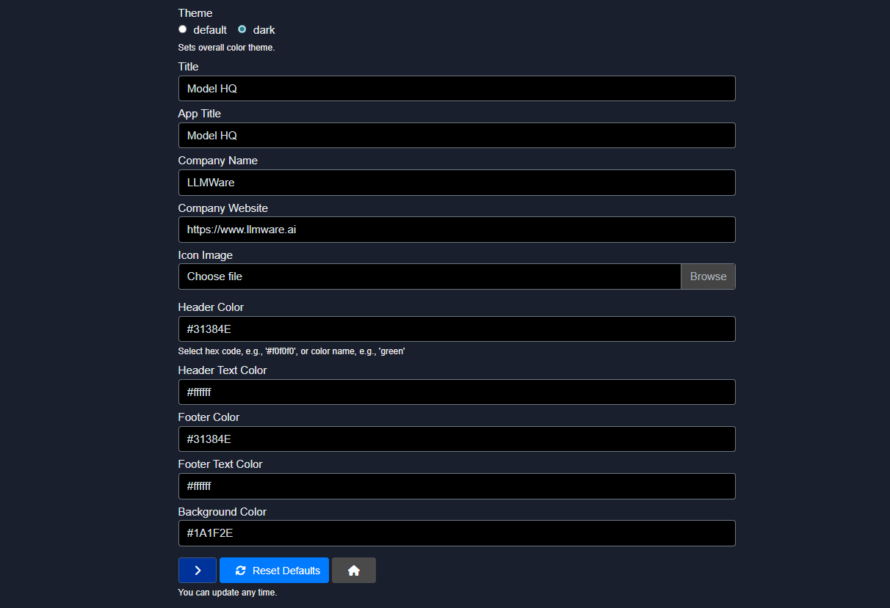

This configuration panel allows the entire Model HQ appearance to be customized according to organizational branding requirements. The following elements can be modified:

- **Theme**: Light or dark mode selection
- **Title**: Application window title
- **App Title**: Display name shown in the interface
- **Company Name**: Organization name displayed throughout the application
- **Company Website**: URL link associated with the organization
- **Icon**: Custom application icon/logo
- **Header Color**: Color scheme for the top navigation bar
- **Footer Color**: Color scheme for the bottom interface elements
- **Background Color**: Main interface background color

These customization options are designed to enable quick and seamless enterprise branding, allowing organizations to align Model HQ with their unique visual identity and corporate standards.

## 3.4 RAG
The **RAG (Retrieval Augmented Generation)** section controls how Model HQ retrieves, ranks, and injects external knowledge into model prompts. These settings directly affect answer quality, relevance, performance, and memory usage when working with documents and sources.

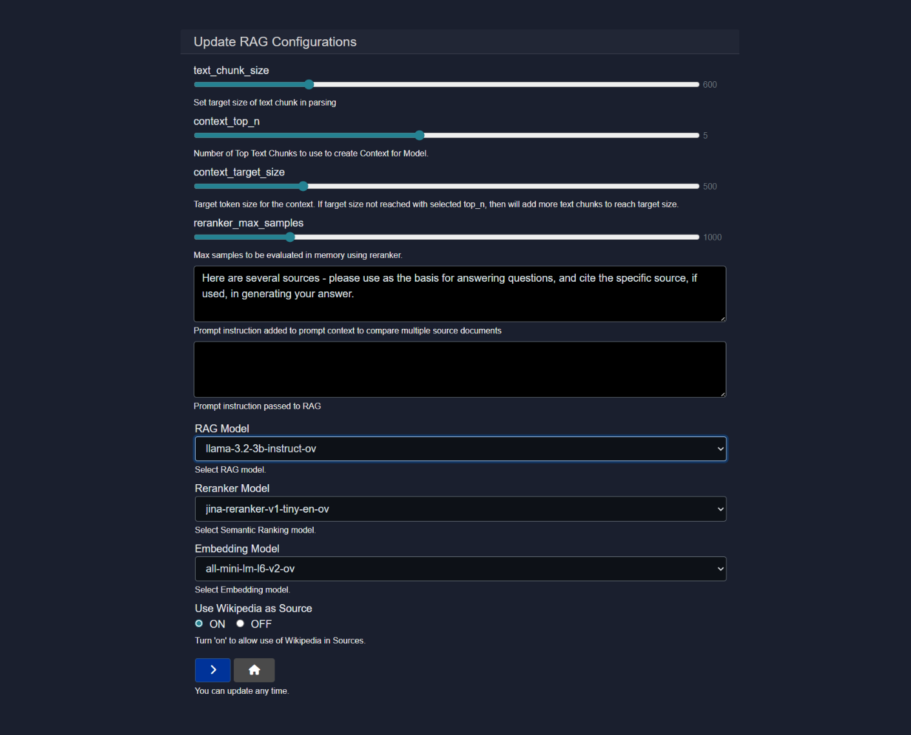

### 3.4.1 Text Chunk Size
Defines the target size of text segments created during document parsing.

**Purpose:**

* Controls how source documents are split before embedding.
* Smaller chunks improve precision.
* Larger chunks preserve more context.

**Example:**

```
600
```

**Guidance:**

* Use smaller values for highly structured or technical documents.
* Use larger values for narrative or long-form content.

### 3.4.2 Context Top N
Specifies the number of top-ranked text chunks selected to build the context for the model.

**Purpose:**

* Limits how many chunks are initially considered relevant.
* Improves speed by narrowing the search space.

**Example:**

```
5
```

### 3.4.3 Context Target Size
Defines the target token size for the final context passed to the model.

**Behavior:**

* If the target size is not reached using the selected top N chunks, additional chunks are added until the target is met.

**Example:**

```
500
```

**Impact:**

* Larger values provide more context but increase token usage.
* Smaller values reduce latency and cost.

### 3.4.4 Reranker Max Samples
Sets the maximum number of text chunks evaluated in memory by the reranker.

**Purpose:**

* Controls how many candidates are semantically re-scored.
* Higher values improve ranking accuracy but increase memory and compute usage.

**Example:**

```
1000
```

### 3.4.5 Context Comparison Prompt
Adds a system instruction to the prompt when multiple source documents are used.

**Default Example:**

```
Here are several sources - please use as the basis for answering questions, and cite the specific source, if used, in generating your answer.
```

**Use case:**

* Ensures answers reference and differentiate between multiple documents.
* Encourages source-aware responses.

### 3.4.6 RAG Prompt Instruction
Custom instruction passed directly into the RAG pipeline.

**Purpose:**

* Guides how retrieved context should be interpreted.
* Can enforce tone, citation format, or reasoning style.

**Example Use Cases:**

* Enforce strict citation requirements.
* Limit answers to retrieved content only.
* Control summarization vs extraction behavior.

### 3.4.7 RAG Model
Selects the language model used to generate responses using retrieved context.

**Example:**

```
llama-3.2-3b-instruct-ov
```

**Recommendation:**

* Use instruction-tuned models for best RAG performance.
* Smaller models improve speed, larger models improve reasoning.

### 3.4.8 Reranker Model
Defines the semantic ranking model used to reorder retrieved text chunks.

**Example:**

```
jina-reranker-v1-tiny-en-ov
```

**Role:**

* Improves relevance by re-ranking chunks beyond vector similarity.
* Critical for multi-document or noisy datasets.

### 3.4.9 Embedding Model
Selects the model used to convert text into vector embeddings.

**Example:**

```
all-mini-lm-l6-v2-ov
```

**Impact:**

* Affects retrieval accuracy and embedding performance.
* Smaller models are faster, larger models capture deeper semantics.

### 3.4.10 Use Wikipedia as Source
Controls whether Wikipedia is included as an external retrieval source.

**Options:**

* **ON**
  Allows Wikipedia content to be used during retrieval.
* **OFF**
  Restricts retrieval to configured sources only.

**Recommendation:**

* Enable for general knowledge queries.
* Disable for enterprise or private datasets.

### 3.4.11 Update Behavior
RAG settings can be updated at any time.

**Notes:**

* Changes take effect immediately for new queries.
* No restart is required.

These RAG configurations allow fine-tuned control over document retrieval, ranking, and prompt construction, enabling accurate, scalable, and context-aware AI responses across diverse data sources.

## 3.5 DB
The **DB** section provides tools for managing resources on the local Model HQ database.

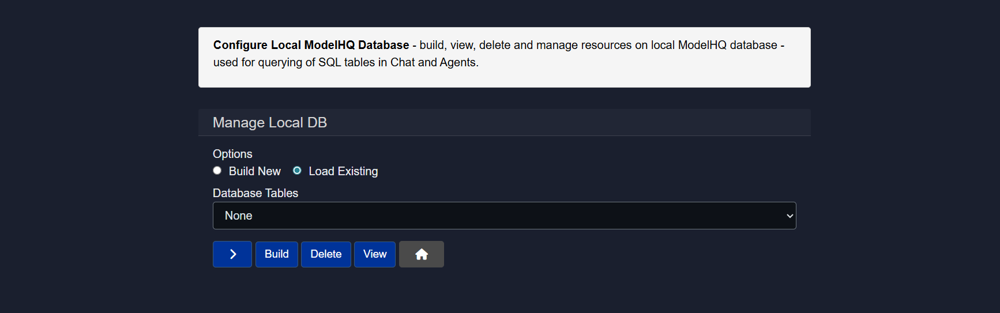

The local Model HQ database can be configured to build, view, delete, and manage resources. This database is utilized for querying SQL tables in Chat and Agents, enabling structured data interactions and query-based workflows. Database management capabilities include schema creation, table configuration, and resource cleanup operations.

## 3.6 Prompts
The **Prompts** section allows system-level prompts to be added and pre-configured for reuse across sessions.


Custom prompt templates can be created and stored for consistent behavior across different workflows. These pre-configured prompts help standardize model interactions, enforce specific response formats, and maintain consistent tone or style requirements throughout the application.

## 3.7 Server
The **Server** section configures the Backend API Server when running Model HQ in **Headless mode**. These settings define how external clients, agents, or applications connect to Model HQ without using the built-in UI.

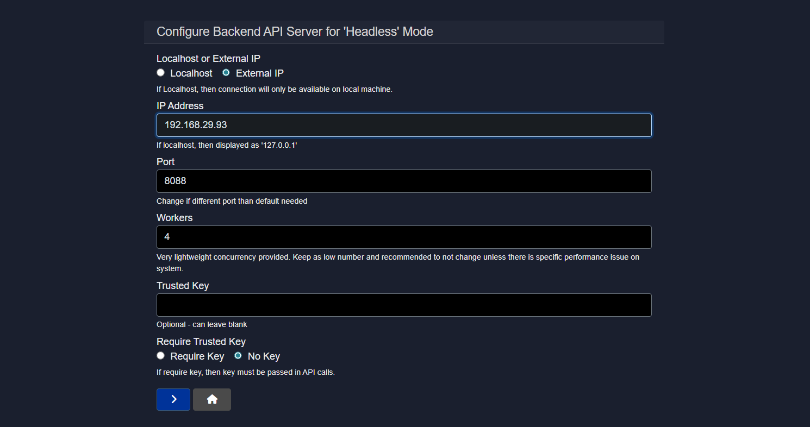

### 3.7.1 Localhost or External IP
Determines whether the backend server is accessible only on the local machine or exposed over the network.

**Options:**

* **Localhost**
  Restricts access to the local machine only.
* **External IP**
  Allows other machines and services to connect.

**Guidance:**

* Use **Localhost** for development and testing.
* Use **External IP** for production or shared environments.

### 3.7.2 IP Address
Specifies the IP address the backend server binds to.

**Behavior:**

* When **Localhost** is selected, this is automatically set to `127.0.0.1`.
* When **External IP** is selected, provide a valid local or public IP.

**Example:**

```
192.168.29.93
```

### 3.7.3 Port
Defines the port on which the Backend API Server listens.

**Default:**

```
8088
```

**Notes:**

* Change only if the default port is already in use.
* Ensure the port is open in firewall and security group rules if exposed externally.

### 3.7.4 Workers
Controls the number of lightweight worker processes handling incoming requests.

**Purpose:**

* Enables basic concurrency for API calls.
* Designed to remain lightweight.

**Example:**

```
4
```

**Recommendation:**

* Keep this value low.
* Increase only if you experience measurable performance bottlenecks.


### 3.7.5 Trusted Key
Optional shared secret used to authenticate API requests.

**Usage:**

* Acts as a simple access control mechanism.
* Must be provided by clients when authentication is enabled.

**Example:**

```
my-secure-trusted-key
```

### 3.7.6 Require Trusted Key
Controls whether the Trusted Key is mandatory for API access.

**Options:**

* **Require Key**
  All API requests must include the trusted key.
* **No Key**
  API is accessible without authentication.

**Security Guidance:**

* Enable **Require Key** for any network-exposed or production deployment.
* Use **No Key** only in isolated or local environments.

### 3.7.7 Access Behavior
When enabled and configured correctly:

* Agents and services can communicate with Model HQ via REST APIs.
* Headless mode allows full automation without the UI.

### 3.7.8 Applying Changes
Server configuration updates take effect immediately.

**Notes:**

* Restart is not required unless explicitly prompted.
* Verify connectivity after changes using a test API call.

This configuration enables secure and flexible deployment of Model HQ as a backend service, supporting both local development and production-grade headless integrations.

## 3.8 Controls
The **Controls** section defines global governance, security, validation, and safety behaviors for model execution and inference. These settings influence how models are loaded, validated, executed, and how sensitive data is handled across the platform.

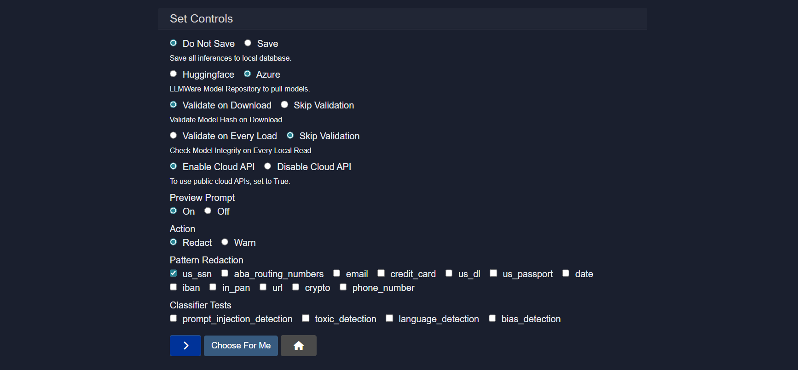

### 3.8.1 Inference Persistence
Controls whether inference results are stored locally.

**Options:**

* **Do Not Save**
  Inference data is not persisted.
* **Save**
  All inference outputs are saved to the local database.

**Guidance:**

* Disable saving for privacy sensitive or transient workloads.
* Enable saving for debugging, audits, or analytics.

### 3.8.2 Model Repository Source
Specifies the repository used to download models.

**Options:**

* **Hugging Face**
  Pulls models from the Hugging Face ecosystem.
* **Azure**
  Pulls models from Azure based model storage.

**Use Case:**

* Select **Azure** for enterprise managed environments.
* Select **Hugging Face** for broader open model access.

### 3.8.3 Model Validation on Download
Controls hash verification when a model is first downloaded.

**Options:**

* **Validate on Download**
  Ensures model integrity at download time.
* **Skip Validation**
  Downloads without integrity checks.

**Recommendation:**

* Keep validation enabled in production environments.

### 3.8.4 Model Validation on Load
Controls whether integrity checks occur each time a model is loaded from disk.

**Options:**

* **Validate on Every Load**
  Verifies model consistency on every read.
* **Skip Validation**
  Skips repeated validation for faster startup.

**Tradeoff:**

* Validation improves safety.
* Skipping improves performance.

### 3.8.5 Cloud API Access
Controls whether public cloud APIs can be used.

**Options:**

* **Enable Cloud API**
  Allows use of external cloud based model APIs.
* **Disable Cloud API**
  Restricts execution to local models only.

**Security Note:**

* Disable cloud APIs for air gapped or compliance restricted environments.

### 3.8.6 Prompt Preview
Controls visibility of the final prompt before execution.

**Options:**

* **On**
  Displays the constructed prompt.
* **Off**
  Executes without preview.

**Use Case:**

* Enable during development and debugging.
* Disable for streamlined end user experiences.

### 3.8.7 Enforcement Action
Defines how the system responds when sensitive patterns are detected.

**Options:**

* **Redact**
  Automatically masks detected content.
* **Warn**
  Flags content but allows execution.

### 3.8.8 Pattern Redaction
Specifies which sensitive data patterns are detected and handled.

**Available Patterns:**

* `us_ssn`
* `aba_routing_numbers`
* `email`
* `credit_card`
* `us_dl`
* `us_passport`
* `date`
* `iban`
* `in_pan`
* `url`
* `crypto`
* `phone_number`

**Behavior:**

* Selected patterns are either redacted or warned based on the configured action.

### 3.8.9 Classifier Tests
Enables built in content classifiers for safety and quality.

**Available Tests:**

* `prompt_injection_detection`
* `toxic_detection`
* `language_detection`
* `bias_detection`

**Purpose:**

* Detects unsafe, malicious, or policy violating content.
* Improves trust and governance across model usage.

### 3.8.10 Automated Configuration
**Choose For Me** automatically selects recommended defaults based on environment and use case.

**Use Case:**

* Quick setup for new deployments.
* Safe baseline configuration for most users.

The **Controls** section provides centralized enforcement of security, compliance, and safety policies, ensuring consistent and governed model behavior across all applications and agents.

## 3.9 Templates
The **Templates** section enables custom templates to be created for accelerated bot and agent development.

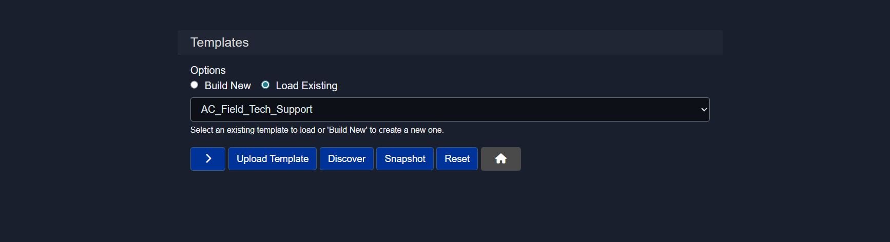

Template management provides options to build new templates or edit and view existing ones. Custom templates streamline the creation process by providing pre-configured structures, default settings, and reusable components. This significantly reduces development time when building multiple bots or agents with similar configurations or workflow patterns.

## 3.10 Connections
The **Connections** screen allows backend API endpoints to be configured for Model HQ connectivity.

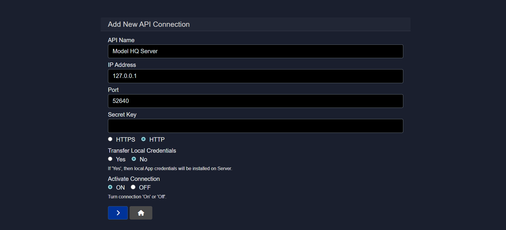

### 3.10.1 API Name
A descriptive label to identify the connection within the UI can be provided.

**Example:** `Model HQ Server`

### 3.10.2 IP Address
The address of the API server should be specified.

**Example:** `127.0.0.1` for local server

### 3.10.3 Port
The port where the server is running should be entered.

**Example:** `52640`

### 3.10.4 Secret Key
An optional key used to authenticate requests between Model HQ and the server can be provided.

### 3.10.5 Protocol
The connection protocol should be selected based on the deployment environment.

* **HTTP** for local or internal setups
* **HTTPS** for secure or remote connections

### 3.10.6 Transfer local credentials
If enabled, local app credentials are copied to the server.
Use only in trusted environments.

### 3.10.7 Activate Connection
Turns the connection on or off.

> [!NOTE]
> Only active connections are used.

## 3.11 Reset
The **Reset** section provides options to reset the application or specific configurations.


The following reset options are available:

- **Default Bots**: Restores default bot configurations
- **Default Agents**: Restores default agent configurations
- **Reset Model Catalog**: Refreshes the model catalog to default state
- **Delete Models**: Removes downloaded models from local storage
- **Clear All**: Clears all loaded state for agents, bots, and sources

> [!CAUTION]
> Reset operations should be performed with caution. Once reset, models, custom applications, and other Model HQ-related files will be deleted and will need to be re-created or re-downloaded.

## 3.12 Theme toggler
The theme toggler provides a quick switch between light and dark display modes for the interface.

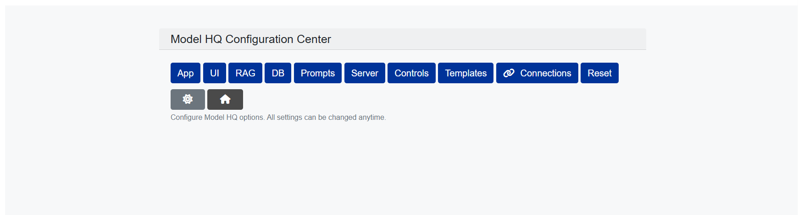

## Conclusion
This document described the comprehensive configuration options available in Model HQ's Configure interface. The configuration system enables fine-grained control over application behavior, visual appearance, RAG performance, database connectivity, safety controls, and enterprise integrations. Key configuration areas include App settings for controlling feature visibility and runtime modes, UI customization for branding and appearance, RAG parameters for optimizing document retrieval and context building, Server settings for headless deployments, Controls for safety and compliance enforcement, and Connections for backend API integration. Understanding and properly configuring these settings enables organizations to optimize Model HQ for their specific use cases—whether prioritizing security in air-gapped environments, customizing branding for enterprise deployments, tuning RAG performance for document-heavy workflows, or establishing robust safety controls for production systems. The flexibility provided by these configuration options allows Model HQ to adapt from development environments to production deployments while maintaining consistent behavior, appearance, and security posture across different scenarios.
