# Exploring datasets in Model HQ
After the initial setup is complete, the **Main Menu** will be presented, from which all of Model HQ's features — including **Datasets** — can be accessed.

**Datasets** is a feature designed for working with structured data files such as **CSV**, **XLSX**, and **JSON** directly within AI agent workflows. Unlike regular document sources — which handle unstructured content such as PDFs or text files — datasets are built for **structured, table-based data**, meaning rows and columns with clearly defined fields.

When a dataset is created in Model HQ, the following configuration steps are completed:

- Structured data (CSV, XLSX, or JSON) is uploaded as the dataset source.
- The columns containing searchable text are identified for RAG/retrieval indexing.
- A unique ID column is designated for precise record referencing.
- Key performance indicator (KPI) fields are marked for analytical and predictive tasks.
- The columns most relevant to agent workflows are selected to streamline interaction.

Once configured, datasets enable AI agents to perform a wide range of data-driven operations:

- Structured data can be searched across rows using semantic, keyword, or exact-phrase queries.
- Results can be filtered by row number, keyword match, or natural language query.
- Classification tasks — such as sentiment, emotion, topic, or ratings analysis — can be applied to selected rows, with output exported in CSV format.
- Questions can be answered and summaries generated from filtered results.
- Trend and pattern analysis can be performed on selected columns, with detailed reports produced in Word format.
- Data-driven insights and predictions can be generated from designated KPI fields.

In summary, the Datasets feature transforms spreadsheets and structured data files into intelligent, searchable knowledge bases that AI agents can reason over with accuracy and efficiency.

## Quick setup

The following animation provides an overview of the full dataset creation and configuration workflow — from launching the interface to completing the four-step index configuration.

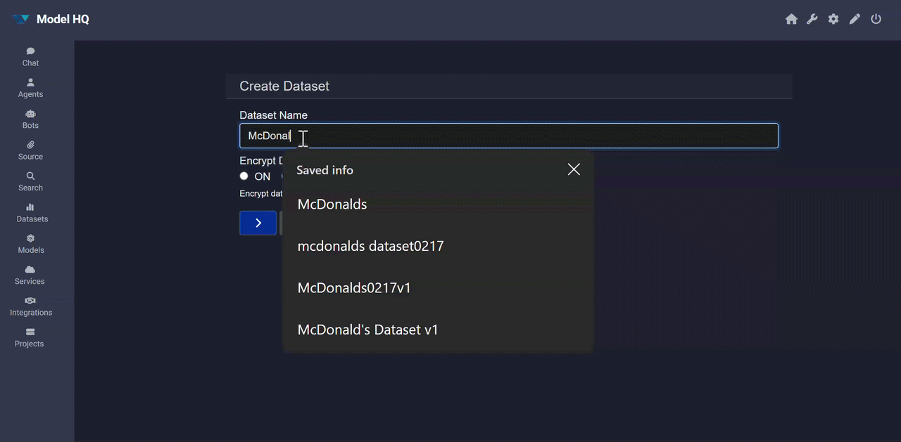

For a detailed walkthrough of each step, refer to the sections below.

## 1. Launching the dataset interface
To begin, the **Dataset** button in the main menu sidebar can be selected.

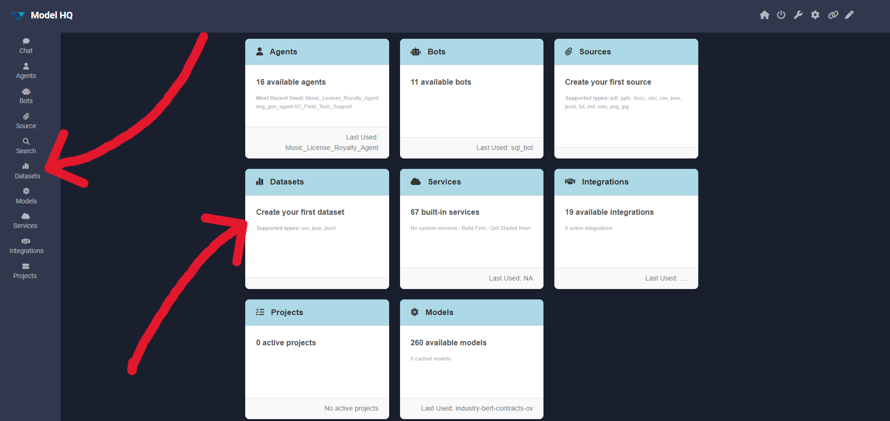

## 2. Creating a dataset
To create a dataset, the **Build New** button can be selected. If datasets have been created previously, both **Load Existing** and **Build New** options will be visible; otherwise, only **Build New** will be available.

When **Build New** is selected, a creation interface will be presented in which a dataset name and encryption type can be specified.

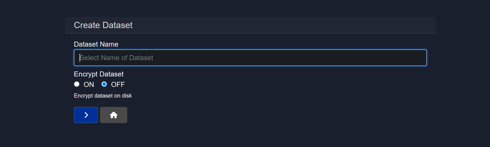

### 2.1 Adding a dataset
Once the creation form is completed, a file upload prompt will be presented. The file should have a well-defined row-column structure and will serve as the dataset source. Supported file types include `.csv`, `.xlsx`, and `.json`.

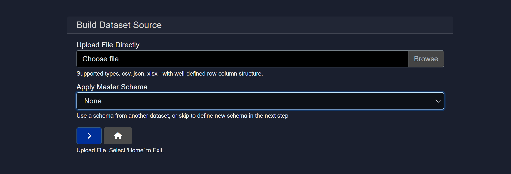

### 2.1.1 Master schema
If a previous dataset source exists, it can be leveraged to establish a master schema for the dataset currently being created. This enables structural consistency across multiple datasets with similar field layouts.

### 2.2 Mapping
Once a file has been added, the schema will be automatically fetched and field mapping will be performed. The mapping can be reviewed for accuracy and updated as needed to ensure proper field alignment and data type classification.

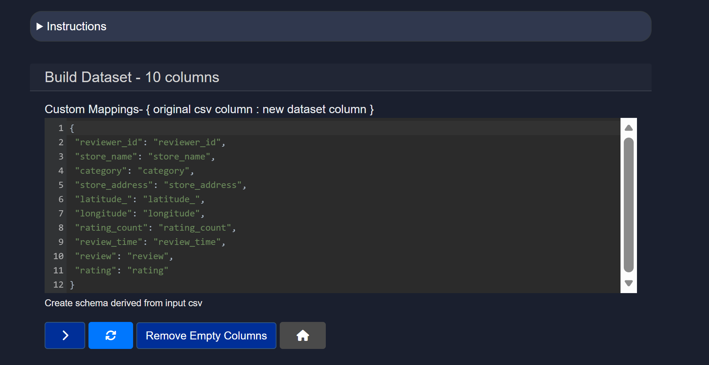

The **Remove Empty Columns** button can be used to remove any columns that contain no data.

The **refresh** icon can be used to restore the dataset to its original state if any changes were made in error.

Additionally, through the custom mapping screen, the following manual adjustments can be made:

1. Unnecessary columns — particularly those that will not be used in agent workflows — can be removed. This is especially useful when working with large datasets.
2. Columns can be renamed, which is helpful when original column names are lengthy or when a more descriptive designation is preferred.

> [!NOTE]
> Care should be taken to preserve the JSON structure (i.e., quotation marks, colons, and commas) when making manual edits to the mapping. Malformed JSON will prevent the dataset from saving correctly.

Once the mapping has been reviewed and adjusted, the **>** button can be selected to proceed to the next step.

### 2.3 Confirm the dataset schema
In this step, confirmation of the dataset schema will be requested. Comprehensive dataset details — including an automated dataset analysis and instructions for dataset setup — will be provided for review before proceeding.

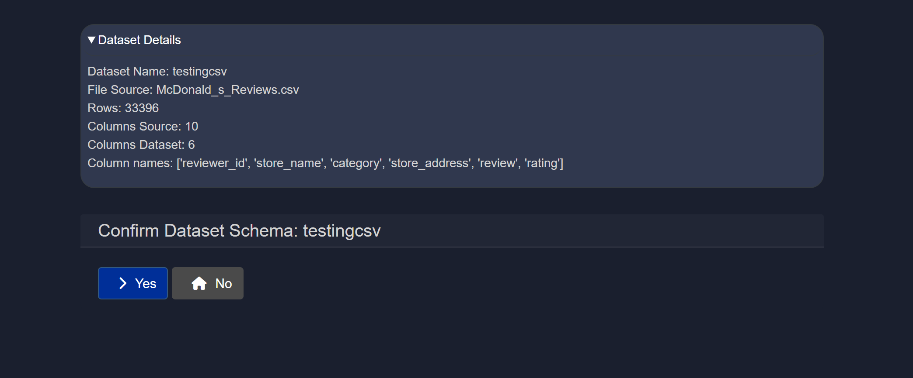

### 2.4 Dataset configuration setup
This is a four-step configuration process in which three foundational questions will be presented. One or more fields from the dataset should be selected at each step to define how the dataset will be indexed and queried.

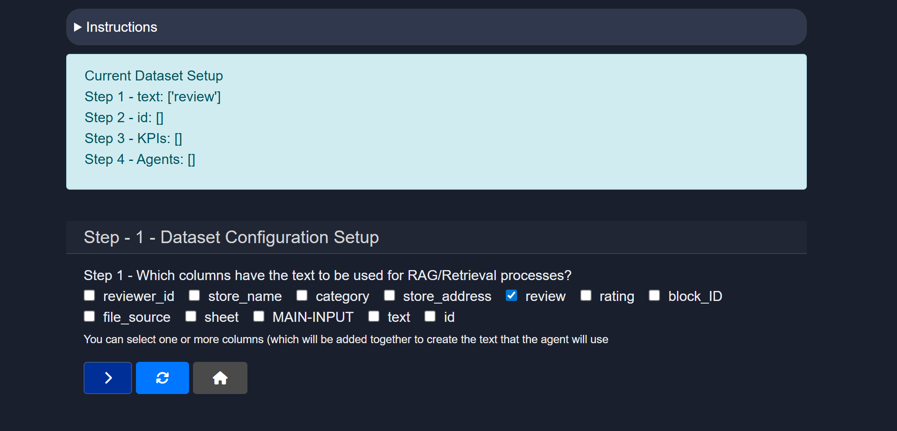

**Step 1: RAG/retrieval columns**
*"Which columns have the text to be used for RAG/Retrieval processes?"*

Model HQ automatically identifies and pre-selects column(s) containing text data suitable for language queries and analysis. These columns form the basis of semantic search and retrieval within the dataset, and can also serve as the foundation for AI-driven classification tasks such as topic detection, intent recognition, sentiment analysis, emotion detection, and ratings evaluation — applied to the text content of each row.

Any additional columns suitable for these types of tasks should be checked before proceeding.

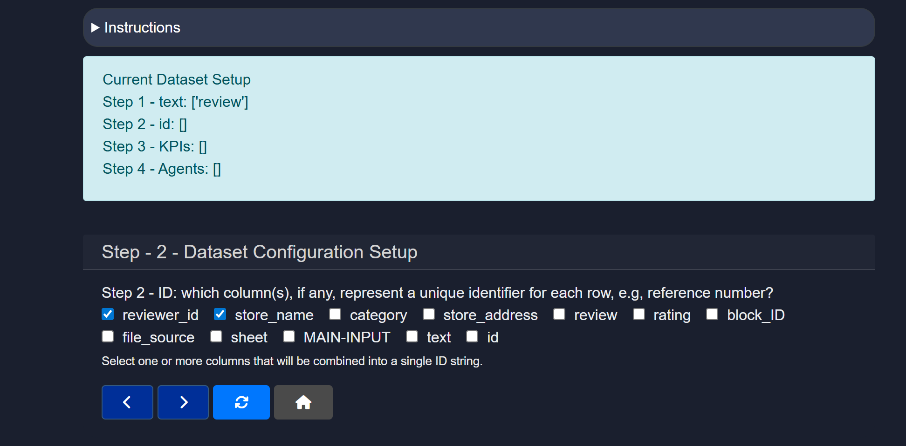

**Selection guidance:**
- **Purpose**: Columns selected here will be indexed for keyword filtering, semantic similarity search, and AI analyses such as topic classification, sentiment, emotion, and ratings evaluation. These columns are also searched when natural language questions are posed to the dataset.
- **Examples**: In a product dataset, columns such as "Product Description", "Features", or "Customer Reviews" would be appropriate RAG columns. In an HR dataset, columns like "Job Description", "Requirements", or "Responsibilities" would be suitable.
- **Multiple selections**: Multiple columns can be selected when textual information is distributed across several fields — for example, a dataset may contain both "Title" and "Content" columns that should both be indexed.
- **Impact**: Only columns selected here will be included in the semantic search index. Unselected columns can still be used for filtering or display purposes, but will not contribute to relevance ranking.

**Step 2: ID column**
*"Which column(s), if any, represent a unique identifier for each row, e.g., reference number?"*

An ID column serves as the primary key for each record in the dataset, enabling precise referencing and tracking of individual rows during retrieval and analysis.

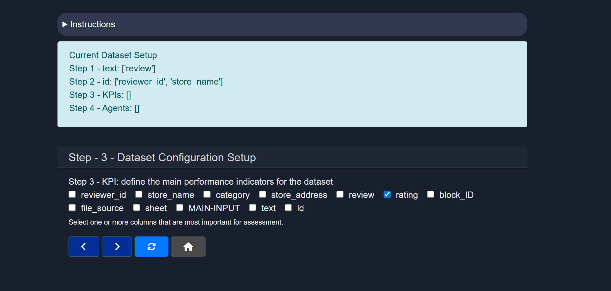

**Selection guidance:**
- **Purpose**: ID columns uniquely identify each row in the dataset. They serve as primary keys that distinguish one record from all others.
- **Examples**: In a product dataset, "Product ID" or "SKU" would serve as ID columns. In a customer database, "Customer ID" or "Email" might function as identifiers. In a document collection, "Document ID" or "Reference Number" would be appropriate.
- **Single or multiple**: While a single ID column is typically preferred, some datasets may use composite identifiers in which multiple columns together form a unique key.
- **Impact**: When query results are returned, the ID column allows users to identify exactly which records were retrieved — a critical factor for data integrity and downstream processing.
- **Optional**: If no clear identifier exists in the dataset, this field can be left empty. The system will still function, though individual record tracking will be less precise.

**Step 3: KPI definition**
*"Define the main performance indicators for the dataset"*

Key Performance Indicators (KPIs) are quantifiable metrics that represent important business or analytical values within the dataset. These fields are typically used for aggregation, trend analysis, predictive modeling, and performance evaluation tasks.

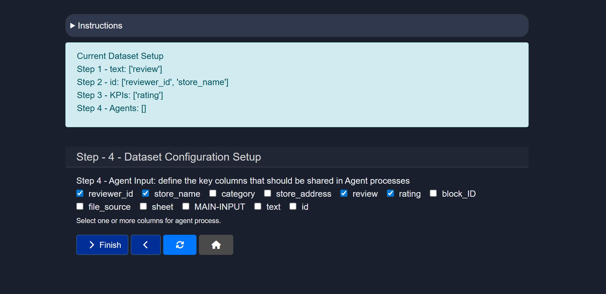

**Selection guidance:**
- **Purpose**: KPIs are numerical or categorical fields that represent important metrics or measurable outcomes. These columns are prioritized for predictive modeling, trend detection, and performance benchmarking.
- **Examples**: In a sales or marketing dataset, KPIs might include "Ratings", "Revenue", "Sales Amount", "Conversion Rate", or "Customer Lifetime Value". In a healthcare dataset, relevant KPIs could be "Patient Recovery Time", "Treatment Success Rate", or "Cost per Treatment". In an analytics dataset, "Click-Through Rate", "Engagement Score", or "User Growth" would be appropriate KPIs.
- **Multiple indicators**: Several KPI columns can be designated when the dataset tracks more than one important metric — for example, an e-commerce dataset might define both "Sales" and "Customer Satisfaction Score" as KPIs.
- **Numerical vs. categorical**: KPIs are typically numerical (such as revenue or count), but categorical KPIs (such as "Status: Active/Inactive") can also be meaningful for classification and analysis.
- **Impact**: Designated KPIs allow the AI model to focus analytical and predictive operations on the most business-critical fields, enabling more targeted insights and comparative trend tracking.

Once the three configuration steps are completed, a final review of the dataset configuration will be presented for confirmation.

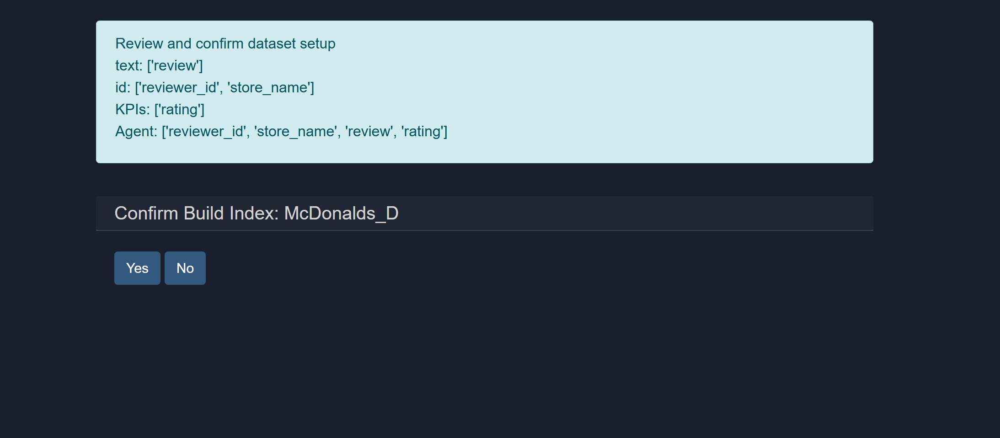

**Step 4: Agent input**
*"Define the key columns that should be shared in Agent processes"*

This step identifies the columns that will be exposed as actionable data within agent workflows. Only the columns selected here will be available when the dataset is attached to an agent as a file source. It is recommended that only the columns intended for active querying, analysis, or interaction in agents be selected — a leaner column structure results in more focused and manageable agent workflows.

**Confirm build index**

Once the dataset index has been configured and reviewed, confirmation can be submitted by selecting **Yes**. If further edits to any previous step are required, **No** can be selected to return and make adjustments.

Upon confirming by selecting **Yes**, the Dataset Configuration screen for the newly created dataset will be displayed.

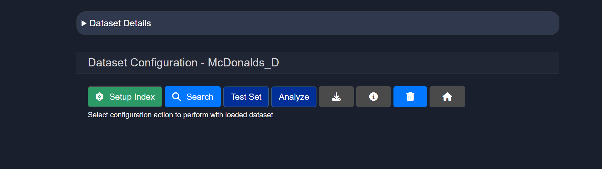

### 2.5 Search
The search functionality for dataset sources operates identically to the standard source search described in the [Source documentation](). Queries can be formulated using semantic search (which returns the top 20 matches), keyword-based matching, or exact phrase matching to retrieve relevant records from the dataset.

### 2.6 Test set (BETA) (may not be available in all versions)
The **Test** option enables a target variable to be defined that will be predicted or fitted using a machine learning model. This feature allows predictive models to be built and evaluated against dataset columns.

In this step, the **train variable** — for example, a target outcome column — that represents the output the model should learn to predict can be specified.

- **Train variable**: The name of the column to be used as the training target should be entered. This is the variable the ML model will attempt to predict based on the other features present in the dataset.
  - If the column already exists in the dataset, it will be used directly.
  - If the column name does not exist in the current schema, it will be added.
  - If the field is left blank, the training configuration will be ignored and no ML model will be trained.

> [!NOTE]
> The train variable should correspond to a column with clear, well-defined values. Sparse or incomplete columns may result in degraded model performance.

Once the target variable has been specified, confirmation will be requested to finalize and begin training an ML model on the dataset.

### 2.7 Analyze
The **Analyze** tab provides an overview analysis of the dataset. By expanding the *Analysis* section, statistical information can be reviewed — including mean, standard deviation, minimum and maximum values, average text length, KPI column summaries, and other analytical metadata about the dataset.

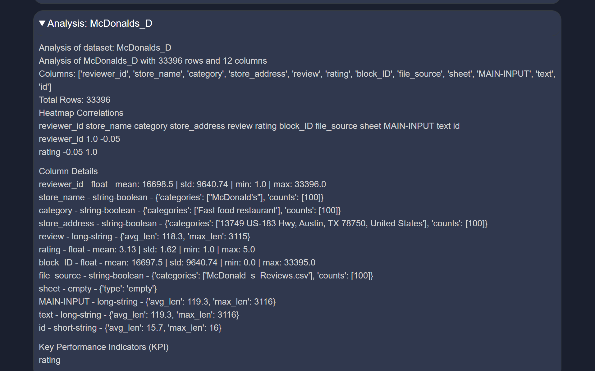

### Download dataset
The CSV of the configured dataset can be downloaded by selecting the download icon in the dataset interface.

### Dataset information
Detailed information about the original dataset — including row count, column count, and the full schema — can be reviewed by selecting the **i** icon.

### Delete dataset
A specific dataset can be permanently removed from Model HQ by selecting the delete option associated with that dataset in the interface.

## Conclusion
This document described how to work with the Datasets feature in Model HQ — a specialized capability designed for structured data sources such as CSV, XLSX, and JSON files. Once a dataset has been created and configured through the four-step index setup, it becomes a queryable, AI-ready knowledge base that can be attached to agent workflows for search, classification, analysis, and prediction tasks.

The configuration process — covering RAG/retrieval columns, ID columns, KPI definitions, and agent input columns — ensures that the AI model has the structural context needed to reason over the data accurately. It is recommended to invest care in the initial mapping and column selection steps, as these decisions directly influence retrieval quality and agent performance.

For information on how datasets can be used within agent workflows, refer to the [WILL BE ADDED SOON].