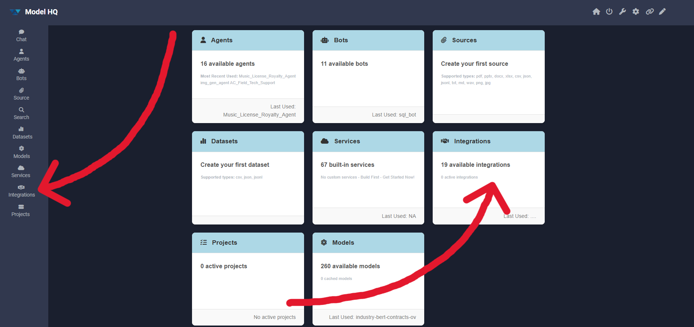
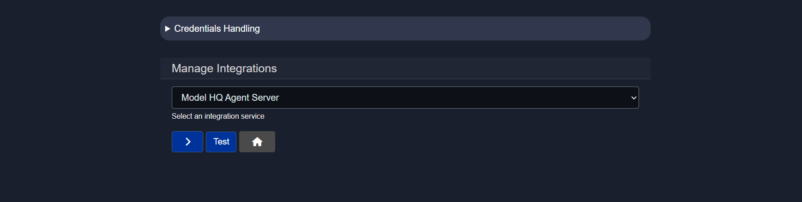

# Exploring integrations in Model HQ
The Integrations interface in Model HQ enables seamless connectivity with external services, cloud platforms, search engines, productivity tools, and AI model providers. Integrations transform Model HQ into a connected platform capable of accessing enterprise data sources, leveraging third-party APIs, and orchestrating workflows across multiple systems. 

By establishing authenticated connections to services such as AWS S3, Azure Blob Storage, Google Workspace, Microsoft 365, Jira, ServiceNow, and leading AI providers, Model HQ agents can retrieve documents, execute searches, access structured data, and invoke external APIs as part of their workflows.

Credential management for integrations follows a security-first approach where all credentials are encrypted and stored locally on the user's machine. No credential information is transmitted to LLMWare or external parties except when explicitly required to authenticate with the connected service itself. Users maintain full control over their credentials and can review, test, or delete them at any time using the Integrations interface. Most Model HQ features can be utilized without providing any credentials, and integration setup is entirely optional based on specific use case requirements.

This document provides comprehensive guidance on the Integrations interface, including how to launch it, manage credentials securely, and configure each of the 19 supported integrations. For each integration, detailed setup instructions are provided, including required credentials, configuration parameters, and links to external documentation for obtaining API keys or access tokens. As Model HQ continues to evolve, additional integrations are regularly added to support new services and platforms. Organizations requiring custom integrations can contact support to request new connectivity options tailored to their specific enterprise systems.

## 1. Launching the integrations interface
The **Integrations** button in the main menu sidebar can be selected, or the integrations option can be chosen from the home page as shown in the screenshot.

## 2. Integrations interface overview
The Integrations interface is straightforward and requires only essential credentials to connect external applications with Model HQ.

For users concerned about credential security and potential data leaks, the following section explains how added credentials are stored and managed.

### 2.1 Credentials handler
- Credentials are stored in encrypted form on the local machine only.
- No credential information is ever transmitted or shared with LLMWare.
- Except where credentials are needed to authenticate with a cloud service, credential information is not saved or transmitted anywhere.
- Credentials are optional and relate to specific clearly identified services.
- Virtually all features of Model HQ can be used without providing any credentials.
- All credentials can be deleted using the REFRESH button below.
- All credentials can be reviewed in the Credentials section.

### 2.2 Available integration options:
Currently, 19 applications can be integrated with Model HQ. However, the platform is scaling rapidly, and new applications are continuously being added.

If integration with additional applications is desired, please [contact us](/support).

- Model HQ Agent Server
- AWS S3 Bucket
- Azure Blob Storage
- Serp API Search
- Tavily Search
- NewsAPI.org
- Finnhub
- Jira API
- ServiceNow
- Zendesk
- Microsoft OneDrive
- Microsoft Sharepoint
- Gmail
- Wikipedia
- Yahoo Finance
- Open AI
- Anthropic Claude
- Google Gemini
- Windows Local Foundry

Once an integration is added, it can be utilized within agents to automate workflows and processes.

When integrating any service, options are available to activate or deactivate the integration at any time.

> [!NOTE]
> Integrations not already listed above can be easily added by the user in **Services**.

## 3. Integrations
In the sections below, a detailed breakdown of all integrations is provided, including the required credentials needed to connect each service with Model HQ.

When configuring any integration, options are available to activate or deactivate it at any time by selecting **Activate Integration** in the integration page.

Once all credentials have been added, the **test** button can be clicked to verify whether the connection is successful. If the connection fails, there may be issues with the provided credentials. If the credentials are correct but the connection still fails, please [contact support](/support).

### 3.1 Model HQ Agent Server
Model HQ Agent Server provides a scalable deployment environment for custom Agents, semantic RAG and model inferencing - and is integrated seamlessly across the Model HQ App. Once you connect, you will see Library available as an option in RAG Sources if the server has them, as well as other Model HQ bots, services or agents that have been set up in the server.

**Setup Integration:**
- IP Address
- Port
- Model HQ Trusted API Key

> [!NOTE]
> The Model HQ Trusted API Key provides an additional layer of security for accessing the Model HQ Agent Server. Please obtain this key from your system administrator before connecting.

### 3.2 AWS S3 Bucket
Files can be pulled from AWS S3 Buckets to build RAG sources. After activating and testing credentials, to get started, please go to RAG and start building a source, and you will see the AWS S3 button available as a repository to download and add documents to your source.

**Setup Integration:**
- AWS Access Token
- AWS Secret Token

> [!NOTE]
> Here's are the steps to get your tokens:
> 1. Open the [AWS Console](https://eu-north-1.signin.aws.amazon.com/oauth?client_id=arn%3Aaws%3Asignin%3A%3A%3Aconsole%2Fcanvas&code_challenge=JIB96iKBMcgvbiRgUseEGT7kt6qWzonb7hgPGwH-LnQ&code_challenge_method=SHA-256&response_type=code&redirect_uri=https%3A%2F%2Fconsole.aws.amazon.com%2Fconsole%2Fhome%3Fca-oauth-flow-id%3D5fdc%26hashArgs%3D%2523%26isauthcode%3Dtrue%26state%3DhashArgsFromTB_eu-north-1_92eabaa8fd1185a6)
> 2. Click on your username near the top right and select **Security > Credentials**
> 3. Click on Users in the sidebar
> 4. Click on your username
> 5. Click on the **Security Credentials** tab
> 6. Click **Create Access Key**
> 7. Click **Show User Security Credentials**

### 3.3 Azure Blob Storage
Files can be pulled from a selected Azure Blob Container. After activating and testing credentials, to get started, please go to RAG and start building a source, and you will see the Azure Blob Storage button available as a repository to download and add documents to your source. Since Blob Storage permissions tend to align at the container level, you should be prepared to name the specific container to access in addition to account credentials.

**Setup Integration:**
- Azure Account URL
- Azure Credential
- Azure Blob Storage container

> [!NOTE]
> Here are the steps to get your Azure Blob Storage URL and credentials:
> 1. Sign in to the [Azure Portal](https://portal.azure.com)
> 2. Navigate to **Storage accounts** and select your storage account
> 3. Go to **Settings > Endpoints** and copy the **Blob service URL** (`https://<storage-account-name>.blob.core.windows.net`)
> 4. To get credentials, open **Security + networking > Access keys**
> 5. Click **Show keys** and copy **Key1** or the **Connection string**
> 6. To find a container name, go to **Data storage > Containers**
> 7. The container URL will be `https://<storage-account-name>.blob.core.windows.net/<container-name>`

### 3.4 Serp API Search
Use Serp Search API to retrieve links and website content.

**Setup Integration:**
- Serp API Key

> [!NOTE]
> Here are the steps to get your SerpAPI key:
> 1. Open the [SerpAPI website](https://serpapi.com)
> 2. Click **Sign up** or **Log in**
> 3. Complete the account signup if you are new
> 4. Go to your **Dashboard**
> 5. Copy the **API Key** shown on the dashboard
> 6. Use this key in your application as your SerpAPI key

### 3.5 Tavily Search
Use Tavily API to retrieve links and website content

**Setup Integration:**
- Tavily API Key

> [!NOTE]
> Here are the steps to get your Tavily API key:
> 1. Open the [Tavily website](https://tavily.com)
> 2. Click **Sign up** or **Log in**
> 3. Complete the account onboarding
> 4. Go to your **Dashboard**
> 5. Navigate to **API Keys**
> 6. Copy the generated **API key** and use it in your application

### 3.6 NewsAPI.org
Use NewsAPI.org Search API to retrieve links and website content

**Setup Integration:**
- NewsAPI.org API Key

> [!NOTE]
> Here are the steps to get your NewsAPI.org API key:
> 1. Open the [NewsAPI website](https://newsapi.org)
> 2. Click **Get API Key** or **Sign up**
> 3. Create an account or log in
> 4. Complete the registration details if prompted
> 5. Go to your **Account** or **Dashboard**
> 6. Copy your **API key** and use it in your application

### 3.7 Finnhub
Use Finnhub.io API to retrieve updated and time series financial data

**Setup Integration:**
- Finnhub API Key

> [!NOTE]
> Here are the steps to get your Finnhub API key:
> 1. Open the [Finnhub website](https://finnhub.io)
> 2. Click **Get Free API Key** or **Sign up**
> 3. Create an account or log in
> 4. Complete the onboarding if required
> 5. Go to your **Dashboard**
> 6. Copy your **API key** and use it in your application

### 3.8 Jira API
Retrieve issues and documentation from Jira tickets. After activating and testing credentials, to get started, please go to RAG and start building a source, and you will see the Jira button available to search projects for tickets, isssues and associated content and add documents to your source.

**Setup Integration:**
- Jira Domain
- Jira User Email
- Jira API Token

> [!NOTE]
> Here are the steps to get your Jira API credentials:
> 1. Identify your **Jira Domain** (`https://<your-domain>.atlassian.net`)
> 2. Log in to your Jira account using your **Jira User Email**
> 3. Open **Account settings** from your profile menu
> 4. Go to **Security > API tokens**
> 5. Click **Create API token**
> 6. Give the token a label and click **Create**
> 7. Copy the generated **Jira API Token** (shown only once)
> 8. Use your **Jira Domain**, **User Email**, and **API Token** for authentication

### 3.9 ServiceNow
Retrieve issues and documentation from ServiceNow tables. After activating and testing credentials, to get started, please go to RAG and start building a source, and you will see the ServiceNow button available to retrieve key tables and associated content and add documents to your source.

**Setup Integration:**
- ServiceNow Instance
- ServiceNow User
- ServiceNow Password

> [!NOTE]
> Here are the steps to get your ServiceNow credentials:
> 1. Identify your **ServiceNow Instance** (`https://<instance-name>.service-now.com`)
> 2. Log in to your ServiceNow instance
> 3. Use your **ServiceNow User** (username or email used to sign in)
> 4. Use the corresponding **ServiceNow Password**
> 5. Ensure the user has the required roles and permissions for API access

### 3.10 Zendesk
Retrieve issues and documentation from Zendesk. After activating and testing credentials, to get started, please go to RAG and start building a source, and you will see the Zendesk button available to retrieve key tables and associated content and add documents to your source.

**Setup Integration:**
- Zendesk Subdomain
- Zendesk Email
- Zendesk API Token

> [!NOTE]
> Here are the steps to get your Zendesk API credentials:
> 1. Identify your **Zendesk Subdomain** (`https://<subdomain>.zendesk.com`)
> 2. Log in to your Zendesk Admin account
> 3. Go to **Admin Center**
> 4. Navigate to **Apps and integrations > APIs > Zendesk API**
> 5. Enable **Token access** if it is not already enabled
> 6. Click **Add API token**
> 7. Copy the generated **API Token**
> 8. Use your **Zendesk Email**, **API Token**, and **Subdomain** for authentication

### 3.11 Microsoft OneDrive
Retrieve information from Microsoft OneDrive

**Setup Integration:**
- One Drive URL Base Path

Default OneDrive Base Url Path:
https://graph.microsoft.com/v1.0/me/drive/root/children (pre-added)

> [!NOTE]
> 1. Authentication Token will be prompted over OAUTH
> 2. When refresh token required, you will be prompted in UI
> 3. After providing OAUTH credentials, you will see confirmation in separate browser tab, which you can close upon completion
> 4. Microsoft Permission Scope: 'Files.Read.All'

### 3.12 Microsoft Sharepoint
Retrieve information from Microsoft Sharepoint

**Setup Integration:**
- Sharepoint URL Base Path

Default Sharepoint Base Url Path:
https://graph.microsoft.com/v1.0/sites?search=* (pre-added)

> [!NOTE]
> 1. Authentication Token will be prompted over OAUTH
> 2. When refresh token required, you will be prompted in UI
> 3. After providing OAUTH credentials, you will see confirmation in separate browser tab, which you can close upon completion
> 4. Microsoft Permission Scope: 'Sites.Read.All'

### 3.13 Gmail
Send emails using gmail account in agent process

**Setup Integration:**
- Sender email address (GMAIL)
- Sender email password (App Access)

### 3.14 Wikipedia
Search Wikipedia and retrieve relevant articles

**Setup Integration:**
Not needed

### 3.15 Yahoo Finance
Retrieve stock ticker information

**Setup Integration:**
Not needed

### 3.16 OpenAI
Open AI models are provided in the core model catalog, and can be referenced by model_name. Open AI is also provided as a Service that can be integrated into Agent processes.

**Setup Integration:**
- Open AI API token

> [!NOTE]
> Here are the steps to get your OpenAI API key:
> 1. Open the [OpenAI platform](https://platform.openai.com)
> 2. Sign in or create an account
> 3. Go to **Dashboard**
> 4. Navigate to **API keys**
> 5. Click **Create new secret key**
> 6. Copy the generated **API key** and store it securely

### 3.17 Anthropic Claude
Anthropic models are provided in the core model catalog, and can be referenced by model_name. Anthropic is also provided as a Service that can be integrated into Agent processes.

**Setup Integration:**
- Anthropic API token

> [!NOTE]
> Here are the steps to get your Anthropic API token:
> 1. Open the [Anthropic Console](https://console.anthropic.com)
> 2. Sign in or create an account
> 3. Go to **Dashboard**
> 4. Navigate to **API Keys**
> 5. Click **Create API Key**
> 6. Copy the generated **API token** and store it securely

### 3.18 Google Gemini
Google Gemini models are provided in the core model catalog, and can be referenced by model_name.

**Setup Integration:**
- Gemini API token

> [!NOTE]
> Here are the steps to get your Gemini API token:
> 1. Open the [Google AI Studio](https://aistudio.google.com)
> 2. Sign in with your Google account
> 3. Go to **API keys**
> 4. Click **Create API key**
> 5. Select or create a Google Cloud project if prompted
> 6. Copy the generated **Gemini API key** and store it securely

### 3.19 Windows Local Foundry
Windows Local Foundry models can be discovered and added to the core model catalog, and can be referenced by model_name.

**Setup Integration:**
[TBD]

## Conclusion
This document provided comprehensive guidance on the Integrations interface in Model HQ, which enables secure connectivity with 19 external services spanning cloud storage providers, search engines, productivity platforms, CRM systems, and AI model providers. The Integrations framework transforms Model HQ from a standalone application into a connected ecosystem capable of accessing enterprise data sources, leveraging third-party APIs, and orchestrating cross-platform workflows. Each integration follows a consistent configuration pattern requiring specific credentials such as API keys, access tokens, or account URLs, with detailed setup instructions provided for obtaining these credentials from each service provider.

Security and privacy are fundamental to the Integrations architecture. All credentials are encrypted and stored exclusively on the local machine, with no transmission to LLMWare or external parties except when explicitly required to authenticate with the connected service. Users maintain complete control over their credentials with the ability to review, test, or delete them at any time. The REFRESH button provides a quick mechanism to clear all stored credentials if needed. This local-first security model ensures that sensitive authentication information remains under user control while still enabling powerful integrations with cloud services and external platforms.

Integrations unlock advanced capabilities across Model HQ's core features. Cloud storage integrations with AWS S3, Azure Blob Storage, Microsoft OneDrive, and SharePoint enable RAG sources to be built from enterprise document repositories. Search integrations with SerpAPI, Tavily, NewsAPI, Finnhub, and Yahoo Finance allow agents to retrieve real-time information from the web and financial markets. Productivity integrations with Gmail, Jira, ServiceNow, and Zendesk enable agents to interact with communication platforms and ticketing systems. AI model provider integrations with OpenAI, Anthropic Claude, and Google Gemini allow agents to leverage both local and cloud-based models within the same workflow. The Model HQ Agent Server integration provides scalable deployment for custom agents and RAG systems. As the platform continues to evolve, additional integrations are regularly added to expand connectivity options. Organizations requiring custom integrations for proprietary systems can contact support to discuss tailored integration solutions that meet their specific enterprise requirements.
