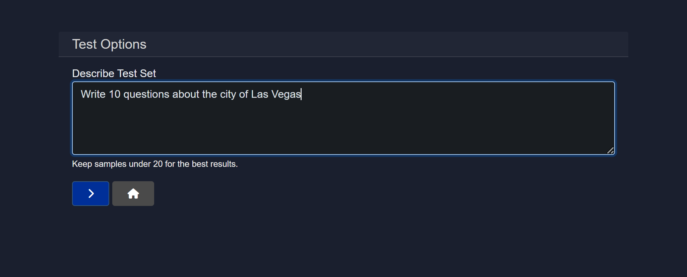
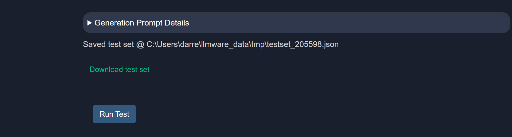
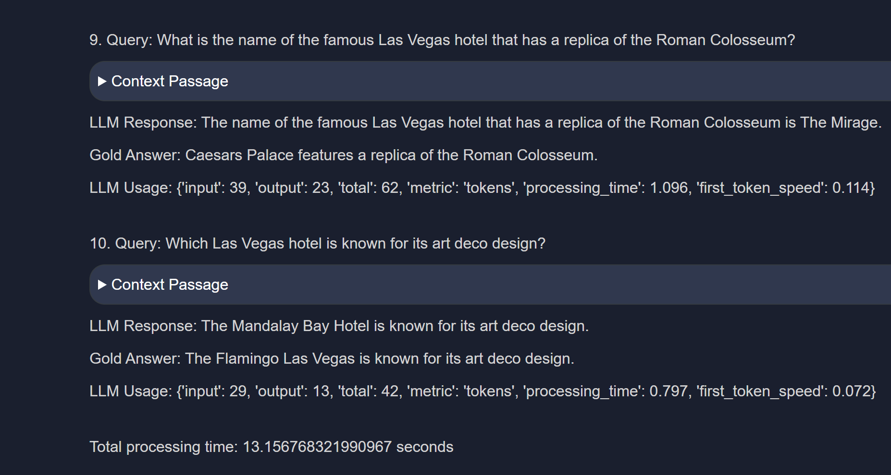

# How to Use and Create a Custom Test for Model Inferencing

Before deploying a model to production or using it for critical tasks, it is important to validate its performance and behavior across different scenarios. Model HQ provides a comprehensive testing framework designed to enable users to evaluate, benchmark, and validate model performance in a controlled and reproducible manner. Whether the goal is to verify basic functionality with quick experiments, establish performance baselines, or evaluate model responses against custom datasets, the testing tools available in Model HQ can accommodate a wide range of testing requirements and workflows.


## 1. Overview
Model HQ's testing framework includes three distinct testing modes, each suited to different validation scenarios and user preferences. This section describes the available test types, file upload requirements, and the action buttons used to execute tests. The testing interface is designed to accommodate different use cases, from quick exploratory testing to structured batch evaluations with custom datasets.

### 1.1 Test types
The testing mode defines how the model will be evaluated. Three options are available to suit different testing requirements:

1. **Sandbox**
  The Sandbox mode runs an interactive test session that allows real-time experimentation.
  - Best suited for quick experimentation.
  - Manual prompts can be entered and responses inspected in real time.
  - This is the default option for exploratory testing.

2. **Standard**
  The Standard mode runs a predefined, system-controlled test using one of LLMWare's pre-made datasets, which are largely designed to test a model's capability for RAG comprehension and answer generation.
  - Useful for repeatable validation checks.
  - No custom input files are required.
  - Suitable for baseline validation.

3. **Custom**
  The Custom mode allows tests to be run using user-provided data.
  - Batch evaluation is enabled.
  - A JSON or CSV file must be uploaded.
  - Designed for structured testing and benchmarking.

### 1.2 File upload
File upload is used exclusively when the Custom test type is selected. The uploaded file provides the test dataset that will be used for evaluation.

- A JSON or CSV file can be uploaded.
- CSV files must include headers: `query`, `context`, `answer`.
- JSON files must contain entries with keys: `query`, `context`, `answer`.
- Each row or entry represents one test case.

### 1.3 Action buttons
The testing interface provides several action buttons to control test execution and file generation.

#### 1.3.1 Run test (>)
The Run Test button initiates the selected test type using the current configuration.

- Sandbox, Standard, or Custom tests can be executed.
- If Custom mode is selected, the uploaded file will be used.

#### 1.3.2 Generate sample
The Generate Sample button automatically creates a sample test file.

- This helps users understand the expected file format.
- Useful as a starting template for custom tests.

#### 1.3.3 Mapper
The Mapper button opens the field mapping interface for custom test files.

- Mapping of uploaded file columns to required fields can be configured.
- Useful when column names do not exactly match expected keys (`query`, `answer`, `context`).
- Schema-related test failures can be prevented.
- Existing datasets can be used without reformatting.

Default mapping values:
```json
{
 "query": "query",
 "answer": "answer",
 "context": "context"
}
```

> [!IMPORTANT]
> When using a custom dataset, the schema should be mapped to the expected fields: `query`, `answer`, and `context`. Note: `query` input is required, while `answer` and `context` are optional.

## 2. Creating a custom test
This section describes how custom tests can be created using Model HQ's testing framework. Two primary workflows are available: generating test samples automatically or using existing CSV/JSON files with the custom mapper.

### 2.1 Generating custom test samples
A sample test file can be created automatically to help users understand the expected format and structure. This feature can be accessed under:

```
Models > [Select Model from Dropdown] > Test > Generate Sample
```

When the Generate Sample option is selected, a text box will prompt the user to specify the test sample that should be created.



Once the query is input, a JSON test set will be created and displayed in an editor interface.


The auto-generated test set can be reviewed, edited, and modified directly on the screen if desired. After review, clicking ">" will prompt the user to either download the test set for later use or run the test immediately.



If the "RUN the TEST" option is selected, the model will be tested using the test set that was just created. This test will provide information about token usage, processing time, and first token speed.



Once the test is complete, the option to either download the test results or return home will be presented.

> [!NOTE]
> The model will download prior to testing unless the model has already been downloaded and is available in the user's cache. Download time depends on model size and network speed.

### 2.2 Using existing datasets with custom mapper
For users who have existing CSV or JSON files that they would like to use as test datasets, the Custom Mapper feature provides a streamlined workflow.

- Mapping of uploaded file columns to required fields can be configured.
- Expected keys can be quickly and exactly matched for fast testing without having to re-create a complex CSV.
- Schema-related test failures can be prevented.
- Existing datasets can be used without reformatting.

This feature can be accessed under:

```
Models > [select model] > Test > Mapper
```

Default mapping values are as follows:

```json
{
 "query": "query",
 "answer": "answer",
 "context": "context"
}
```

The mapping values represent:
- **Query**: The test question.
- **Answer**: The gold answer or correct answer to the test question.
- **Context**: Any additional context or instructions to the model for running the test.

#### 2.2.1 Example workflow
To demonstrate the custom mapper workflow, an example using the Salesworkload CSV file is provided. This file is included as part of the test files in Model HQ and can be accessed via:

```
C:\Users\[user name]\llmware_data\sample_tables\salesworkload.csv
```


This sample CSV contains representative sales data for a retailer. To test whether the model can accurately determine the country of a physical store based on the city, the mapping values can be configured accordingly.

For this test, the "query", "answer", and "context" values on the right-hand side should be mapped to the correct columns as shown, and "Apply Mappings" should be selected.


The next screen will prompt the user to select a file. The **Custom** button should be selected, and the file to be used as the test set should be chosen. Clicking ">" will start the test.


The model will process each row of the test and provide the response to the query, along with other helpful information such as processing time and first token speed.


### 2.3 Stopping a model test
A model test can be stopped at any time by clicking "X".

### 2.4 File upload requirements
When using the Custom test type, the following file requirements should be observed:

- A JSON or CSV file can be uploaded.
- CSV files must include headers: `query`, `context`, `answer`.
- JSON files must contain entries with keys: `query`, `context`, `answer`.
- Each row or entry represents one test case.

## Conclusion
This section described Model HQ's testing framework and how custom tests can be created and executed. Three testing modes are available: Sandbox for interactive experimentation, Standard for predefined validation checks, and Custom for structured batch evaluations with user-provided datasets. The Generate Sample feature allows test templates to be created automatically, while the Custom Mapper enables existing CSV or JSON files to be used without reformatting. These tools provide flexible options for validating model performance across different use cases and datasets.