# Working with Microsoft Foundry Local models in Model HQ

**Foundry Local** is an on-device solution from Microsoft that enables AI models to be run locally on a device. Once downloaded, Foundry Local models can be accessed and used within Model HQ just like any other model in the model repository.

Model HQ supports the use of Foundry Local models in both Chat and Agent workflow capabilities. For users who have already downloaded models with Foundry Local, Model HQ provides seamless integration to access and use those models directly.

For more information about Foundry Local, visit the [Microsoft documentation](https://learn.microsoft.com/en-us/azure/foundry-local/what-is-foundry-local).

## 1. Installing Foundry Local

Before Foundry Local models can be used in Model HQ, Foundry Local must be installed on the device. New users can install Foundry Local by following the step shown below.

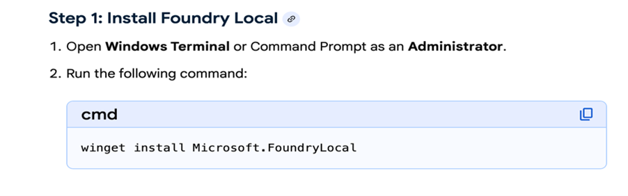

Once Foundry Local has been installed, its models will be available for download and use in chatbots and agents within Model HQ.

> [!NOTE]
> It is strongly recommended that Foundry Local be updated periodically to ensure the latest version is installed, which is required for successful model downloading.

## 2. Foundry Local integration with Model HQ

In order to view and download Foundry Local models, the Foundry Local integration must first be activated in Model HQ. Integration typically completes within a few seconds.

> [!NOTE]
> Once a model has been downloaded to the device, the Foundry Local integration does not need to be re-activated in order to use that model for Chat or Agents.

From the main page in Model HQ, **Integrations** can be selected in the left-hand side menu.

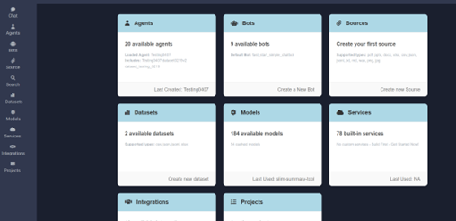

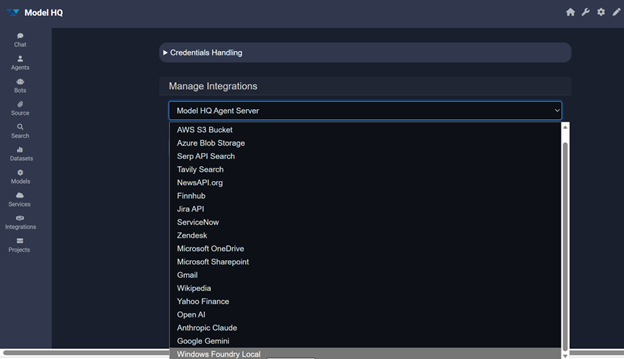

In the **Manage Integrations** dropdown, **Windows Foundry Local** should be selected as shown, then the **>** button can be selected to proceed.

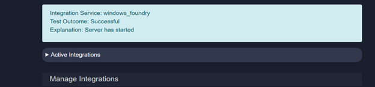

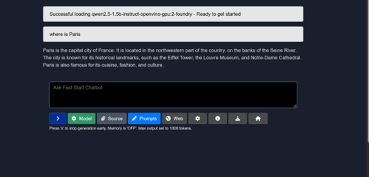

The connection can be verified by selecting the **Test** button after the integration step.

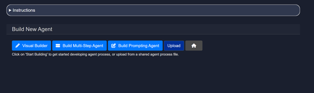

Once a successful Windows Foundry Local connection has been confirmed, the Integrations section can be exited by selecting the **Home** icon button.

## 3. Using Foundry Local models in Chat

The **Chat** option can be selected in the left-hand side menu to open the Fast Start Chatbot.

The **Model** selector can then be used to choose which model — including any Foundry Local model — will power the Chat session.

- Models that have already been downloaded to the device will be marked with a checkmark.
- Models that have not yet been downloaded will show a download symbol, indicating they are available. If such a model is selected, Model HQ will download it before running the chat inference.

To download models outside of the Chat interface, refer to [Section 5: Downloading and testing Foundry Local models](#5-downloading-and-testing-foundry-local-models).

> [!NOTE]
> The example shown below is for Intel devices. Models available for Qualcomm devices will differ.

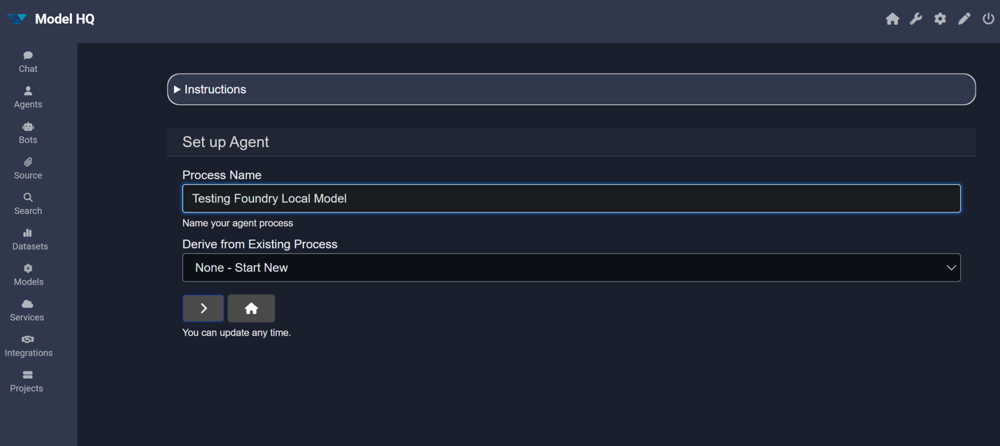

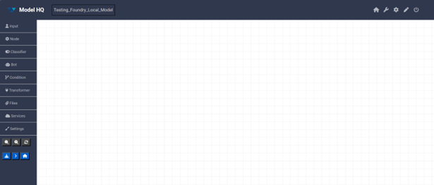

## 4. Using Foundry Local models in agents

The **Agents** card can be selected from the main screen. The **Build New** option should then be selected, followed by the **>** button.

The method for building the new agent can then be chosen. The **Visual Builder** option should be selected for building no-code agents.

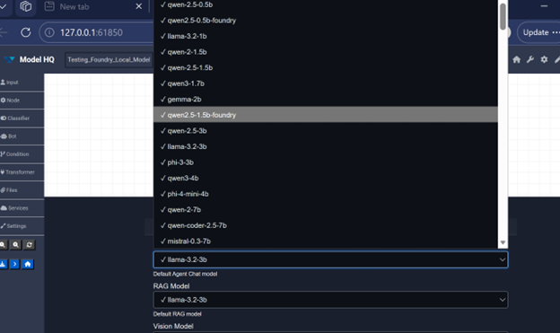

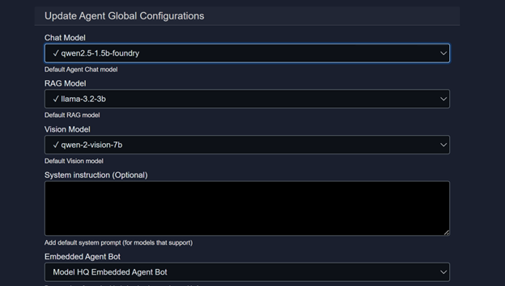

A process name should be typed in the provided field, then the **>** button can be selected to proceed.

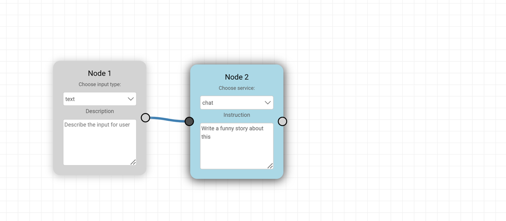

A blank canvas-style screen will be presented for building the no-code agent, with options for adding agent building cards and configuring settings on the left-hand side.

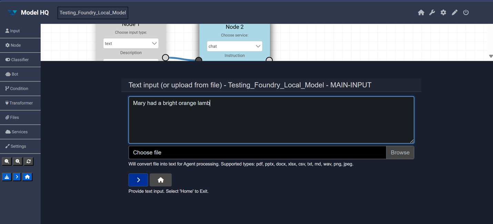

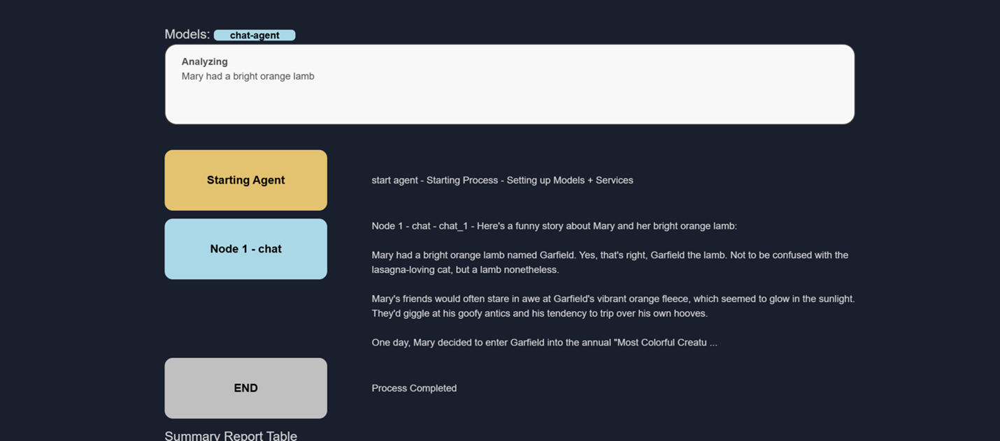

Before adding nodes, **Settings** should be selected in the left-hand side menu. From here, the desired Foundry Local model for Chat or RAG can be chosen for use in the agent process.

Once the desired model has been selected, the **>** button at the bottom of the screen can be clicked to confirm.

- Models that have already been downloaded will be marked with a checkmark.
- Models that have not yet been downloaded will show a download symbol and can be downloaded for use.
- If a model that has not been downloaded is selected for an agent process, Model HQ will download it prior to running the agent process for the first time.

To download models outside of the Agent interface, refer to [Section 5: Downloading and testing Foundry Local models](#5-downloading-and-testing-foundry-local-models).

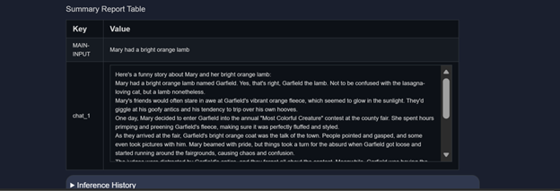

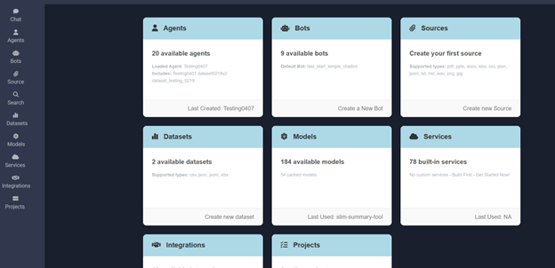

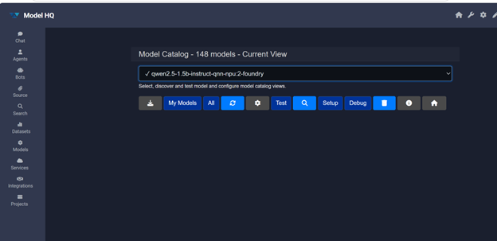

To create a simple test agent, an input card and a node card should be dragged onto the canvas and connected as shown. The default **text** and **chat** options should be left unchanged for this initial test.

In the instruction field for Node 2 (chat), the following model prompt should be entered: *Write a funny story about this*. This constitutes the first simple agent for getting started with a Foundry Local model.

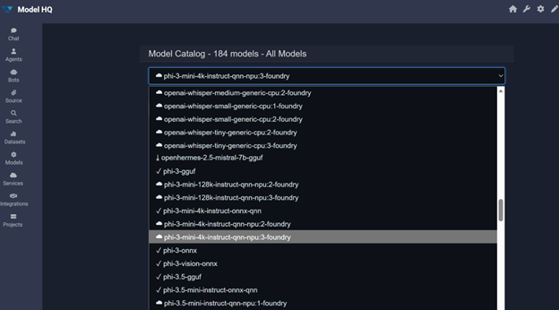

The **>** button in the side menu can then be selected to run the agent.

The text input box will appear. A phrase such as *Mary had a bright orange lamb* — or any other text — can be entered so the model can generate a funny story. The **>** button should then be pressed to submit.

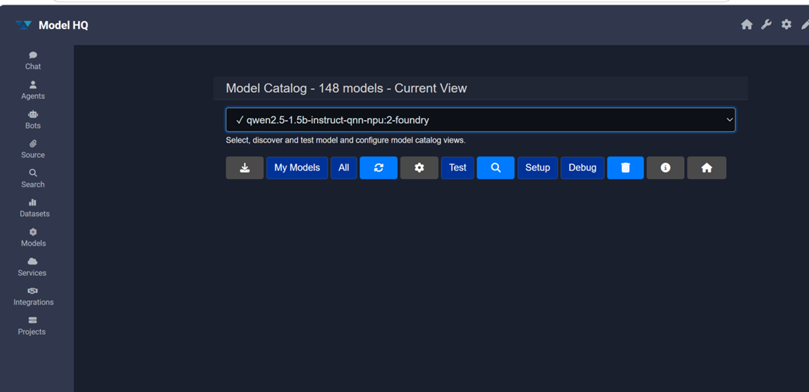

The model will run and produce the inference output — a funny story will be generated as the result.

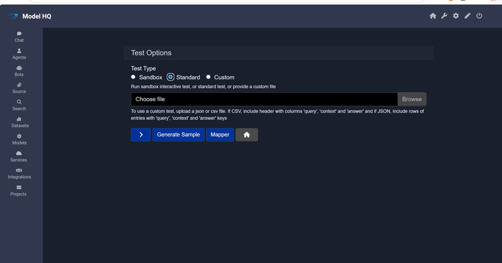

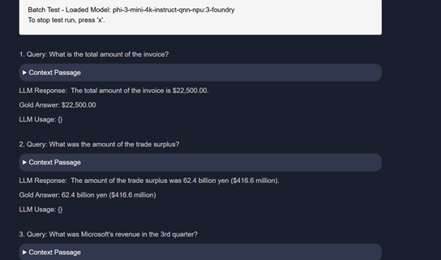

## 5. Downloading and testing Foundry Local models

To download or test downloaded models, the **Models** card can be selected from the main screen.

In the Models interface, **All** should be selected to view the full model catalogue.

A comprehensive model catalogue will be displayed, listing all models available for the device — including Foundry Local models — available via download or API.

> [!NOTE]
> The selection shown below is for a Qualcomm device. Model selection for Intel devices will differ.

A model can then be selected to download or test it.

- The model can be downloaded by selecting the download (**↓**) option. Once downloaded, the model will be immediately available for testing or for use in Chat and Agents.
- Alternatively, the model can be tested directly by selecting the **Test** button.

The **Standard** test option should be selected to run a standard LLMWare RAG inferencing test set against the model and evaluate its accuracy.

> [!NOTE]
> The Standard test feature is designed to evaluate RAG capabilities for Chat models. It will not function for Speech models (such as Whisper) or Vision models.

If the model to be tested has already been downloaded via Foundry Local, the test will begin immediately. If the model has not yet been downloaded, it will be downloaded first and the test will run upon completion.

## Conclusion

This document described how to set up and use Microsoft Foundry Local models within Model HQ, covering Foundry Local installation, integration activation, and model usage across both Chat and Agent workflows. Once the integration has been configured and the desired models have been downloaded, Foundry Local models can be used interchangeably with any other model in the Model HQ repository.

The **Downloading and Testing** section (Section 5) provides a complete reference for managing the model catalogue, downloading new models, and evaluating model accuracy using the Standard test set.