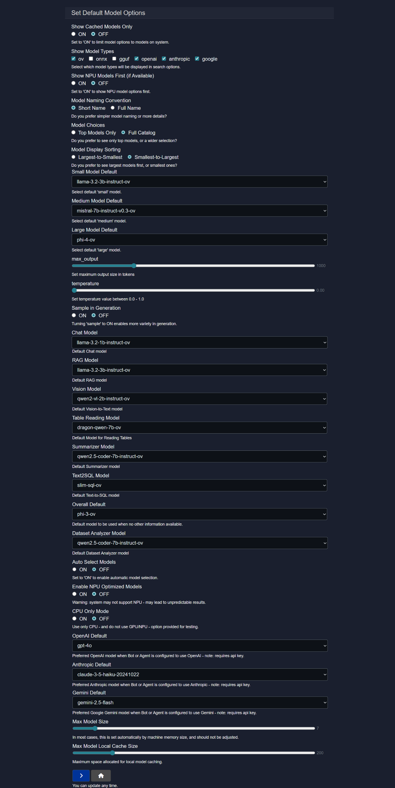

# Model Configuration
The Model Configuration panel serves as the central control layer for model orchestration within Model HQ. It defines how models are selected, prioritized, and executed across different tasks and environments, enabling consistent behavior while maintaining flexibility based on hardware capabilities and provider availability.

This configuration system enables users to:
- Control model visibility and discovery across different runtimes and providers
- Define default model assignments by size category and task type
- Configure execution behavior including hardware utilization (CPU, GPU, NPU)
- Set generation parameters that apply across workflows
- Manage provider-specific preferences for OpenAI, Anthropic, and Google Gemini
- Control resource limits for local cache and model size constraints

These settings allow teams to balance quality, performance, and cost while ensuring predictable behavior across workflows. Proper configuration enables Model HQ to automatically select the appropriate model for each task while providing advanced users with full control when needed.

## 1. Opening the configuration panel

The Model Configuration panel can be accessed by clicking the "⚙️" button in the **Models** interface or alternatively can be accessed via "⚙️" on the upper right-hand side then "Models" .

## 2. Configuration parameters overview

The table below provides a quick reference of all available configuration parameters:

| Parameter | Type | Default | Options/Range | Description |
|-----------|------|---------|---------------|-------------|
| **Show Cached Models Only** | Toggle | OFF | ON / OFF | Limits selection to locally cached models |
| **Show Model Types** | Multi-select | All | ov, onnx, gguf, openai, anthropic, google | Controls which formats/providers appear |
| **Show NPU Models First** | Toggle | OFF | ON / OFF | Prioritizes NPU-optimized models in lists |
| **Model Naming Convention** | Dropdown | Short Name | Short Name, Full Name | Controls model name display format |
| **Model Choices** | Dropdown | Top Models Only | Top Models Only, Full Catalog | Determines selectable model list size |
| **Model Display Sorting** | Dropdown | Largest to Smallest | Largest to Smallest, Smallest to Largest | Controls model ordering by size |
| **Small Model Default** | Dropdown | Varies | Available models | Default lightweight model |
| **Medium Model Default** | Dropdown | Varies | Available models | Default balanced model |
| **Large Model Default** | Dropdown | Varies | Available models | Default high-capability model |
| **max_output** | Integer | 2048 | 256-4096+ | Maximum tokens per response |
| **temperature** | Float | 0.3 | 0.0-1.0 | Randomness control in generation |
| **Sample in Generation** | Toggle | ON | ON / OFF | Enables probabilistic sampling |
| **Chat Model** | Dropdown | Varies | Available models | Default for chat interactions |
| **RAG Model** | Dropdown | Varies | Available models | Default for RAG workflows |
| **Vision Model** | Dropdown | Varies | Available models | Default for vision-to-text tasks |
| **Table Reading Model** | Dropdown | Varies | Available models | Default for table interpretation |
| **Summarizer Model** | Dropdown | Varies | Available models | Default for summarization |
| **Text2SQL Model** | Dropdown | Varies | Available models | Default for SQL generation |
| **Overall Default** | Dropdown | Varies | Available models | Fallback for undefined tasks |
| **Dataset Analyzer Model** | Dropdown | Varies | Available models | Default for dataset analysis |
| **Auto Select Models** | Toggle | ON | ON / OFF | Enables automatic model selection |
| **Enable NPU Optimized Models** | Toggle | OFF | ON / OFF | Allows NPU model usage |
| **CPU Only Mode** | Toggle | OFF | ON / OFF | Restricts to CPU execution |
| **OpenAI Default** | Dropdown | gpt-4 | OpenAI models | Preferred OpenAI model |
| **Anthropic Default** | Dropdown | claude-3 | Anthropic models | Preferred Anthropic model |
| **Gemini Default** | Dropdown | gemini-pro | Gemini models | Preferred Google model |
| **Max Model Size** | Integer | Auto | Memory-based | Maximum model size allowed |
| **Max Model Local Cache Size** | Integer | Auto | Storage-based | Maximum disk space for cache |

> [!NOTE]
> Some parameters interact with each other. For example, enabling **CPU Only Mode** will override **Enable NPU Optimized Models**.

## 3. Model visibility and discovery

These settings control which models appear in selection lists and how they are filtered based on format, provider, and availability.

### 3.1 Show Cached Models Only

**Options:** ON / OFF  
**Default:** OFF

This setting restricts model selection to only those models that are already available in the local system cache.

* **ON:** Only locally cached (downloaded) models are displayed in selection lists. This ensures that all visible models can be used immediately without requiring network access or additional downloads. This mode is recommended for:
  - Offline usage scenarios
  - Restricted network environments
  - Production deployments where model availability must be guaranteed
  - Scenarios requiring predictable, network-independent operation

* **OFF:** All available models are shown, including both locally cached models and remote options that can be downloaded on demand. This provides the full range of model choices and is appropriate for:
  - Exploration and model discovery
  - Environments with reliable network connectivity
  - Development and testing workflows

When enabled, this setting ensures that users only see models that are immediately accessible, preventing confusion or delays caused by unexpected downloads.

### 3.2 Show Model Types

**Options:** ov, onnx, gguf, openai, anthropic, google  
**Default:** All selected

This multi-select setting controls which model formats and providers appear in search and selection lists throughout the interface.

Available options:
* **ov:** OpenVINO optimized models designed for Intel hardware acceleration
* **onnx:** ONNX Runtime models providing cross-platform compatibility
* **gguf:** Quantized local models optimized for efficient CPU inference
* **openai:** OpenAI hosted models (requires API key and internet connection)
* **anthropic:** Anthropic hosted models (requires API key and internet connection)
* **google:** Google Gemini models (requires API key and internet connection)

By selectively enabling only the formats and providers that are relevant to the deployment environment, this setting:
- Reduces visual noise in model selection interfaces
- Hides unsupported or unavailable providers
- Streamlines the user experience for specific hardware configurations
- Prevents accidental selection of incompatible model types

For example, in an air-gapped environment, only local formats (ov, onnx, gguf) might be enabled, while cloud-based providers are hidden. Conversely, in a cloud-focused deployment, only provider-based options (openai, anthropic, google) might be shown.

### 3.3 Show NPU Models First (if Available)

**Options:** ON / OFF  
**Default:** OFF

This setting prioritizes NPU-optimized models in model selection lists when NPU hardware is detected.

* **ON:** Models that support NPU acceleration appear at the top of selection lists, making them easier to discover and select. This is recommended for:
  - Devices with dedicated NPU hardware (e.g., Intel Core Ultra processors or Qualcomm)
  - Workflows optimized for NPU inference
  - Scenarios where NPU performance benefits are prioritized

* **OFF:** Models are displayed in their default ordering (typically by size or alphabetically). This provides a neutral presentation regardless of hardware capabilities.

> [!NOTE]
> This setting only affects display order when NPU-capable hardware is detected. On systems without NPU support, this setting has no effect.

## 4. Model naming and catalog size

These settings control how models are presented and labeled in the user interface.

### 4.1 Model Naming Convention

**Options:** Short Name / Full Name  
**Default:** Short Name

This setting determines how model names are displayed throughout the interface.

* **Short Name:** Displays concise, readable model names (e.g., "Llama 3.2 3B"). This format is:
  - Cleaner and easier to scan in dropdown menus
  - More user-friendly for non-technical users
  - Recommended for most use cases
  - Ideal for interfaces with limited space

* **Full Name:** Displays complete model identifiers including architecture, version, quantization, and optimization details (e.g., "llama-3.2-3b-instruct-ov-int4"). This format is:
  - More precise and technically detailed
  - Useful for debugging and advanced configuration
  - Helpful when distinguishing between multiple variants of the same model
  - Recommended for technical users who need explicit format information

The choice between these options is primarily aesthetic and does not affect functionality—it only changes how model names are rendered in the UI.

### 4.2 Model Choices

**Options:** Top Models Only / Full Catalog  
**Default:** Top Models Only

This setting determines the size and scope of the selectable model list.

* **Top Models Only:** Displays a curated subset of recommended models that have been validated for quality and performance. This mode:
  - Reduces decision paralysis by limiting choices to proven options
  - Simplifies the user experience for typical workflows
  - Hides experimental or specialized models
  - Is recommended for most users and production deployments

* **Full Catalog:** Displays all available models, including experimental, specialized, and legacy variants. This mode:
  - Provides maximum flexibility and choice
  - Enables access to specialized models for specific use cases
  - Is appropriate for advanced users and research scenarios
  - May include models that are less well-tested or optimized

> [!TIP]
> Start with "Top Models Only" and switch to "Full Catalog" only when specific requirements demand access to specialized models.

### 4.3 Model Display Sorting

**Options:** Largest to Smallest / Smallest to Largest  
**Default:** Largest to Smallest

This setting controls how models are ordered in selection lists based on their parameter count or file size.

* **Largest to Smallest:** Larger models appear first in lists. This ordering is appropriate for:
  - Capability-focused workflows where quality is prioritized
  - Scenarios with ample hardware resources
  - Users who typically prefer larger, more capable models

* **Smallest to Largest:** Smaller models appear first in lists. This ordering is appropriate for:
  - Performance-focused workflows where speed is prioritized
  - Edge devices or resource-constrained environments
  - Users who prefer efficient, lightweight models
  - Battery-powered or mobile deployments
 
## 5. Default model assignment by size

These settings define the default models to be used for small, medium, and large model categories. These size-based defaults serve as fallbacks when task-specific models are not explicitly configured.

### 5.1 Small Model Default

**Type:** Dropdown (model selection)  
**Example:** `llama-3.2-3b-instruct-ov`

This parameter defines the default lightweight model used for low-resource tasks or when quick responses are prioritized over maximum capability.

Small models are typically characterized by:
- Parameter counts in the range of 0.5–3 billion
- Fast inference times
- Low memory footprint
- Suitable for edge devices, mobile deployments, or high-throughput scenarios

The selected model should balance capability with efficiency, providing acceptable quality while maintaining fast response times.

### 5.2 Medium Model Default

**Type:** Dropdown (model selection)  
**Example:** `mistral-7b-instruct-v0.3-ov`

This parameter defines the default model used for tasks requiring balanced performance and capability.

Medium models are typically characterized by:
- Parameter counts in the range of 7–8 billion
- Good balance between quality and speed
- Reasonable memory requirements
- Suitable for most general-purpose applications

This is often the most frequently used size category, providing strong performance across a wide range of tasks without requiring excessive resources.

### 5.3 Large Model Default

**Type:** Dropdown (model selection)  
**Example:** `phi-4-ov`

This parameter defines the default model used for high-reasoning or complex tasks where maximum capability is required.

Large models are typically characterized by:
- Parameter counts of 9–32+ billion (or larger)
- Highest quality outputs
- Advanced reasoning capabilities
- Significant memory and computational requirements

> [!NOTE]
> Ensure that sufficient RAM/VRAM is available before configuring large models as defaults, as they may not run on all hardware configurations.

## 6. Generation defaults

These settings define default parameters for text generation that apply across all models unless explicitly overridden at the request level.

### 6.1 max_output

**Type:** Integer (tokens)  
**Default:** 2048  
**Recommended range:** 256-4096

This parameter controls the maximum number of tokens that can be generated in a single response.

Setting an appropriate value:
- Helps manage inference latency (shorter outputs complete faster)
- Controls computational and memory costs
- Prevents runaway generation
- Applies unless overridden on a per-request basis

This global default can be overridden in specific contexts (such as the Chat Configuration panel), but serves as the system-wide fallback when no override is specified.

> [!TIP]
> For detailed information about this parameter, refer to the [Chat Configuration](https://github.com/BloksAdmin/model-hq-docs/tree/master/v1/chat/chatConfiguration.md) documentation.

### 6.2 temperature

**Type:** Float  
**Default:** 0.3  
**Range:** 0.0-1.0

This parameter controls the randomness and creativity in text generation across the system.

* **Lower values (0.0-0.3):** Produce more deterministic, focused, and factual outputs
* **Higher values (0.6-1.0):** Increase creativity, variation, and diversity in responses

This setting serves as the global default temperature across all generation tasks. Individual interfaces may override this value for specific use cases.

> [!TIP]
> For comprehensive guidance on temperature settings, refer to the [Chat Configuration](https://github.com/BloksAdmin/model-hq-docs/tree/master/v1/chat/chatConfiguration.md) documentation.

### 6.3 Sample in Generation

**Options:** ON / OFF  
**Default:** ON

This setting enables or disables probabilistic sampling during text generation system-wide.

* **ON:** The model uses sampling to select tokens based on probability distributions, producing more diverse and natural outputs. This is the standard mode for most applications.

* **OFF:** The model selects the highest-probability tokens. This produces highly deterministic and repeatable outputs.

This global setting can be overridden in specific contexts when different behavior is required for particular tasks.

> [!TIP]
> For detailed information about sampling behavior, refer to the [Chat Configuration](https://github.com/BloksAdmin/model-hq-docs/tree/master/v1/chat/chatConfiguration.md) documentation.

## 7. Task-specific default models

These settings define which models are used by default for specific task types. When a task-specific model is not defined, the system falls back to the size-based defaults (Small, Medium, Large) or the Overall Default.

### 7.1 Chat Model

**Type:** Dropdown (model selection)  
**Default:** Varies by installation

This setting defines the default model used for standard chat interactions.

The Chat Model is invoked when:
- Users engage in conversational interactions 
- No specialized task type is detected
- General-purpose dialogue is required

Selection criteria:
- Should have strong conversational capabilities
- Typically a medium or large model for quality responses
- Should balance response quality with acceptable latency

### 7.2 RAG Model

**Type:** Dropdown (model selection)  
**Default:** Varies by installation

This setting defines the model used when Retrieval-Augmented Generation (RAG) is enabled.

The RAG Model is specifically optimized for:
- Combining retrieved document context with generation
- Grounding responses in provided source material
- Balancing context processing with generation quality
- Maintaining factual accuracy based on retrieved passages

RAG models should be selected for their ability to:
- Process longer context windows effectively
- Maintain coherence across retrieved chunks
- Generate responses that accurately reflect source material
- Avoid hallucination when factual grounding is required

- Generally higher parameter models (i.e. Phi-4) excel at this task.

### 7.3 Vision Model

**Type:** Dropdown (model selection)  
**Default:** Varies by installation

This setting defines the model used for vision-to-text tasks such as image understanding and description.

The Vision Model is invoked when:
- Images are uploaded for analysis
- Visual content needs to be interpreted or described
- Image-based questions are posed

Common use cases include:
- Image captioning and description
- Visual question answering
- Diagram and chart interpretation

### 7.4 Table Reading Model

**Type:** Dropdown (model selection)  
**Default:** Varies by installation

This setting defines the specialized model used for interpreting tables and structured data.

The Table Reading Model is optimized for:
- Understanding tabular structures and relationships
- Extracting specific values from tables
- Answering questions about table contents
- Comparing and analyzing structured data

This model should be selected for its ability to:
- Parse table layouts accurately
- Understand column headers and row relationships
- Perform calculations or aggregations when needed
- Handle various table formats (simple, complex, nested)

### 7.5 Summarizer Model

**Type:** Dropdown (model selection)  
**Default:** Varies by installation

This setting defines the model used for summarization tasks across documents or conversations.

The Summarizer Model is invoked for:
- Document summarization
- Conversation summarization
- Multi-document synthesis
- Extractive and abstractive summarization tasks

### 7.6 Text2SQL Model

**Type:** Dropdown (model selection)  
**Default:** Varies by installation

This setting defines the model that converts natural language queries into SQL statements.

The Text2SQL Model is designed for:
- Translating natural language to SQL
- Understanding database schema and relationships
- Generating syntactically correct and semantically accurate queries
- Supporting various SQL dialects

### 7.7 Overall Default

**Type:** Dropdown (model selection)  
**Default:** Varies by installation

This setting defines the fallback model used when no specific task-type model is configured or when the task type cannot be determined.

The Overall Default ensures:
- System continuity in edge cases
- Predictable behavior when task classification is ambiguous
- A reasonable model is always available

This should typically be set to a well-rounded, general-purpose model that can handle diverse tasks adequately, even if not optimally.

### 7.8 Dataset Analyzer Model

**Type:** Dropdown (model selection)  
**Default:** Varies by installation

This setting defines the model used for dataset inspection, profiling, and analysis tasks.

The Dataset Analyzer Model is optimized for:
- Schema understanding and inference
- Pattern detection in structured data
- Data quality assessment
- Statistical analysis and profiling
- Anomaly detection in datasets

## 8. Automation and hardware controls

These settings manage how Model HQ automatically selects models and utilizes available hardware resources.

### 8.1 Auto Select Models

**Options:** ON / OFF  
**Default:** ON

This setting enables or disables automatic model selection based on task type, hardware availability, and performance characteristics.

* **ON:** The system automatically chooses the most appropriate model for each task based on:
  - Detected task type (chat, RAG, vision, etc.)
  - Available hardware capabilities (CPU, GPU, NPU)
  - Model availability (local vs. remote)
  - Performance requirements
  - Configured defaults and preferences
  
  This mode is recommended for most users as it:
  - Simplifies the user experience by eliminating manual model selection
  - Ensures appropriate models are used for different tasks
  - Adapts to hardware constraints automatically
  - Leverages configured task-specific defaults

* **OFF:** User-defined defaults are always used, and automatic selection is disabled. This mode provides:
  - Explicit control over which models are used
  - Predictable, consistent behavior regardless of task type
  - Useful for testing, benchmarking, or scenarios requiring specific model usage
  - Recommended for advanced users with specific requirements

> [!NOTE]
> Even when Auto Select is ON, users can manually override model selection in specific interfaces when needed.

### 8.2 Enable NPU Optimized Models

**Options:** ON / OFF  
**Default:** OFF

This setting controls whether NPU-optimized models can be used for inference when compatible hardware is detected.

* **ON:** The system will utilize NPU-optimized models when available, which may provide:
  - Improved inference performance on supported hardware
  - Lower power consumption compared to GPU/CPU inference
  - Better efficiency for certain model architectures
  - Relevant for Intel Core Ultra and similar NPU-equipped processors

* **OFF:** NPU-optimized models are not used, even if NPU hardware is available. Inference is performed using CPU or GPU only.

> [!IMPORTANT]
> If this setting is enabled on systems without NPU support, a warning may be displayed, and the system will automatically fall back to CPU/GPU execution. Ensure that NPU drivers and software are properly installed for optimal performance.

### 8.3 CPU Only Mode

**Options:** ON / OFF  
**Default:** OFF

This setting restricts all model execution to CPU only, disabling GPU and NPU acceleration.

* **ON:** All inference is performed exclusively on the CPU. This mode:
  - Disables GPU and NPU acceleration entirely
  - Provides consistent behavior across different hardware configurations
  - Is useful for debugging, testing, and development
  - Ensures compatibility in environments without GPU/NPU support
  - May result in slower inference compared to accelerated execution

* **OFF:** The system can utilize available hardware acceleration (GPU, NPU) when appropriate and configured. This is the recommended mode for production use when hardware acceleration is available.

## 9. Provider-specific defaults

These settings define the preferred models to use when connecting to external AI providers (OpenAI, Anthropic, Google Gemini).

### 9.1 OpenAI Default

**Type:** Dropdown (OpenAI model selection)  
**Default:** gpt-4 (or latest available)  
**Prerequisite:** Requires a valid OpenAI API key

This setting defines the preferred OpenAI model to use when OpenAI is selected as the provider.

The selected model will be used for:
- Tasks routed to OpenAI's API
- Workflows configured to use OpenAI models
- Fallback scenarios when local models are unavailable

Common options include:
- **gpt-4:** Highest capability model for complex reasoning
- **gpt-4-turbo:** Faster variant with good performance
- **gpt-3.5-turbo:** Cost-effective option for simpler tasks

> [!NOTE]
> A valid OpenAI API key must be configured in the Integrations section for this provider to function. Usage is subject to OpenAI's pricing and rate limits.

### 9.2 Anthropic Default

**Type:** Dropdown (Anthropic model selection)  
**Default:** claude-3 (or latest available)  
**Prerequisite:** Requires a valid Anthropic API key

This setting defines the preferred Anthropic model to use for bots, agents, and other workflows.

The selected model will be used for:
- Tasks routed to Anthropic's API
- Agent workflows configured to use Anthropic models
- Complex reasoning and analysis tasks

Common options include:
- **claude-3-opus:** Highest capability for complex tasks
- **claude-3-sonnet:** Balanced performance and cost
- **claude-3-haiku:** Fast, cost-effective option

> [!NOTE]
> A valid Anthropic API key must be configured in the Integrations section for this provider to function. Usage is subject to Anthropic's pricing and rate limits.

### 9.3 Gemini Default

**Type:** Dropdown (Google Gemini model selection)  
**Default:** gemini-pro (or latest available)  
**Prerequisite:** Requires a valid Google API key

This setting defines the preferred Google Gemini model to use when Google is selected as the provider.

The selected model will be used for:
- Tasks routed to Google's Gemini API
- Workflows configured to use Gemini models
- Multimodal tasks requiring vision and language capabilities

Common options include:
- **gemini-pro:** General-purpose model for text tasks
- **gemini-pro-vision:** Multimodal model supporting images
- **gemini-ultra:** Highest capability variant (when available)

> [!NOTE]
> A valid Google API key must be configured in the Integrations section for this provider to function. Usage is subject to Google's pricing and rate limits.

## 10. Resource limits

These settings control resource allocation for model storage and execution, helping manage disk space and memory usage.

### 10.1 Max Model Size

**Type:** Integer (GB or based on system memory)  
**Default:** Auto-configured based on available RAM

This setting defines the maximum size of models that can be loaded into memory for inference.

* **Auto mode:** The system automatically calculates the maximum model size based on available system memory, ensuring that models can be loaded without exceeding memory constraints.

* **Manual configuration:** Advanced users can set a specific limit to:
  - Prevent models from consuming too much memory
  - Reserve memory for other applications
  - Test behavior with constrained resources
  - Align with specific deployment requirements

> [!IMPORTANT]
> Setting this value too low may prevent larger models from loading. Setting it too high may cause out-of-memory errors or system instability. Manual adjustment is rarely needed unless specific constraints exist.

Considerations:
- Models require additional memory beyond their file size for inference
- Leave headroom for system operations and other applications
- Consider peak memory usage during inference, not just model loading

### 10.2 Max Model Local Cache Size

**Type:** Integer (GB or based on available storage)  
**Default:** Auto-configured based on available disk space

This setting defines the maximum disk space allocated for storing cached (downloaded) models locally.

When the cache limit is reached:
- Older or less frequently used models may be automatically removed
- New model downloads may require manual cleanup of existing cache
- The system may prompt users to manage storage

Setting an appropriate cache size helps:
- Control disk space consumption
- Prevent runaway storage usage
- Maintain a manageable collection of local models
- Balance model availability with storage constraints

> [!TIP]
> Regularly review cached models using the **My Models** and **Info** functions in the Models interface to identify models that can be removed to free up space.

## Conclusion
The Model Configuration panel serves as the foundation of Model HQ's model orchestration system. By centralizing control over model selection, execution behavior, and resource usage, it ensures predictable performance, efficient hardware utilization, and seamless task execution across the platform.

These defaults act as both safeguards and accelerators, reducing friction for typical workflows while enabling advanced multi-model capabilities for sophisticated use cases. Regular review and adjustment of these settings based on usage patterns and resource constraints will help maintain optimal system performance over time.
