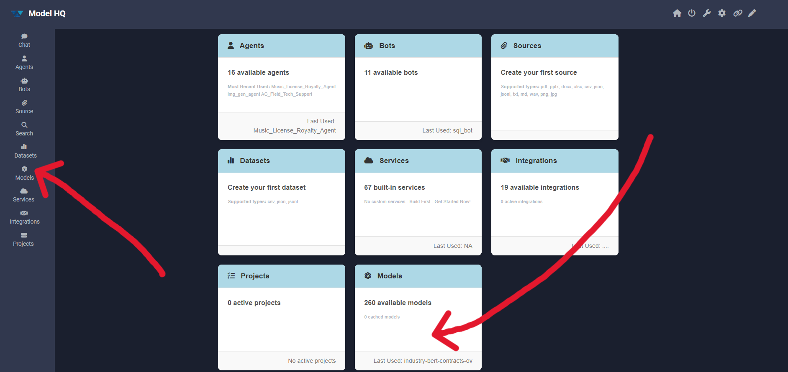
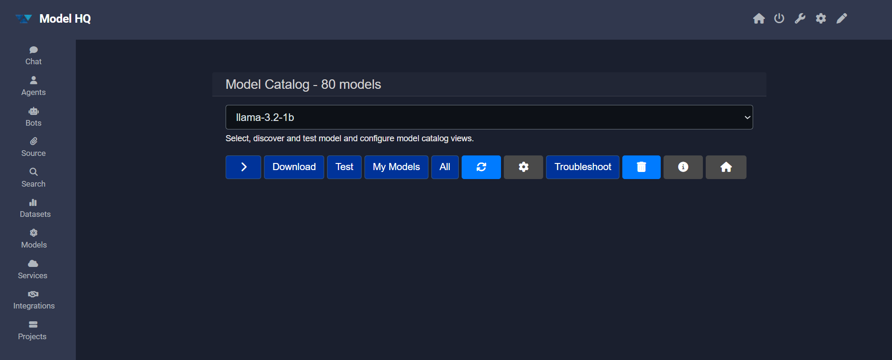
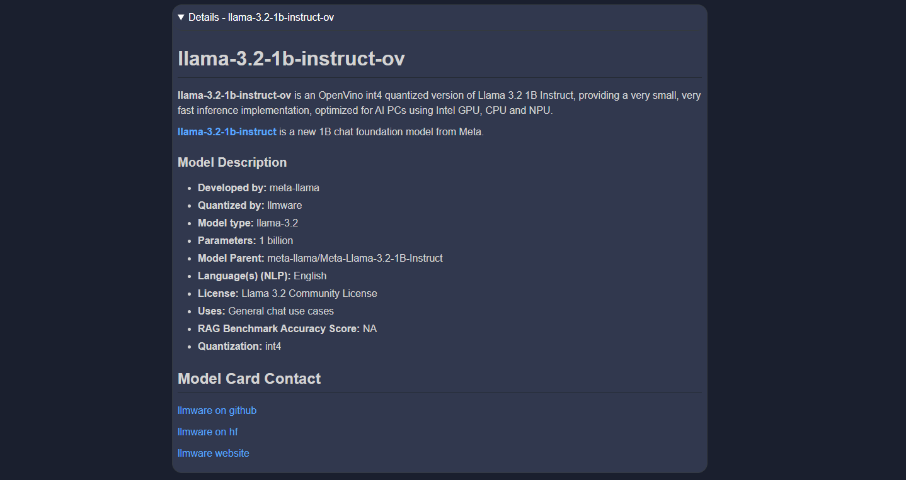
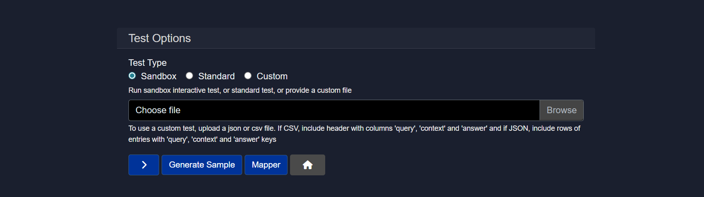
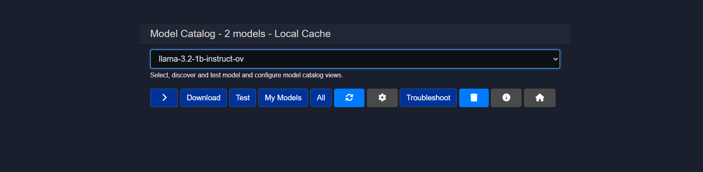
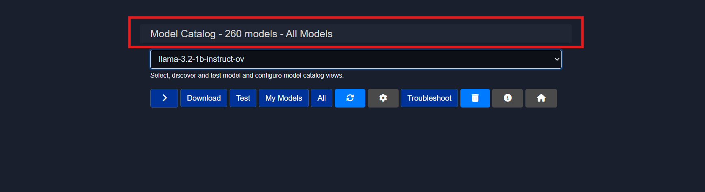
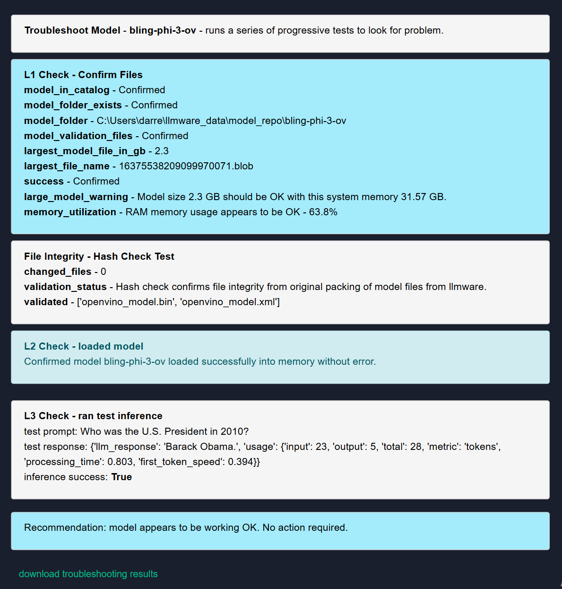
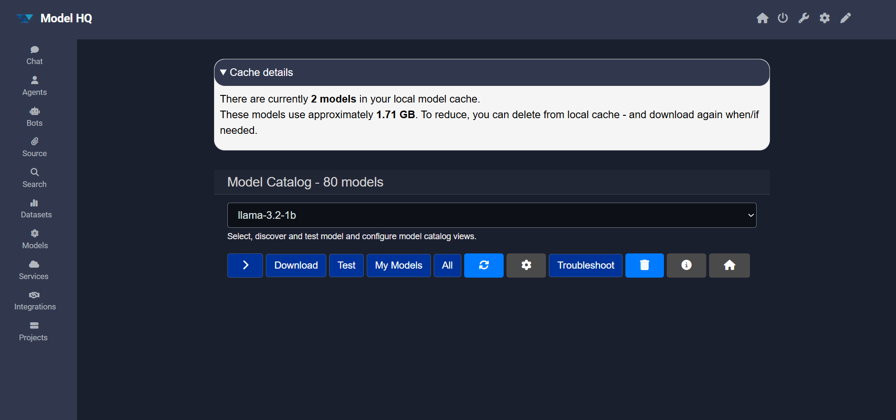

# Exploring Models in Model HQ

After completing the initial setup, users will be directed to the **Main Menu**. This document describes the **Models** functionality, which provides a comprehensive interface for exploring, managing, and testing models within Model HQ.

The Models section enables users to:
- Discover and download models from the catalog
- Manage locally stored models
- Run benchmark tests and validation
- Configure model selection preferences
- Troubleshoot model-related issues

## 1. Launching the Models interface

To begin, the **Models** button can be selected from the main menu sidebar or the first screen interface. The card on the main menu displays the total number of models that are available as well as provide the number of models that are cached and already downloaded on the user's device.

## 2. Models interface overview

After launching the Models section, the interface will present a comprehensive set of tools for model management, testing and download:

The interface includes the following key controls:

Primary actions:
- **Model Card (>)** — View detailed information about a selected model
- **Download** — Retrieve models from the catalog to local storage
- **Test** — Run validation and benchmark tests on models
- **My Models** — Display all locally downloaded models
- **All** — Show the complete model catalog with quantization types

Configuration and maintenance:
- **Refresh** — Update the model catalog to reflect recent changes
- **Models Config (⚙️)** — Configure model selection preferences and orchestration
- **Troubleshoot** — Diagnose and resolve model-related issues
- **Delete** — Remove models from local storage
- **Info** — View storage usage and model statistics

The following subsections describe each control in detail.

### 2.1 Model Card (>)

The Model Card provides detailed information about a selected model, including its description, capabilities, and specifications.

To view a model card:
1. Select a model from the dropdown menu
2. Click the `>` button to expand the model card

The model card appears as a collapsible section that, when expanded, displays comprehensive information about the selected model.

Model cards typically include:
- Model architecture and parameter count
- Recommended use cases and capabilities
- Performance characteristics
- Licensing and attribution information

This feature is useful for evaluating models before download or understanding the capabilities of already-downloaded models.

This feature is useful for evaluating models before download or understanding the capabilities of already-downloaded models.

### 2.2 Download

The Download button enables retrieval of models from the catalog to local storage.

To download a model:
1. Select a model from the dropdown menu
2. Click the **Download** button

The download process will begin, and progress will be displayed. Download time varies based on model size and network speed. Once complete, the model will be available for use in Chat, Agents, and other Model HQ features.

> [!NOTE]
> Downloaded models are stored locally and can be managed through the **My Models** view.

### 2.3 Test
Model HQ's Test feature allows you to test a model once downloaded.

> [!NOTE]
> If you try to test a model that is not already downloaded, then it will download first.

The test interface consists of several components that control how testing is performed:

#### Test Type
Defines the testing mode to be used.
1. Sandbox
2. Standard
3. Custom

 Find the explanation of each section of here 

1. **Sandbox**
  Runs an interactive test session.
  - Best for quick experimentation
  - Allows manual prompts and real time inspection
  - Default option for exploratory testing

2. **Standard**
  Runs a predefined, system controlled test.
  - Useful for repeatable validation checks
  - Requires no custom input files
  - Suitable for baseline validation

3. **Custom**
  Runs tests using user provided data.
  - Enables batch evaluation
  - Requires uploading a JSON or CSV file
  - Designed for structured testing and benchmarking

Learn more about Testing a model in [How to Use and Create Test for Model Inferencing](https://github.com/BloksAdmin/model-hq-docs/tree/master/v1/models/customTest.md)

### 2.4 My Models

The **My Models** view displays all models that have been downloaded and are currently stored locally.

### 2.5 All
This button will show all the models present in the model catalog that can be used for the user's device along with their quantization/model type. The number of models available in the Model Catalog will vary depending on the user's device platform.

This comprehensive view shows:
- All models available in the catalog
- Different quantization types for each model
- Model sizes and parameter counts

### 2.6 Refresh

The **Refresh** button updates the model catalog to reflect any recent additions or changes.

This function should be used when:
- New models have been added to the catalog
- Model metadata has been updated
- The catalog appears out of sync with the latest available models

Refreshing ensures that the displayed information is current and accurate.

Refreshing ensures that the displayed information is current and accurate.

### 2.7 Models Config (⚙️)

The Models Configuration panel provides access to the model orchestration layer, which controls model selection, visibility, and behavior across different workloads.

This configuration system serves several critical functions:
- Determines which models are visible and selectable in various interfaces
- Defines default model selections by task type (chat, RAG, vision, analytics)
- Manages model behavior under different hardware constraints
- Configures provider integrations and model routing
- Supports separation of defaults by task type and model size

By providing both automated intelligence and fine-grained manual control, these settings ensure consistent behavior across Chat, RAG, vision, analytics, and structured data workflows. The configuration can be optimized for performance, cost, or quality depending on deployment needs.

For comprehensive configuration options and detailed guidance, please refer to the [Model Configuration](https://github.com/BloksAdmin/model-hq-docs/tree/master/v1/models/modelConfiguration.md) documentation.

### 2.8 Troubleshoot

The Troubleshoot function provides diagnostic tools and guidance for resolving model-related issues.

When troubleshooting is initiated, the system performs diagnostic checks and identifies potential issues. If problems are detected, several resolution options are available:

- **Confirm**: Apply the suggested solution
- **Delete**: Remove the diagnostic log file
- **Repair**: Reinstall the model (equivalent to delete + download)
- **No action**: Return to the main menu without making changes

> [!NOTE]
> Troubleshooting logs can be downloaded for further analysis. If issues persist after troubleshooting, support can be contacted at `support@aibloks.com` and the logs can be shared for assistance.

Common issues that troubleshooting can address:
- Model loading failures
- Corrupted model files
- Configuration inconsistencies
- Memory or resource allocation problems

### 2.9 Delete

The Delete function removes models from local storage to free up disk space.

This action:
- Permanently removes the selected model from local storage
- Frees up the disk space occupied by the model
- Does not affect the model's availability in the catalog for future download

> [!IMPORTANT]
> Deleted models must be re-downloaded if they are needed again. Ensure that models are no longer required before deletion.

### 2.10 Info

The Info panel displays storage statistics and usage information for locally stored models.

Information provided includes:
- Total number of models currently downloaded
- Total storage space occupied by all models
- Breakdown of storage usage by individual models
- Available storage space on the device

## 3. Models interface controls summary

The table below provides a quick reference of all available controls in the Models interface:

| Control | Purpose | Key Features |
|---------|---------|--------------|
| **Model Card (>)** | View detailed model information | Architecture details, capabilities, use cases, licensing |
| **Download** | Retrieve models from catalog | Downloads models to local storage for offline use |
| **Test** | Validate and benchmark models | Three modes: Sandbox, Standard, Custom; supports file upload |
| **My Models** | Display downloaded models | Shows locally stored models and storage usage |
| **All** | Show complete catalog | Displays all available models with quantization options |
| **Refresh** | Update catalog | Syncs catalog with latest model additions and changes |
| **Models Config (⚙️)** | Configure orchestration | Controls model selection, defaults, and behavior by task type |
| **Troubleshoot** | Diagnose issues | Provides diagnostic tools and repair options |
| **Delete** | Remove models | Frees storage space by removing local models |
| **Info** | View statistics | Displays storage usage and model count information |

## Conclusion

The Models interface in Model HQ provides comprehensive tools for discovering, managing, and validating models. Users can explore the full catalog, download models for local use, run tests to validate performance, and configure model selection preferences to optimize for their specific use cases.
