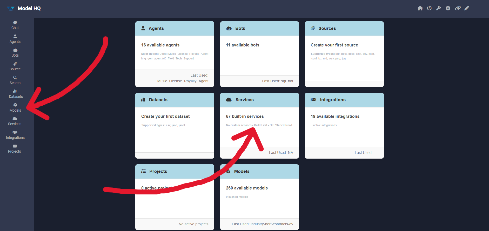
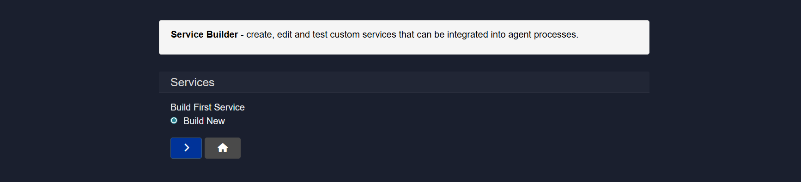
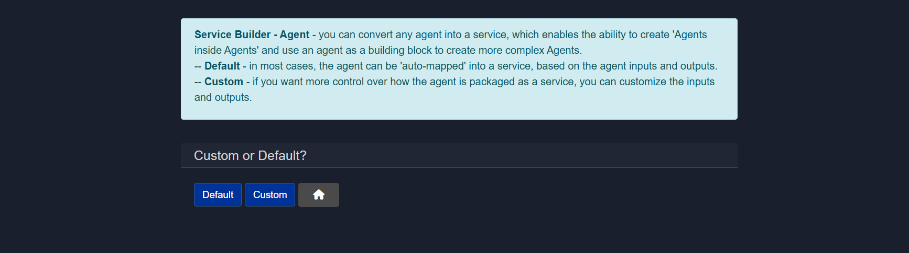
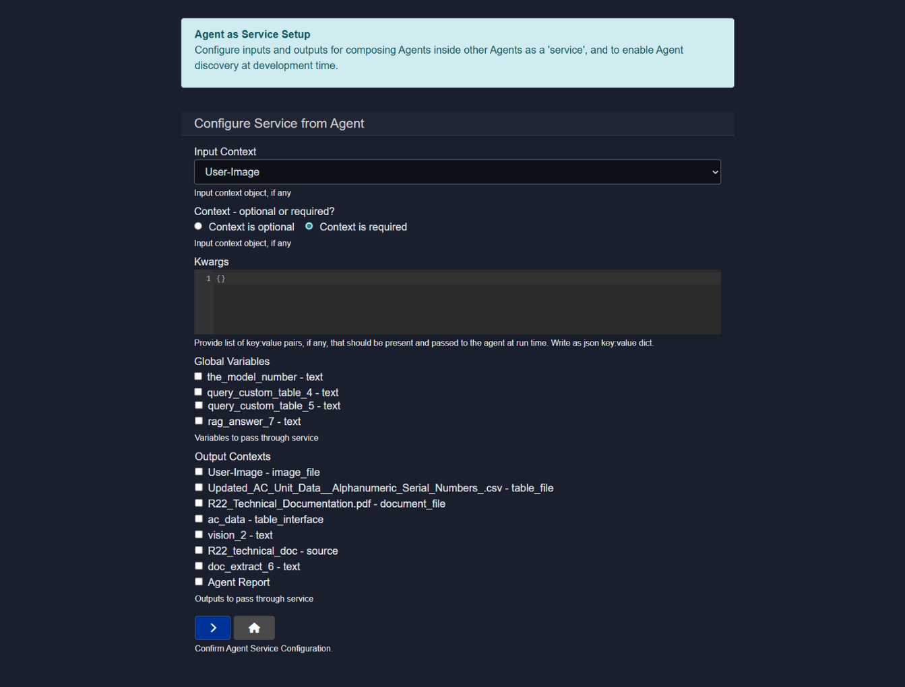
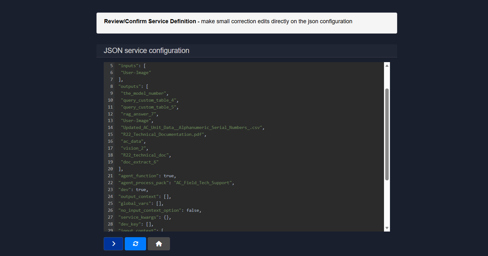
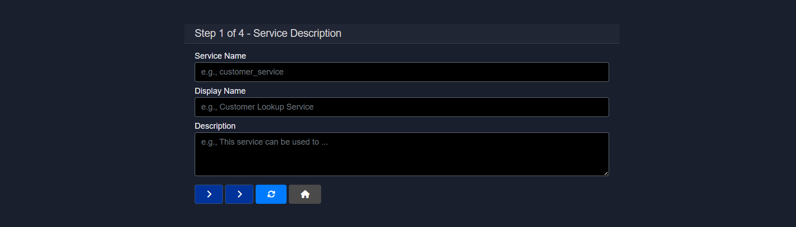

# Exploring services in Model HQ

The Services section in Model HQ lets you turn useful functions into reusable building blocks. These building blocks can be plugged into agent workflows, connected to outside systems, or used as part of larger automated processes.

Think of a service as a way to take something that works on its own — like an agent or an API — and make it something other agents can call and use. For example, an agent can:
- Call another agent
- Connect to an external REST API
- Use tools through an MCP server

This makes it possible to build more advanced, multi-step agent systems where each service clearly defines what it takes in (inputs) and what it returns (outputs).

Model HQ supports three main types of services:
1) Agent Services – Turn an existing agent into something other agents can call.
2) REST API Services – Connect outside APIs into your agent workflows.
3) MCP Services – Connect MCP tools so agents can use them.

Each service is set up in a structured way where you define:

What inputs it needs
Any runtime settings
Authentication details (if required)
What outputs it produces

Because every service follows the same structure, agents can easily work together and connect smoothly with outside systems and tools.

The Services interface in Model HQ enables the creation of modular, reusable components that can be integrated into agent workflows, external systems, and orchestrated processes. Services act as building blocks that transform standalone functionality into composable units, allowing agents to invoke other agents, call external REST APIs, or interact with Model Context Protocol (MCP) servers. This capability supports the development of complex, multi-layered agent architectures where each service maintains a well-defined input-output contract.

This document provides comprehensive guidance on creating and configuring all three service types within Model HQ. It covers the service interface overview, detailed configuration steps for each service type, and best practices for defining input contexts, runtime parameters, and output structures. Understanding the Services interface is essential for building scalable agent systems, integrating external data sources, and creating reusable components that can be shared across multiple workflows and use cases.

## 1. Launching the services interface
The **Services** button in the main menu sidebar can be selected, or the service option can be chosen from the home page as shown in the screenshot.



## 2. Services interface overview
The Services interface allows three types of services to be created. When no pre-built services exist, an option to build a new service will be displayed as shown in the screenshot.



However, when services have been created previously or are already available, the interface will appear as follows:


When service creation is initiated, three options will be presented:
1. Agent
2. Rest API Endpoint
3. MCP Server


Detailed information about each service type can be found in the sections below.

## 3.1 Agents as service
Any agent can be converted into a service, which enables the creation of 'Agents inside Agents' and allows agents to be used as building blocks for more complex agent architectures.

To build an agent as a service, the **Agents** option should be selected. A prompt will then appear to choose an existing agent process workflow, which will enable the creation of another agent inside the pre-created agent.


Following this selection, a choice between default and custom service configurations will be presented.



These options serve the following purposes:
- **Default** - In most cases, the agent can be auto-mapped into a service based on the agent's inputs and outputs.
- **Custom** - When more control over how the agent is packaged as a service is needed, inputs and outputs can be customized.

### 3.1.1 Agent as service setup
An Agent can be exposed as a reusable service that can be consumed by other Agents. The service contract is defined by clearly specifying inputs, runtime parameters, shared variables, and outputs.



> [!NOTE]
> This option will be available when Custom is selected over Default in the previous interface.

#### 3.1.1.1 Configure service from agent
This section defines how the Agent behaves when invoked as a service by another Agent.

| Section          | What it Defines                              | Why it Matters                              |
| ---------------- | -------------------------------------------- | ------------------------------------------- |
| Input Context    | Primary input object required by the service | Ensures the service receives the right data |
| Kwargs           | Runtime configuration parameters             | Enables flexible and dynamic execution      |
| Global Variables | Variables passed into the service            | Allows data reuse across Agents             |
| Output Contexts  | Data returned by the service                 | Controls what downstream Agents receive     |

#### 3.1.1.2 Input context
**Purpose**
Defines the main input object expected by the service during execution.

**Details**
A context type such as an image, text, document, or other supported object should be selected. This determines what kind of data the calling Agent must supply.

**Optional vs Required**

* **Context is optional**: The service can execute without this input.
* **Context is required**: The calling Agent must provide this input for the service to run.

The context should be marked as required when the Agent logic depends on this input to function correctly.

#### 3.1.1.3 Kwargs
**Purpose**
Defines structured runtime parameters passed to the Agent.

**Details**
Kwargs are provided as a JSON key-value object and are injected at runtime when the service is invoked.

**Common use cases**

* Configuration flags
* Processing modes
* Threshold values
* Feature toggles

This allows the same service to behave differently based on runtime parameters without requiring modification of the Agent.

#### 3.1.1.4 Global variables
**Purpose**
Controls which global variables are forwarded into the service.

**Details**
Only selected variables are made available inside the service Agent. This ensures clear data boundaries and prevents unintended variable leakage.

**Typical usage**

* Passing model identifiers
* Sharing query results
* Reusing RAG outputs
* Forwarding intermediate computations

#### 3.1.1.5 Output contexts
**Purpose**
Defines what the service returns to the calling Agent.

**Details**
Multiple output types such as images, tables, documents, text, sources, or reports can be exposed.

Only selected outputs are returned, forming a clean and predictable service interface for downstream Agents.

#### 3.1.1.6 Confirm agent service configuration
Once confirmed, the Agent becomes discoverable and callable by other Agents, and all interactions follow the defined input and output contract.

### 3.1.2 JSON service configuration
Once the "Agent as Service" setup is completed, a JSON editor will be provided for reviewing or modifying the configuration.

This allows minor corrections or edits to be made directly.



This completes the process of adding Agents as a Service.

> [!NOTE]
> This option will be available for both the Custom and Default options while setting up agents as services.

## 3.2 Rest API endpoint as service
This workflow allows an external REST API to be registered as a callable service that can be invoked by Agents. The API metadata, connection details, inputs, and outputs are defined, creating a clear and reusable service contract.


| Step                    | What It Configures                 | Purpose                                           |
| ----------------------- | ---------------------------------- | ------------------------------------------------- |
| 1. Service Description  | Service identity and intent        | Makes the service discoverable and understandable |
| 2. IP Endpoint Setup    | Network and authentication details | Defines how the API is called                     |
| 3. Service Input Setup  | Input schema and context           | Controls what data is sent                        |
| 4. Service Output Setup | Output definitions                 | Specifies what the service returns                |


### Step 1 of 4 - Service description
This step defines how the service is identified and described within the system.



#### 1.1 ervice name
A unique, system-friendly identifier for the service. This is used internally and should follow a consistent naming convention.

#### 1.2 Display name
A human-readable name shown in the UI. This helps users quickly understand what the service does.

#### 1.3 Description
A concise explanation of the service's purpose and behavior. This should clearly state what the API does and when it should be used.

### Step 2 of 4 – IP endpoint setup
This step defines how the platform connects to and authenticates with the external REST API.

#### 2.1 IP address
The hostname or IP address where the API is hosted.

**Example:** `api.example.com`, `192.168.1.16`

#### 2.2 Endpoint method
The specific API route that will be called on the host.

**Example:** `/customer`, `/v1/orders/search`

#### 2.3 IP port
The network port used by the API. This is optional if the API uses standard ports.

**Example:**

* `443` for HTTPS
* `8080` for custom services

#### 2.4 Protocol
Specifies whether the API uses a secure or non-secure connection.

* **HTTPS** is recommended for production environments.
* **HTTP** may be used for internal or local services.

#### 2.5 Request method
Defines how data is sent to the API.

* **GET** for fetching data
* **POST** for sending request payloads

**Example:**

* GET `/users?id=123`
* POST `/users/search`

#### 2.6 Content type
Specifies the format of the request payload.

* `application/json` for structured JSON requests
* `application/x-www-form-urlencoded` for form-style submissions
* `plain/text` for raw text payloads

#### 2.7 Credential location
Determines where authentication credentials are included.

* **Header** for tokens or API keys in headers
* **Body** for credentials passed in the request payload.

**Example:**

* Header: `Authorization: Bearer <token>`
* Body: `{ "api_key": "xxxx" }`

#### 2.8 Endpoint credential name
The key name used by the API to read the credential.

**Examples:**

* `Authorization`
* `api_key`
* `x-api-key`

#### 2.9 Endpoint credential value
The actual credential required to authenticate the request.

**Examples:**

* `Bearer eyJhbGciOi...`
* `abcd1234apikey`

This configuration ensures the service can securely and reliably communicate with the external REST API.

### Step 3 of 4 – Service input setup

This step defines how inputs are collected, structured, and passed to the service at runtime.

#### 3.1 Main input key

The primary parameter name expected by the service or API. This key is used to map user input to the request payload.

**Example:** `user_id`, `order_id`, `query`

#### 3.2 Input description

A short hint that explains what value should be provided for the main input. This is shown to users interacting with the service.

**Example:** `Enter user_id`, `Provide order number`

#### 3.3 Input context (Optional)

An optional reference to an additional context object that can be passed along with the main input. This is useful when the service needs supporting data.

**Example:** `user_profile`, `document.pdf`, `uploaded_image`

#### 3.4 Input context type (Optional)

This field defines how input is collected from the user or passed into the service. It also determines how the platform interprets and structures the input at runtime.

**Available Input Context Types**:

- **Text Input – standard chat-style text box**

  Used for free-form text input similar to a chat interface. Best suited for prompts, queries, or natural language instructions.

- **Short snippet of text input – standard input style box**

  Designed for brief, single-line text such as IDs, keywords, or short commands.

- **Document File Input – any file type**

  Allows documents or files to be uploaded. Commonly used for PDFs, text files, or reports that need to be processed by the service.

- **Image File Input – png, jpg and common image formats**

  Accepts image files as input. Useful for vision-based workflows such as OCR, object detection, or image analysis.

- **Dataset File Input – pre-build json dataset**

  Used for structured datasets provided as pre-built JSON files. Ideal for batch processing or data-driven workflows.

- **Structured Data File – csv, json with database-like rows/columns**

  Accepts tabular or structured data formats. Useful when the service expects records, rows, or schema-based input.

- **Multiple Files (Source) – aggregate documents into a single source**

  Combines multiple uploaded files into one unified source context. Best for search, RAG, or document aggregation use cases.

- **Multiple Files (Collection) – input a list of documents**

  Passes multiple files as separate items in a collection. Suitable when each document needs to be processed individually.

- **JSON File – consisting of key-value pairs**
  
  Accepts a JSON file where data is structured as key-value pairs. Useful for configuration-driven or structured requests.

- **Custom Form – consisting of key-value pairs**

  Creates a custom form interface where users can input structured data fields. Ideal for controlled and validated inputs.

Selecting the appropriate input context type ensures the service receives data in the expected format and improves execution reliability.

#### 3.5 Service input presets

Optional JSON key-value pairs that are automatically included in every request. These are useful for static parameters, defaults, or fixed configuration values.

**Example:**

```json
{
  "source": "agent_service",
  "version": "v1"
}
```

This setup ensures the service receives all required inputs in a consistent and predictable format.

### Step 4 of 4 - Service output setup
Defines what outputs are exposed to the calling Agent.


#### 4.1 Output name
The name under which the API response or extracted data is returned.

#### 4.2 Multiple outputs
The add button can be used to define additional outputs if the API returns multiple values.

Once the configuration is completed, the service becomes registered and available for Agent workflows, chaining, and orchestration.

## 3.3 MCP as service (Beta)
This workflow allows an MCP tool to be exposed as a first-class service that can be discovered and invoked by Agents. It bridges MCP servers with the agent ecosystem by defining inputs, context handling, runtime parameters, and endpoint configuration, all wrapped in a reusable service contract.


| Section                 | What It Configures                    | Purpose                                     |
| ----------------------- | ------------------------------------- | ------------------------------------------- |
| MCP Service Definition  | Service identity and MCP tool mapping | Makes the MCP tool usable as a service      |
| Input and Context Setup | User input, context, and parameters   | Controls how data is passed to the MCP tool |
| Runtime Configuration   | Kwargs, globals, and outputs          | Enables flexible execution and data sharing |
| MCP Endpoint Setup      | MCP server connection details         | Defines how the MCP server is called        |
| Review and Confirm      | Final JSON configuration              | Allows validation and fine tuning           |

### 3.3.1 Add New MCP Tool as Service

This section defines the full service configuration for exposing an MCP tool.

#### 3.3.1.1 MCP service name
A unique, system-friendly identifier for the service.

**Example:** `customer_lookup`

#### 3.3.1.2 Display name
A human-readable name shown to users when selecting the service.

**Example:** `Customer Lookup Service`

#### 3.3.1.3 Description
A brief explanation of what the service does. This is shown to users to help them understand the purpose of the MCP service.

**Example:** `Fetches customer details using the MCP customer lookup tool`

#### 3.3.1.4 MCP tool name
The exact name of the MCP tool that should be invoked on the MCP server.

**Example:** `getCustomerInfo`

#### 3.3.1.5 Input instruction
Defines the variable name for the main text input provided by the user. This input maps directly to a string parameter expected by the MCP tool.

**Example:** `customer_id`, `query`

#### 3.3.1.6 Input hint placeholder
Hint text shown in the input field to guide the user.

**Example:** `Enter customer ID`

#### 3.3.1.7 Input context
Optional context object name expected by the service, if any.

**Example:** `user_profile`, `support_ticket`

#### 3.3.1.8 Input context type
Defines how the input or context is collected and interpreted.

**Example:**

* Text Input – standard chat-style text box
* Document File Input
* JSON File
* Custom Form

#### 3.3.1.9 Kwargs
Optional JSON key-value pairs passed to the MCP tool at runtime. Useful for static configuration or flags.

**Example:**

```json
{
  "source": "agent",
  "env": "prod"
}
```

#### 3.3.1.10 Global vars
Defines the name of any output variable that should be shared globally across the agent workflow. Typically used for short text values.

**Example:** `customer_status`

#### 3.3.1.11 Output context
Defines the name of the output context that other services or agents can consume.

**Example:** `customer_details`

#### 3.3.1.12 Output context type
Specifies how the output is structured and exposed.

**Example:**

* Text Output
* JSON Output
* Document Output

#### 3.3.1.13 IP address
The base IP address or hostname of the MCP server.

**Example:** `mcp.example.com`, `192.168.1.16`

#### 3.3.1.14 IP port
Optional port used by the MCP server.

**Example:**

* `443` for HTTPS
* `8080` for custom MCP servers

#### 3.3.1.15 Protocol
Specifies whether the MCP server is accessed via HTTP or HTTPS.

* **HTTPS** recommended for production
* **HTTP** for local or internal setups

#### 3.3.1.16 MCP route
The route on the MCP server used to invoke tools.

**Example:** `/mcp`

### 3.3.2 JSON service configuration
This step displays the complete JSON service configuration generated from the form inputs.

**Purpose**
Allows advanced users to review, validate, and make small corrections directly in the JSON before finalizing the service.

**What can be done here**
* Endpoint URL, method, and credentials can be verified
* Headers or credential placement can be adjusted
* Tool mapping and runtime flags can be confirmed
* Outputs and context definitions can be ensured to be correct

Once confirmed, the MCP tool is registered as a service and becomes available for agent workflows, chaining, and orchestration.

## Conclusion
This document provided comprehensive guidance on creating and configuring services within Model HQ, covering three distinct service types that enable modular, reusable components for agent workflows and system integrations. Agent Services allow existing agents to be exposed as callable building blocks, facilitating the creation of complex multi-layered agent architectures where agents can invoke other agents with well-defined input-output contracts. REST API Endpoint Services integrate external APIs into the agent ecosystem by defining connection details, authentication parameters, input schemas, and output specifications, enabling seamless communication between Model HQ and third-party services. MCP Services bridge Model Context Protocol tools with the agent framework, allowing MCP servers to be invoked as first-class services with structured configuration for inputs, runtime parameters, and endpoint details.

Each service type follows a structured configuration process that standardizes how inputs are collected, how runtime parameters are passed, how authentication is managed, and how outputs are returned to calling agents. This standardization ensures interoperability between agents, external systems, and MCP tools, regardless of their underlying implementation details. The Services interface supports various input context types ranging from simple text inputs to complex file uploads, structured datasets, and custom forms, providing flexibility in how data is collected and passed to services.

By understanding and utilizing the Services interface, developers can build scalable agent systems that leverage reusable components, integrate external data sources and APIs, and create sophisticated workflows that combine multiple agents and tools. Services transform Model HQ from a standalone application into an extensible platform where agents can collaborate, external systems can be seamlessly integrated, and complex business logic can be decomposed into manageable, testable, and reusable units. Properly configured services enable organizations to accelerate development, reduce duplication, standardize integration patterns, and build robust multi-agent systems capable of handling complex real-world use cases.
