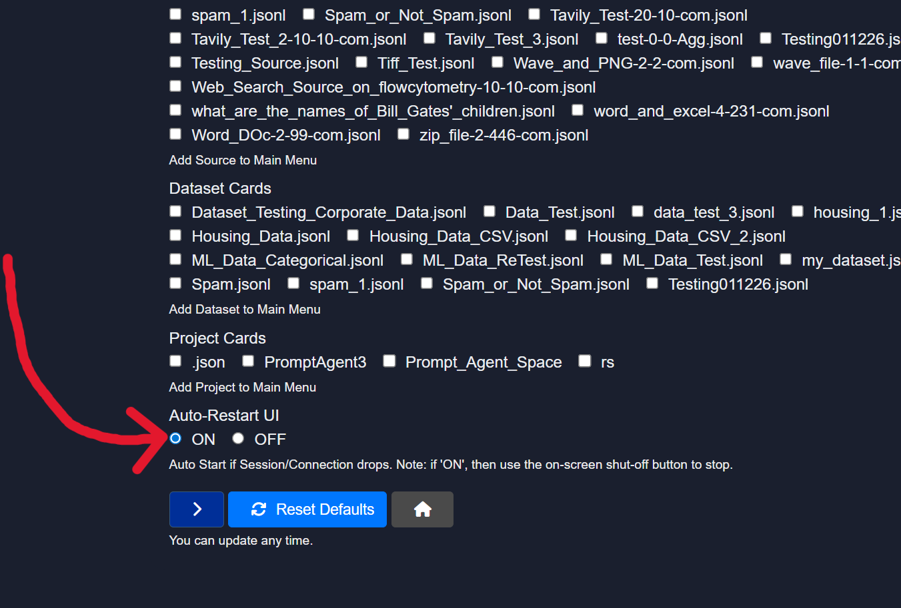

# Shutting Down Model HQ
To ensure optimal performance and prevent background processes, Model HQ should be properly shut down after each use.

## How to shut down
The shutdown process can be initiated by clicking the **power button (`⏻`)** located at the **top-right corner** of the application interface.

## Why proper shutdown matters
If the application is not closed properly, the following issues may occur:
- The application may continue running in the background.
- The application may replicate itself while the device is in hibernation.
- Unintended system behavior or resource usage may result.

> [!TIP]
> It is recommended to shut down Model HQ manually after each session to maintain system stability and avoid unnecessary background activity.

> [!NOTE]
> If the application remains idle for an extended period, the server will disconnect automatically.

## Unintended shutdown
The application may shutdown and need to be restarted when the device goes into hibernation mode or if the user closes the laptop. To prevent this from happening frequently, please change the hibernation setting of your device. Alternatively, user can select Model HQ to automatically restart after a shutdown by selecting **config button** (upper right hand side) to access Model HQ Configuration Center, then **App** then make the "ON" selection for "Auto-Restart UI". This will automatically restart Model HQ in a new browser tab.

## Conclusion
After each use, the application should be shut down by clicking the power button (`⏻`) in the top-right corner. If the application is not closed properly, it may continue running in the background and could replicate itself while the device is in hibernation.
