# Source
After completing the initial setup, users will be directed to the **Main Menu**. This interface provides access to several powerful features. In this section, the **Source** (or RAG Source) feature will be described. RAG, which stands for **Retrieval-Augmented Generation**, is a feature within Model HQ to help users search their documents or other knowledge bases.

The Source section is used to create, test and interact with user-created knowledge bases. Once created, the user-created Source can be later incorporated into Chat, Bot or Agents as a knowledge base.

RAG combines retrieval-based techniques with generative AI to enable models to answer questions more accurately by retrieving relevant information from external sources or documents. With RAG in Model HQ, knowledge bases can be created that can be queried in the chat section or via a custom bot (to be used either standalone or in an Agent workflow) by uploading documents or other information that the model can use when searching for information. 

## 1. Launching the source interface
To begin, the **Source** button in the main menu can be selected to launch the source interface. 

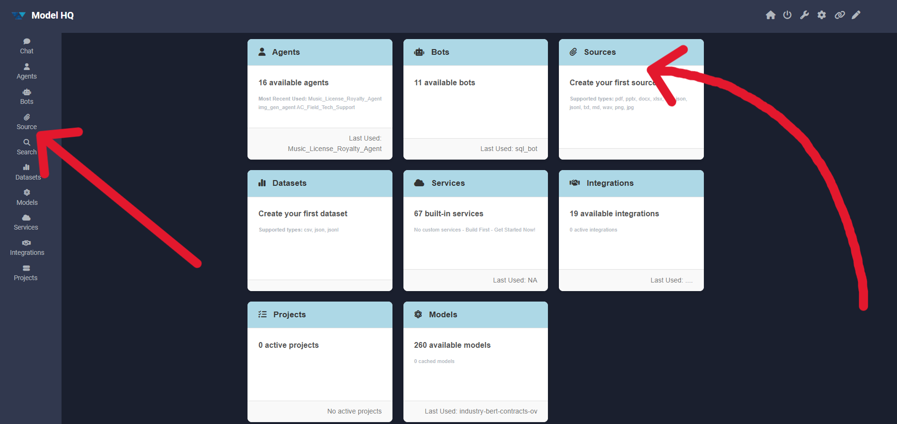

&nbsp;

## 2. Understanding the source interface
The source interface typically provides two options, but when accessed for the first time, only one option will be visible: `build new`, as shown below:

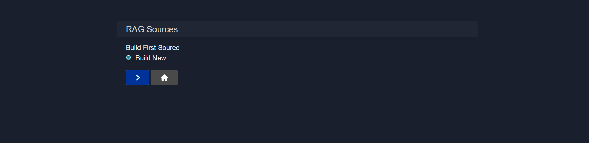

Key elements of the interface:

- **RAG Sources Options**
  - **Build New**: A new source can be created using the available template.
  - **Load Existing**: Previously created sources can be loaded and reused.

The second option (`load existing`) becomes available only when at least one source has been created. The following sections describe how sources are created.

## 3. Creating a source
Since there are no existing sources initially, the **Next ( > )** button can be clicked to build a new source. To create a source at any time, the **Build New** option should be selected.

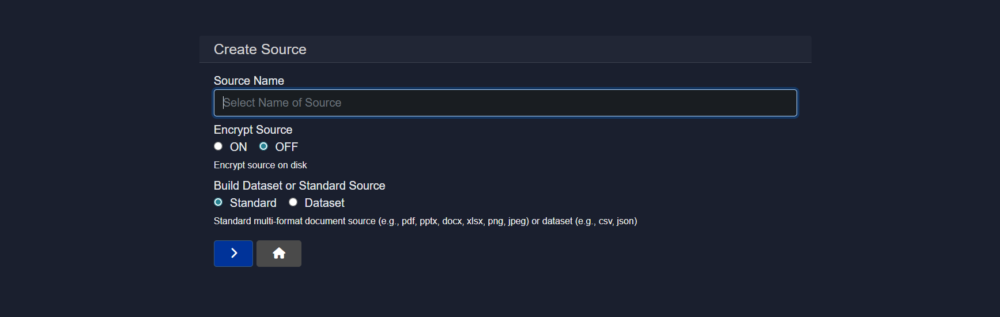

When creating a new source, the basic source settings are configured first before any data is uploaded.

### 3.1 Source configuration
- **Source Name:**
  A unique name to identify the source. This name will be used when selecting sources across bots and workflows.

- **Encrypt Source:**
  When enabled, the source will be encrypted at rest on disk. This is recommended for sensitive or confidential data.

- **Source Type:**
  The type of source to be built can be selected from:
  - **Standard**: Used for multi-format documents such as PDF, PPTX, DOCX, XLSX, PNG, and JPEG.
  - **Dataset**: Used for structured data sources such as CSV or JSON files.

The following sections will first describe how a **Standard Source** is created, followed by the creation of a **Dataset Source**.

> [!NOTE]
> Standard Source and Dataset Source both are completely different from one another and thus they have different interfaces.

## 4. Creating a standard source
After creating and naming a Standard source, the RAG Builder – Source view will be displayed. This page represents the active source and provides actions to manage documents and test retrieval.


From this interface, documents can be added, searches can be performed within the source, RAG responses can be tested, the indexed library can be viewed, links can be managed, and the source can be deleted.

The following subsections describe each of these functions in detail.

### 4.0 RAG Builder

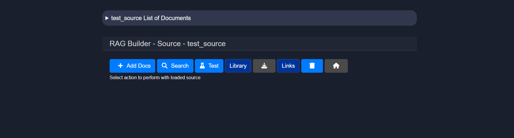

### 4.1 Uploading documents
The `Add Docs` button can be clicked to upload files into the source. This action opens the document upload interface.

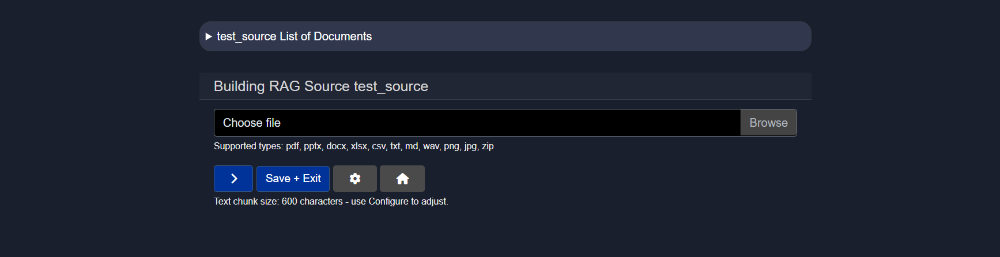

Supported file types such as `.pdf`, `.pptx`, `.docx`, `.xlsx`, `.csv`, `.txt`, `.md`, `.wav`, `.png`, `.jpg`, and `.zip` archives can be browsed and uploaded. Multiple files can be uploaded to the same source.

Users may upload multiple files by selecting a file, then clicking ">" and continuing to do so until all the desired files are added to the source.

After selecting the complete set of files, the Save + Exit button can be clicked to process the documents and return to the source view.

#### 4.1.1 Parsing configuration
The **Configure (⚙️)** icon can be clicked from the upload screen to control how documents are parsed and indexed.

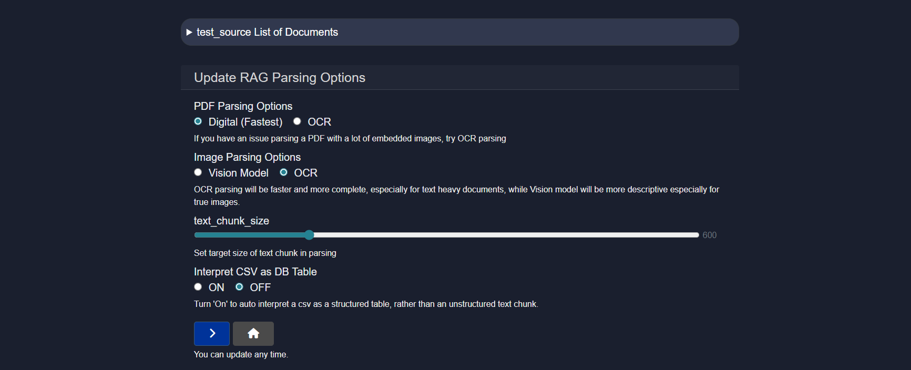

The following configuration options are available:

| Configuration Option | Description | Default | Recommended Use |
|---------------------|-------------|---------|-----------------|
| **PDF Parsing Options** | Controls how PDF files are processed | Digital (Fastest) | Digital is faster and suitable for text-based PDFs. OCR should be used for scanned or image-heavy PDFs. |
| **Image Parsing Options** | Controls how image files are processed | OCR | OCR focuses on extracting text, while Vision Model provides richer descriptions for image-based content. |
| **Text Chunk Size** | Defines how documents are split during indexing | 400-600 tokens | Smaller chunks improve retrieval precision, while larger chunks retain more context. |
| **Interpret CSV as DB Table** | Treats CSV files as structured tables | OFF | When enabled, CSV files are treated as structured tables instead of plain text, allowing more accurate data queries. |

> [!TIP]  
> Text chunk size determines how the document is segmented into smaller pieces during parsing. Choosing the right size is important—too small may lose context, while too large could reduce processing performance or exceed model input limits.

These options can be updated at any time and will apply to documents processed after the change.

If any issues are encountered related to document parsing, the [Document Parsing Issues]() guide can be consulted.

### 4.2 Search
The **Search** feature is a core component of the RAG interface, enabling the source content to be queried efficiently and effectively.

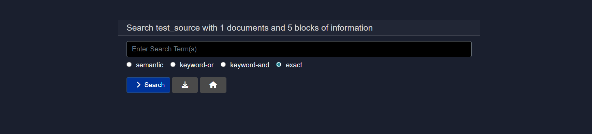

Unlike basic search tools, the RAG-powered search is augmented with semantic understanding. This enables:
- Natural language questions to be asked (e.g., "What are the key findings of the clinical study?")
- Precise and relevant answers to be retrieved from uploaded content
- Large volumes of unstructured data to be navigated quickly

The query can be entered in the query field, and one of the following search strategies can be selected:

- **Semantic**
  Semantic search is a technique that aims to improve search accuracy by understanding the meaning (semantics) behind the words in a query, rather than matching exact keywords only. Users may use natural language to use this semantic search feature to query their source.

- **keyword-or**
  Results that contain any of the keywords will be found.
  - Logic used: OR logic.
  - Example:
  ```
  Search: dog OR cat
  → Returns results with either "dog", "cat", or both.
  ```

- **keyword-and**
  Results that contain all of the keywords will be found.
  - Logic used: AND logic.
  - Example:
  ```
  Search: dog AND cat
  → Returns results that contain both "dog" and "cat".
  ```

- **exact**
  Results that contain the exact word or phrase in the same order will be found.
  - Example:
  ```
  Search: "artificial intelligence"
  → Only returns results with the full phrase "artificial intelligence", not just "artificial" or "intelligence" separately.
  ```

| Type            | Matches                                                             | Example Query                  |
|-----------------|---------------------------------------------------------------------|--------------------------------|
| Semantic Search | Related meanings or concepts, even if exact words are not present  | `benefits of eating apples` → matches “health advantages of apples” |
| Keyword-OR      | Any of the words                                                    | `apple OR orange`              |
| Keyword-AND     | All the words                                                       | `apple AND orange`             |
| Exact Search    | Exact phrase (in the same order)                                    | `"apple orange juice"`         |

### 4.3 Test
The **Test** option allows the Source that is created to be evaluated by running prompt-based queries against it using different AI models.

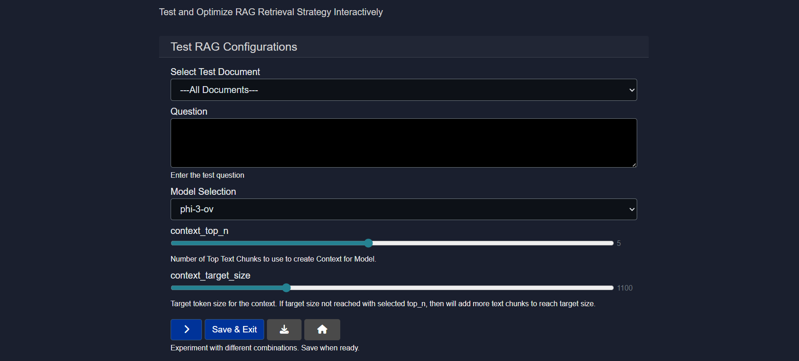

This is an essential step to ensure that the RAG source responds accurately and effectively to real-world questions and meets the user's usage goals.

Sample questions can be entered and different models can be compared to see how they interpret and respond to document content. Based on the responses, the model that delivers the most accurate or relevant results can be selected.

Testing a RAG Source requires the following inputs:

- **Select Test Document**
  Either all documents can be selected or any one uploaded document (via "add-docs" button) can be chosen for testing purposes.

- **Question**
  A question related to the document content should be entered to test the model's response.

- **Model Selection**
  A model can be selected based on specific needs, or multiple models can be tested to compare their performance.

- **context_top_n**
  Increase or decrease the number of top text chunks use to create context for model.

  > [!TIP]
  > Context Top N refers to selecting the top N most relevant pieces of information (e.g., text chunks) from a larger context based on similarity to a query, and it's important because it ensures the model focuses on the most pertinent data to generate accurate and relevant responses. Choosing this will give you the number of results you indicate which is particularly important if you selected the "Compare" feature for the source, and would like to see individual results.

  > **Example of Testing a Source**
  > We created a Source called Testing011426 which consisted of an Employment Ageement (in PDF format - provided as a sample document with Model HQ in C:\Users\[user name]\llmware_data\Agreements) and a Screenshot of a financial table.
  > 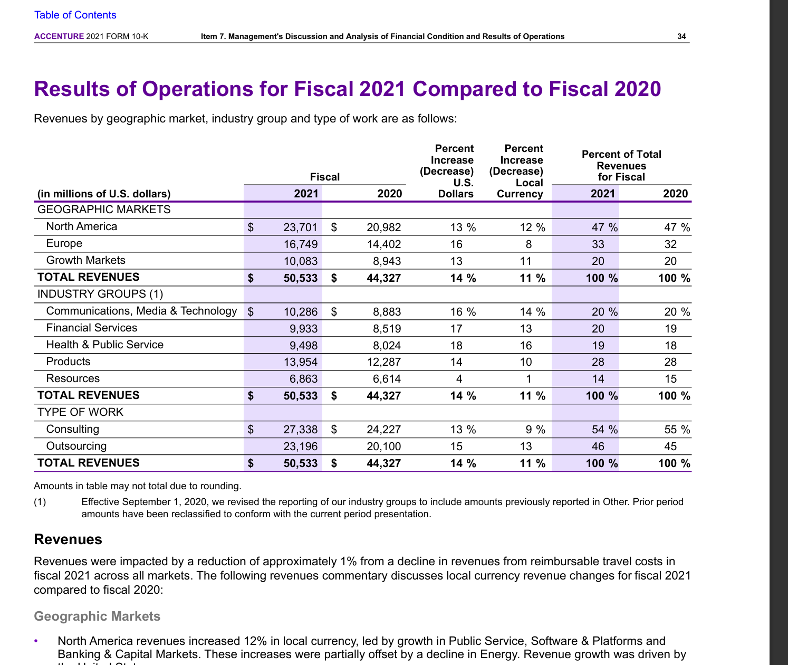
  > We are able to ask the Source questions about both the Employment Agreement as well as the Financial Table because they are in the same Source.
  > Example of Financial Table Query:
  > 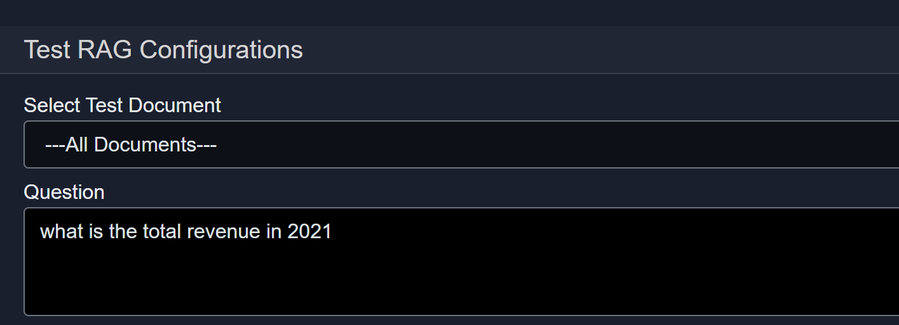
  > Example of Financial Table Answer:
  > 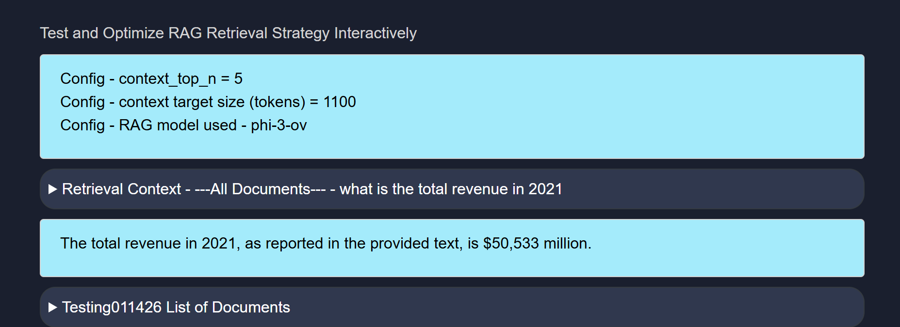
  > Example of Employment Agreement Query:
  > 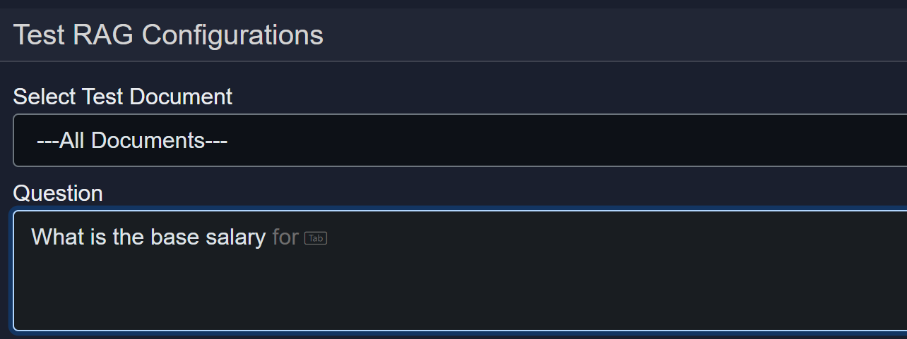
  > Example of Employment Agreement Answer:
  > 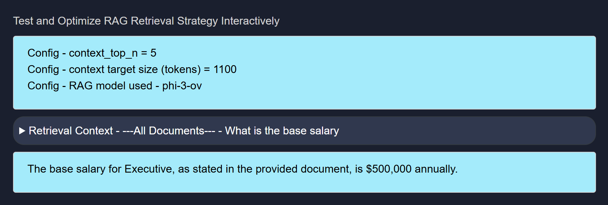
  

- **context_target_size**
  Select the target token size for the context. If target size not reached with selected top_n, then will add more text chunks to reach target size.

  > [!TIP]
  > Context target size is the predefined maximum amount of text (in tokens) that can be included in a model’s input, and it balances the trade-off between including enough relevant information and staying within the model’s processing limits to ensure efficient and coherent responses.

### 4.4 Other options
#### 4.4.1 Library
The source can be exported to the library in the local database.

#### 4.4.2 Download
The source can be exported to text (markdown file) and downloaded.

#### 4.4.3 Links
If the source contains links (e.g., from a web search), this option will return a list of only the links found in the search-based source.

#### 4.4.4 Delete
The source can be deleted from the system.

## 5. Creating a dataset source
To create a dataset source, the source creation process should be started again. 

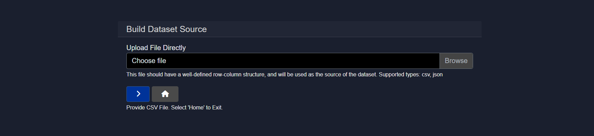

Learn more about creating a dataset source in [Datasets](https://github.com/BloksAdmin/model-hq-docs/tree/master/v1/models/datasets.md)

## 6. Load existing source
This option allows RAG functionality to be quickly accessed for sources that have been previously created.

Sources can be configured and deleted as needed from this interface.

## Conclusion
This document described the Source (RAG) feature in Model HQ, including how to launch the source interface, create standard and dataset sources, configure parsing options, perform searches, and test RAG responses. Sources provide the foundation for knowledge base creation in Model HQ, enabling document-based context retrieval for chat sessions and custom bots. Standard sources support multi-format documents such as PDFs, presentations, and images, while dataset sources are optimized for structured data like CSV and JSON files. Once created, sources can be tested with different models, configured with various retrieval parameters, and reused across multiple workflows. Understanding how to create and configure sources effectively enables more accurate, context-aware AI responses throughout Model HQ.
